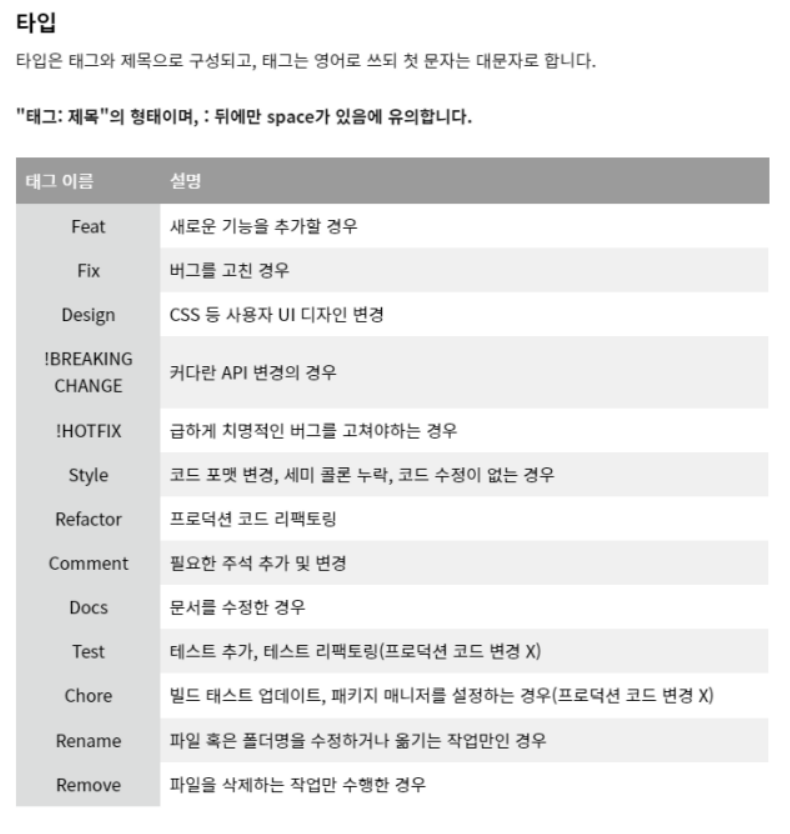

# 웹 큐레이션 SNS 프로젝트

<!-- 필수 항목 -->

## 🔰 카테고리

| Application | Domain | Language | Framework |
| ---- | ---- | ---- | ---- |
| :black_square_button: Desktop Web | :black_square_button: AI | :white_check_mark: JavaScript | :black_square_button: Vue.js |
| :black_square_button: Mobile Web | :black_square_button: Big Data | :black_square_button: TypeScript | :white_check_mark: React |
| :white_check_mark: Responsive Web | :black_square_button: Blockchain | :black_square_button: C/C++ | :black_square_button: Angular |
| :black_square_button: Android App | :black_square_button: IoT | :black_square_button: C# | :black_square_button: Node.js |
| :black_square_button: iOS App | :black_square_button: AR/VR/Metaverse | :black_square_button: Python | :black_square_button: Flask/Django |
| :black_square_button: Desktop App | :black_square_button: Game | :white_check_mark: Java | :white_check_mark: Spring/Springboot |
| |  | :black_square_button: Kotlin | |

<!-- 필수 항목 -->

## 🔰 프로젝트 소개

- 서비스명  - 아트그램(artgram)
  - 예술(art) 정보를 보낸다는 의미의 텔레그램(Telegram)을 합쳐 만든 이름
  - (아직은 가명입니다.)

- 서비스 설명/ 주요기능

  - 설명 : 문화예술분야 큐레이션 SNS 서비스

  - 주요기능 : 

    -  SNS 기능 (뉴스피드 / 팔로우 / 팔로잉 / 좋아요 / 댓글)

    -  공연정보 제공 기능
    -  검색 기능(문자열 자동완성)
    -  계정 관리
    -  해당 공연 SNS글 추천 기능
    -  해당 카테고리의 다양한 공연 추천 기능

- 주요 기술 스택
  - HTML / CSS / JS
  - React
  - Java Spring 

* 참조 리소스
  * sass-loader: scss 로드 및 컴파일
* 배포 환경
  - URL: // 웹 서비스, 랜딩 페이지, 프로젝트 소개 등의 배포 URL 기입
  - 테스트 계정: // 로그인이 필요한 경우, 사용 가능한 테스트 계정(ID/PW) 기입

<!-- 자유 양식 -->

## 🔰 팀 소개
* 이윤영 : 팀장, 프론트엔드 개발
* 김준석 : 프론트엔드 개발
* 양승우 : 프론트엔드 개발
* 정현수 : 백엔드 개발
* 황이레 : 백엔드 개발

<!-- 자유 양식 -->

## 🔰 프로젝트 상세 설명

// 개발 환경, 기술 스택, 시스템 구성도, ERD, 기능 상세 설명 등

- 기술 스택  
  - Front-end : HTML/CSS/JS, React
  - Back-end : Java Spring

- ERD

### 🔰 우리팀 Git Commit Convention

