- Main 화면

  

  Main화면에서 정보를 확인하고 상세 보기를 통해 2차 정보를 제공합니다.

  여기서 사용되는 기능은 검색 기능, 프로필 기능, 글 작성 기능이 있습니다.

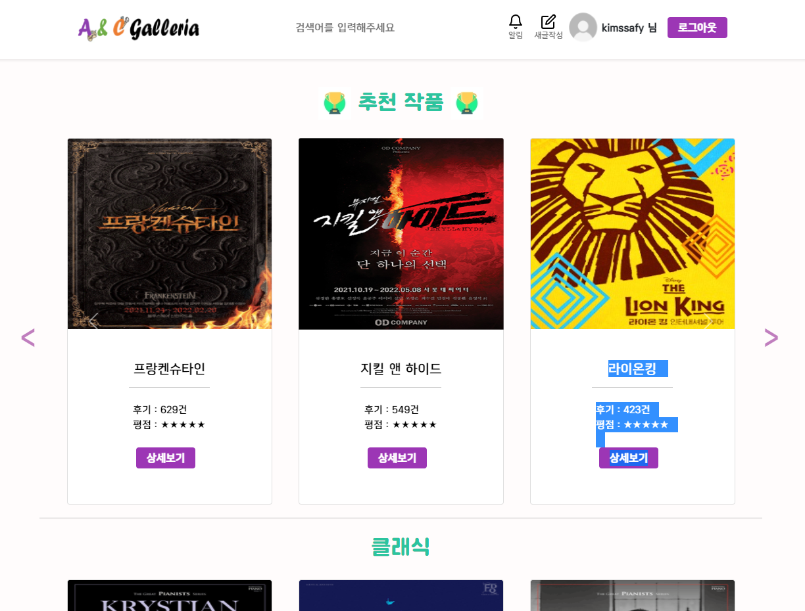

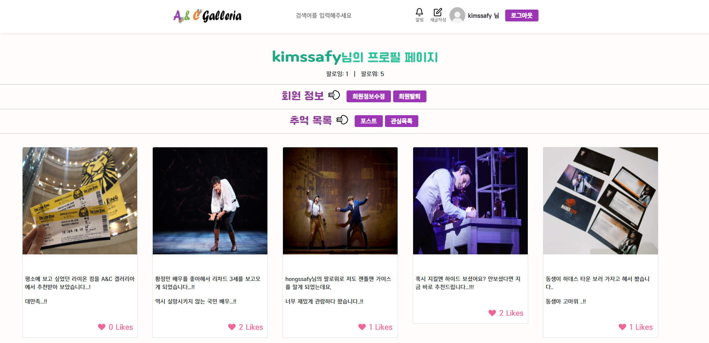

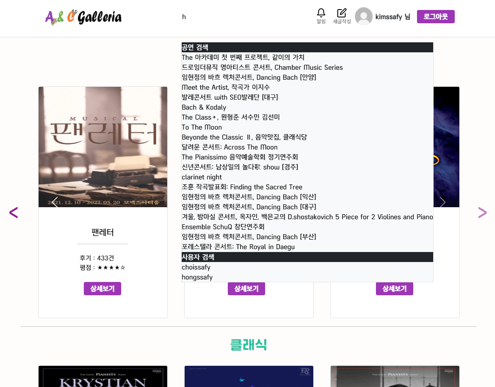

- 로그인 기능

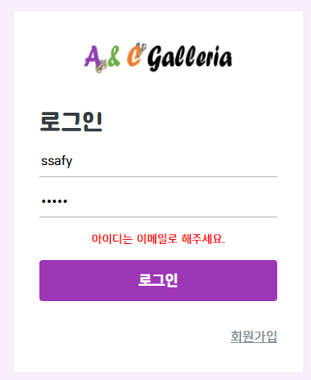

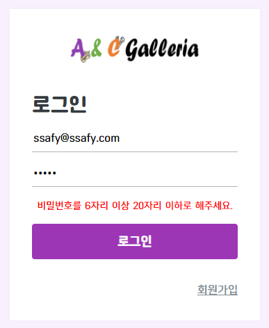

아이디와 비밀번호는 제한 조건 속에서 작성해야 합니다.

- 글 작성

  

  글 작성은 글 남기기, 공연 검색하기, 태그, 파일 선택을 통해 글을 남길 수 있습니다.

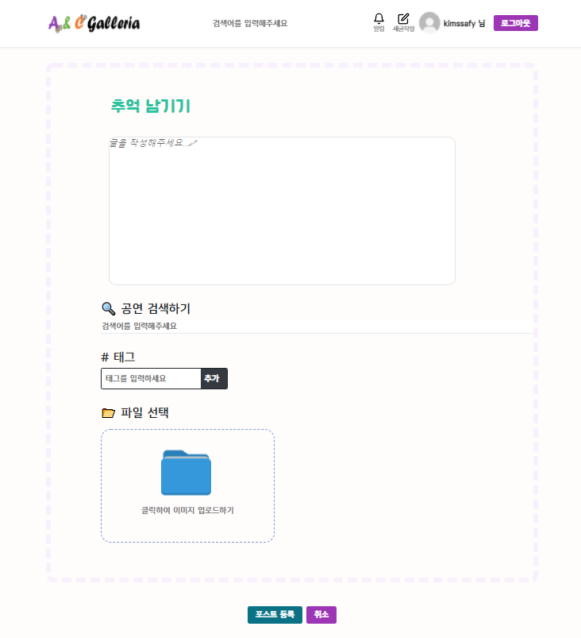

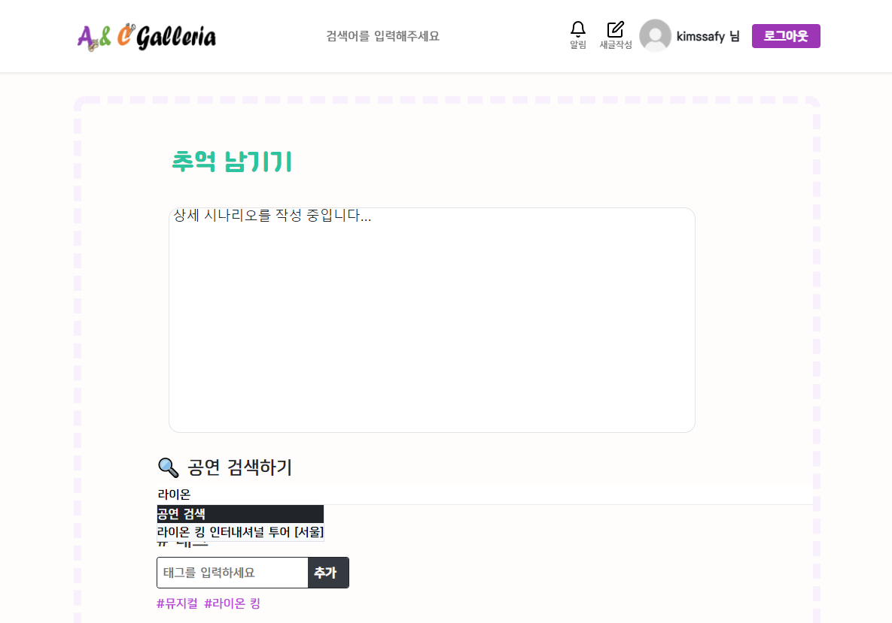

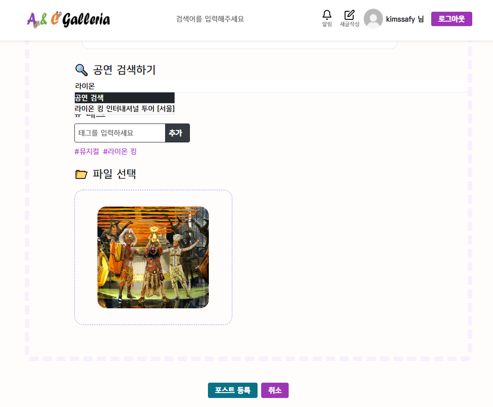

- 공연 상세정보

  

공연 상세 정보를 제공하여 SNS 기능과 더불어 이용자에게 합리적인 결정을 내릴 수 있게 돕습니다.

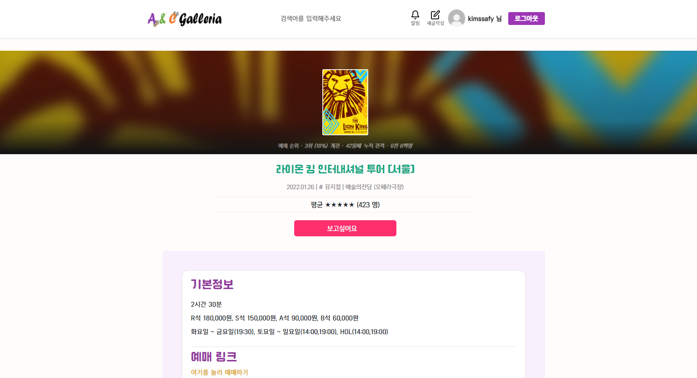

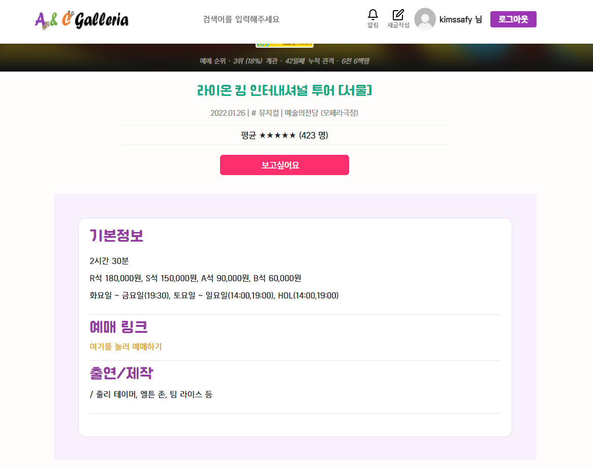

- Header와 Footer
- 

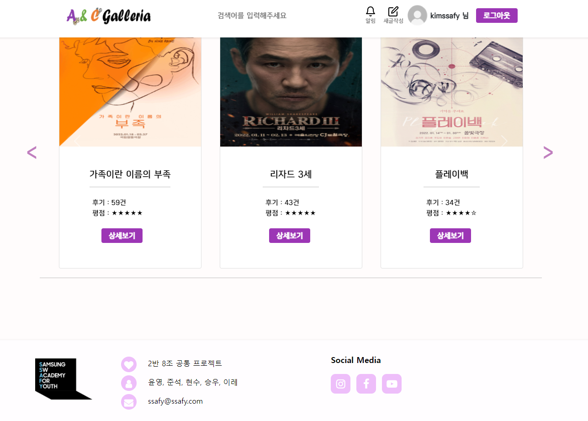