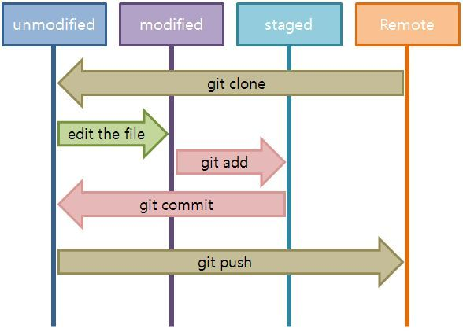

# 🌞 Git 공부 



=======


```git commit --amend
git commit --amend : 방금 커밋한 메시지 수정하기
```


```
git restore <file> : 수정된 파일 되돌리기 (단순 파일 수정)
```


``` 
git restore --staged <file> : 스테이지에서 내리기
```


```
git reset HEAD^ : 방금 한 Commit 취소
```


```
git reset --hard <해시코드> : 특정 시점의 위치로 이동
```


```
git revert <해시코드> : Commit을 남기고 취소
```


```
git branch : Branch 생성
```


```
git checkout <branch> : 해당 Branch로 변경
```


```
git merge <branch> : 해당 Branch에서 <branch>를 병합
```


```
git stash : Commit하지 않은 내용을 잠시 임시 보관
```


```
git stash list : 임시 보관된 리스트를 불러옴
```


```
git stash pop : 임시 보관된 내용을 불러옴
```

