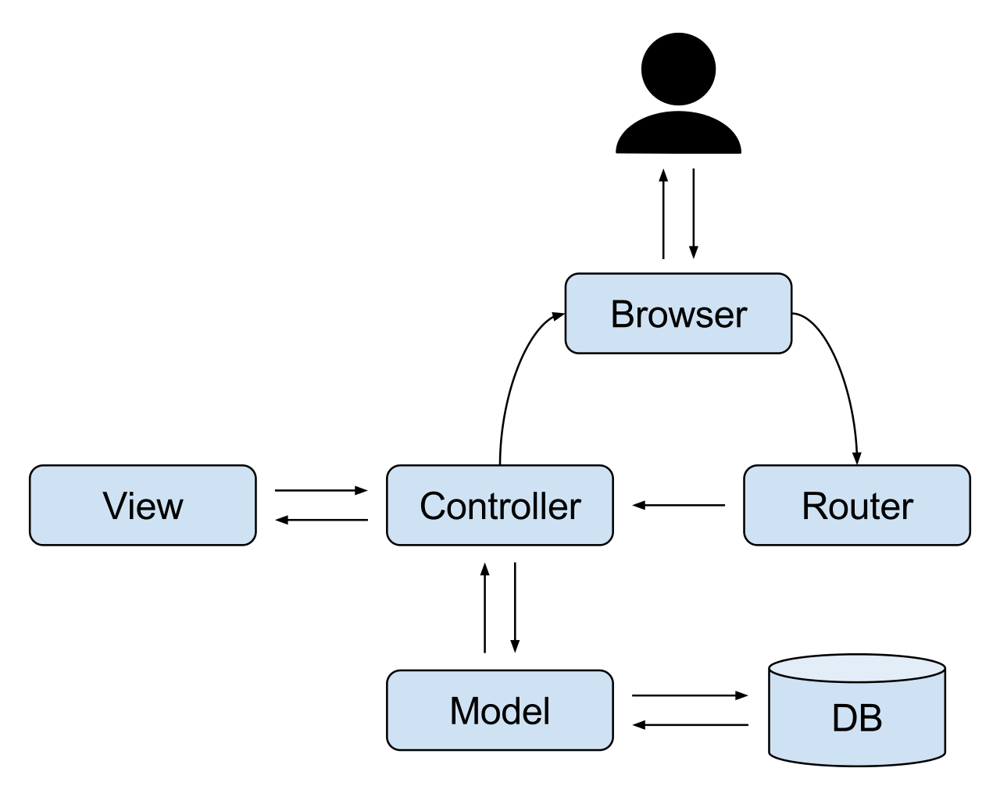
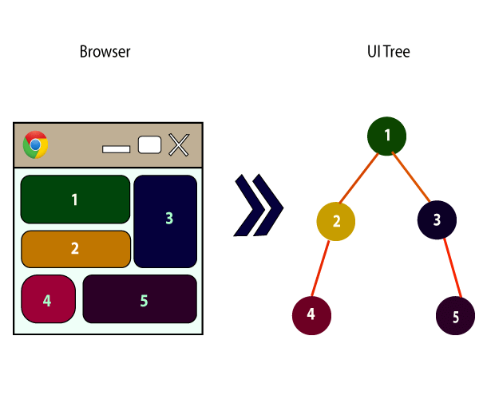
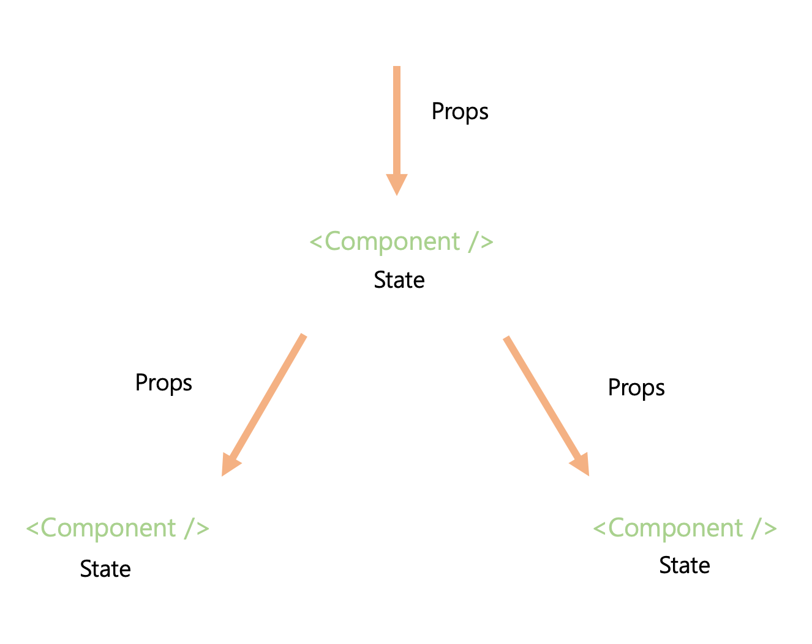

# ⭐️ 리액트 Component 공부


## 1.컴포넌트를 표현하는 JSX

 ***JSX***는 **J**ava**S**cript **X**ML의 줄임말로 <자바스크립트에 XML을 추가한 확장형 문법>이다.


```react
import React from 'react';

class App extends React.Component {
  render() {
    return (
      // 아래의 내용이 JSX.
      <div>
        
        <div>안녕하세요</div>
      </div>
    );
  }
}
export default App;
```


## 2. 컴포넌트와 구성요소


웹 사이트의 화면은 각 요소가 비슷하고 반복적으로 사용한 경우가 많아 컴포넌트가 등장하게 되었다.


|                MVC Pattern                 |                     Component                     |
| :----------------------------------------: | :-----------------------------------------------: |
|  |  |


1. TodaysPlan 컴포넌트 만들기

   

   ```react
   import React from 'react';
   
   class TodaysPlan extends React.Component {
     render() {
       return (
        <div className="message-container">
          공부하기
        </div>
       );
     }
   }
   
   export default TodaysPlan;
   ```

   

2. App 컴포넌트에 TodaysPlan 컴포넌트 추가하기


```react
import React, { Component } from 'react';
// 작성된 컴포넌트를 import
import TodaysPlan from './TodaysPlan';

class App extends React.Component {
  render() {
    return (
      <div className="body">
        <TodaysPlan />
      </div>
    );
  }
}

export default App;
```


3. TodaysPlan 컴포넌트 출력하기


+ Properties, State, and Component




## 3. 컴포넌트에 데이터를 전달하는 프로퍼티


다음과 같이 **속성(Attribute)**의 형태로 전달되는 값을 **프로퍼티(Property)**라고 한다.


```react
class App extends React.Component {
  render() {
    return (
      <div className="body">
        <MyComponent name="message" />
      </div>
    );
  }
}
```


>  MyComponent : 컴포넌트, Name : 프로퍼티


* 프로퍼티 사용하기

```react
// 문자열형 프로퍼티
PropsComponent.propTypes = {
  name: PropTypes.string,
};

//다양한 프로퍼티
PropsComponent.propTypes = {
  boolValue: PropTypes.bool,
  numValue: PropTypes.number,
  arrayValue: PropTypes.arrayOf(PropTypes.number),
  objValue: PropTypes.object,
  nodeValue: PropTypes.node,
  funcValue: PropTypes.func,
 } 

```


이 외에도 객체형, 필수형 프로퍼티 등이 있다.


#### 자식 프로퍼티


**{this.props.children}** 과 같은 방법으로 

**<div> <**span**> 자식 노드 <**/span**> </div>**를 쉽게 받을 수 있다.


---


