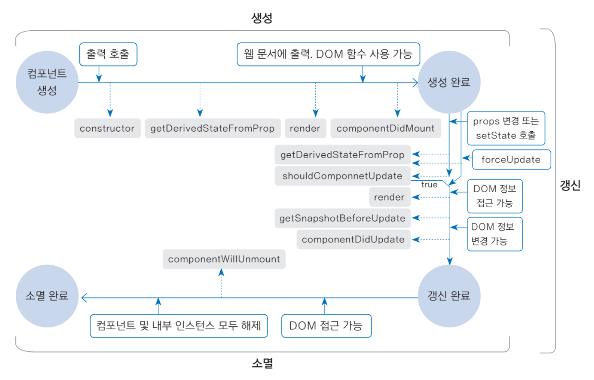

# ⭐️ 리액트 Component 공부 (계속)


## 4. 컴포넌트 상태 관리하기


프로퍼티의 특징은 **컴포넌트 내부에서 값을 바꿀 수 없다**이지만,

State를 사용하여 컴포넌트의 상태를 관리할 수 있다. 보통 버튼을 클릭하거나 값을 입력하는 등의 이벤트와 함께 사용된다.


```
⚡ state 사용 시 주의사항

1. 생성자(Constructor)에서 반드시 초기화해야 한다.
2. state 값을 변경할 때는 setState()함수(상태 관리 함수)를 반드시 사용해야 합니다.
3. setState() 함수는 비동기로 처리되며, setState() 코드 이후로 연결된 함수들의 실행이 완료된 시점에 화면 동기화를 거친다.
```


🌙 State Example

```react
import React from 'react';

class StateExample extends React.Component {
  constructor(props) {
    super(props);
    // 상태 정의
    this.state = {
      loading: true,
      formData: 'no data',
    };
    this.handleData = this.handleData.bind(this);
    // 생성 후 4초 후에 handleData를 호출
    setTimeout(this.handleData, 4000);
  }
  handleData() {
    const data = 'new data';
    const { formData } = this.state;
    // 상태 변경
    this.setState({
      loading: false,
      formData: data + formData,
    });
    // this.state.loading 은 현재 true.
    // 이후 호출될 출력함수에서의 this.state.loading은 false.
  }

  render() {
    return (
      <div>
        {/* 상태 데이터는 this.state로 접근 가능. */}
        <span>로딩중: {String(this.state.loading)}</span>
        <span>결과: {this.state.formData}</span>
      </div>
    );
  }
}

export default StateExample;

```


## 5. 컴포넌트의 생명주기


컴포넌트의 생성부터 소멸까지의 과정을 컴포넌트의 생명주기(Life Cycle)이라고 한다.


생명주기함수는 render( ) 함수를 포함하여 총 8종의 함수가 있다.

생명주기 함수는 리액트 엔진에서 자동으로 호출하며 개발자가 마음대로 호출할 수 없다.




생성주기는 크게 3단계이며 **생성**, **갱신**, **소멸**이 있다.

*생성완료* 까지 4개의 생명주기 함수가 호출되며 이를 **생성 과정**이라 부른다. 이후 생성 완료부터 갱신 완료까지 5개의 생명주기 함수가 호출된다. 이 과정을 **갱신 과정**이라고 부르며 이때 갱신과정은 shouldComponentUpdate( ) 함수의 반환값에 따라 진행이 계속되거나 멈추기도 한다. 갱신 완료부터 소멸 완료까지는 1개의 생명주기 함수가 호출되며, 이 과정을 **소멸 과정**이라고 부른다.


- constructor(props) 함수

  - constructor 함수는 이름 그대로 '맨 처음에 생성될 때 한 번만 호출'되며, 상태를 선언할 때 사용된다.

  - 항상 super( ) 함수를 가장 위에 호출해야 한다.

    

- render( ) 함수

  - render( ) 함수는 데이터가 변경되어 새 화면을 그려야 할 때 자동으로 호출되는 함수이다.


- static getDerivedStateFromProps(props, state) 함수
  - 이 함수는 정적함수이며 this를 이용하여 props나 state 값에 접근할 수 없다. 
  - 만약, 각 값에 접근해야 하는 경우 반드시 인자로 전달된 props, state를 이용해야한다.


- componentDidMount( ) 함수
  - render( ) 함수가 JSX를 화면에 그린 이후에 호출되는 함수이다.


-  shouldComponentUpdate(nextProps, nexState) 함수
  - 화면을 새로 출력할지 말지를 판단하며, 데이터 변화를 비교하는 작업을 포함하므로 리액트 선능에 영향을 많이 준다.


- getSnapshotBeforeUpdate(prevProps, prevState) 함수
  - 컴포넌트가 화면에 실제로 출력되기 전에 호룿ㄹ되는 함수로 DOM 정보에 접근할 대 사용된다.


- componentDidUpdate(prevProps, prevState, snapshot) 함수
  - 컴포넌트가 실제 화면에 출력된 이후 호출되는 함수이며, 위의 함수에서 반환된 값을 인자로 받는다.
  - 이 값들을 이용하여 스크롤 위치를 옮기거나 커서를 이동시키는 등의 DOM 정보를 변경할때 쓰인다.


- coponentWillUnmount( ) 함수
  - 컴포넌트가 소멸 직전에 호출되는 함수이며 감시하고 있는 작업들을 해제할 때 필요한 함수이다.


---

