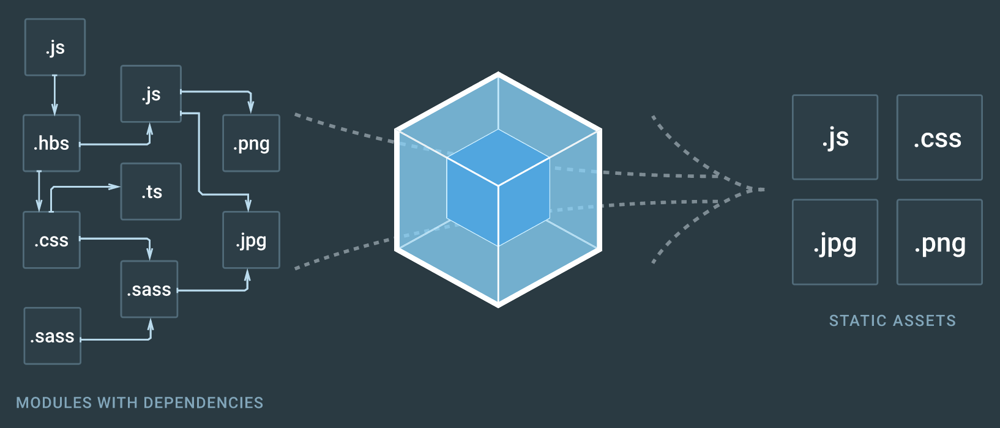

## 2. JSX


리액트 프로젝트를 생성하고 나면 이런 첫 화면이 나온다.


여기서 src/App.js 파일을 열어보면


```react
import logo from './logo.svg';
import './App.css';

function App() {
  return (
    <div className="App">
      <header className="App-header">
        
        <p>
          Edit <code>src/App.js</code> and save to reload.
        </p>
        <a
          className="App-link"
          href="https://reactjs.org"
          target="_blank"
          rel="noopener noreferrer"
        >
          Learn React
        </a>
      </header>
    </div>
  );
}

export default App;
```


이 파일의 코드가 낯설 수 있으니 하나씩 뜯어 보면,


```react
import logo from './logo.svg';
import './App.css';
```


리액트로 만든 프로젝트의 자바스크립트 파일에서는 import를 사용하여 다른 파일들을 불러와 사용할 수 있습니다.

여기서 한ㄴ 가지 알아 둘 점은 이렇게 모듈을 불러와서 사용하는 것은 원래 브라우저에는 없던 기능이다.

브라우저가 아닌 환경에서 자바스크립트를 실행할 수 있게 해주는 환경인 Node.js에서 지원하는 기능이다.

참고로 Node.js에서는 import가 아닌 require라는 구문으로 패키지를 불러올 수 있다.


이러한 기능을 브라우저에서도 사용하기 위해 번들러(bundler)를 사용한다.





번들(bundle)은 묶는다는 뜻이다. 즉, 파일을 묶듯이 연결하는 것이다.


대표적인 번들러로 웹팩, Parcel, browserify라는 도구들이 있지만, 리액트 프로젝트에서는 주로 웹팩을 사용하는 추세이다.


src/index.js를 시작으로 필요한 파일을 다 불러와 번들링하게 된다.

이렇게 파일들을 불러오는 거은 웹팩의 로더(loader)라는 기능이 답당합니다. 로더는 여러 종류가 있다.

그리고 babel-loader는 자바스크립트 파일들을 불러오면서 최신 자바스크립트 문법으로 작성된 코드를 바벨이라는 도구를 사용하여 ES5 문법으로 변환해 줍니다.


```react
function App() {
  return (
    <div className="App">
      <header className="App-header">
        
        <p>
          Edit <code>src/App.js</code> and save to reload.
        </p>
        <a
          className="App-link"
          href="https://reactjs.org"
          target="_blank"
          rel="noopener noreferrer"
        >
          Learn React
        </a>
      </header>
    </div>
  );
}
```


위의 코드는 App이라는 컴포넌트를 만들어준다.


function 키워드를 사용하여 컴포넌트를 만들었다. 이러한 컴포넌트를 함수 컴포넌트라고 부른다.

프로젝트에서 컴포넌트를 렌더링하면(렌더링이란 '보여 준다'는 것을 의미한다) 함수에서 반환하고 있는 내용을 나타낸다.

함수에서 반환하는 내용을 보면 HTML같지만 이 코드는 'JSX'라고 불린다.


### JSX란?


JSX는 자바스크립트의 확장 문법이며 XML과 매우 비슷하게 생겼다.

이런 형식으로 자성된 코드는 브라우저에서 실행되기 전에 코드가 번들링되는 과정에서 바베을 사용하여 일반 자바스크립트 형태의 코드로 변환된다.


```react
function App() {
  return (
      <div>
      	Hello <b>react</b>
      </div>
  );
}
```


이렇게 작성된 코드는 다음과 같이 변환됩니다.


```javascript
function App() {
	return React.createElement("div", null, "Hello", React.createElement("b", null, "react"));
}
```


만약 컴포넌트를 렌더링할 때마다 JSX 코드를 작성하는 것이 아니라 위의 코드처럼 매번 React.createElement 함수를 사용한다면 매우 불편할 것이다.


JSX의 장점


1. 보기 쉽고 익숙하다

   일반 자바스크립트만 사용한 코드와 JSX로 작성한 코드를 비교해보면, HTML 코드와 비슷한 JSX가 더 보기 쉽고 익숙하다.

   

2. 더욱 높은 활용도

   

   JSX에서는 우리가 알고 있는 div나 span 같은 HTML 태그를 사용할 수 있을 뿐만 아니라, 앞으로 만들 컴포넌트도 JSX 안에서 작성할 수 있다. App.js에서는 App 컴포넌트를 마치 HTML 태그 쓰듯이 그냥 작성했다.

    

   ```react
   import ReactDOM from 'react-dom';
   import './index.css';
   import App from './App';
   
   ReactDOM.render(
     <React.StrictMode>
       <App />
     </React.StrictMode>,
     document.getElementById('root')
   );
   ```

   


## JSX 문법


1. 감싸인 요소


컴포넌트에 여러 요소가 있다면 반드시 부모 요소 하나로 감싸야 한다.


```react
function App() {
  return (
      <h1>리액트 안녕!</h1>
      <h2>잘 작동하니?</h2>
  );
}

export default App;
```


이런 형태의 코드는 잘 작동하지 않는다.


요소 여러 개가 부모 요소 하나에 의하여 감싸져 있지 않기 때문에 오류가 발생하였다.


```react
function App() {
  return (
  <div>
      <h1>리액트 안녕!</h1>
      <h2>잘 작동하니?</h2>
  </div>
  );
}

export default App;
```


VirtualDOM에서 컴포넌트 변화를 감지해 낼 때 효율적으로 비교할 수 있도록 컴포넌트 내부는 하나의 DOM 트리 구조로 이루어져야 한다는 규칙이 있다. 여기서 div 대신에 Fragment 키워드나 <>로 대체해도 된다.


2. 자바스크립트 표현


JSX에서는 자바스크립트 표현식을 쓸 수 있다.

자바스크립트 표현식을 쓰려면 JSX 내부에서 코드를 { }로 감싸면 된다.


```react
function App() {
  const name = '리액트';
  return (
  <>
      <h1>{name} 안녕!</h1>
      <h2>잘 작동하니?</h2>
  </>
  );
}

export default App;
```


3. If 문 대신 조선부 연산자


JSX 내부의 자바스크립트 표현식에서 if문을 사용할 수 없기 때문에 삼항 연산자를 이용한다.


```react
function App() {
  const name = '리액트';
  return (
  <div>
      {name === '리액트' ? (
        <h1>리액트입니다.</h1>
      ) : (
        <h2>리액트가 아닙니다.</h2>
      )}
  </div>
  );
}

export default App;
```


4. AND 연산자(&&)를 사용한 조건부 렌더링


&& 연산자를 사용해 조건부 렌더링을 할 수 있다.


```react
function App() {
  const name = '리액트';
  return <div> {name === '리액트' && <h1>리액트입니다.</h1>}</div>;
}

export default App;
```

  

한 가지 주의해야 할 점은 falsy한 값인 0은 예외적으로 화면에 나타난다.


5. undefined를 렌더링하지 않기


리액트 컴포넌트에서는 함수에서 undefined만 반환하여 렌더링하는 상황을 만들면 안된다.

이 것을 방지하려면 OR 연산자를 이용하거나 undefined일 때, 보여줄 문구를 다음과 같이 작성한다.


```react
import './App.css'

function App() {
  const name = undefined;
  return <div>{name || '리액트'}</div>;
}

export default App;
```


6. 인라인 스타일링


리액트에서 DOM 요소에 스타일을 적요할 때는 문자열 형태로 넣는 것이 아니라 객체 형태로 넣어 주어야 한다.


```react
import './App.css'

function App() {
  const name = '리액트';
  return (
    <div
    style={{
      backgroundColor: 'black',
      color: 'aqua',
      fontSize: '48px',
      fontWeight: 'bold',
      padding: 16
    }}
    >
      {name}
    </div>
  );
}

export default App;
```


7. class 대신 className


일반 HTML에서 CSS 클래스를 사용할 때는 <div class="myClass"></div>와 같이 class라는 속성을 설정한다.

하지만 JSX에서는 class가 아닌 className으로 설정해 주어야 한다.


```react
import './App.css'

function App() {
  const name = '리액트';
  return <div className='react'>{name} </div>;
}

export default App;
```


8. 꼭 닫아야 하는 태그


HTML 코드를 작성할 때 가끔 태그를 닫지 않은 상태로 코드를 작성하기도 한다.

예를 들면 input HTML 요소는 태그를 닫지 않아도 <input>이라고만 입력해도 작동한다.


JSX에서는 <input>일지라도 태그를 닫아주지 않으면 오류가 난다.

때문에 Self-Closing 태그를 이용한다.


```react
import './App.css'

function App() {
  const name = '리액트';
  return (
    <>
      <div className='react'>{name}</div>
      <input />
    </>
  );
}

export default App;
```


9. 주석


JSX 내부에서 주석을 작성할 때는 {/* ... */}와 같은 형태로 작성한다.

이 내부라면 // 주석도 가능하다.


---

