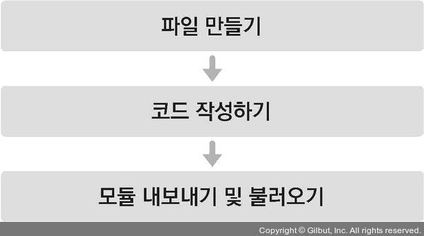

## 컴포넌트


## 1. 클래스형 컴포넌트


기본 App 컴포넌트는 함수 컴포넌트이며, 코드가 다음과 같은 구조로 이루어져 있다.


```react
import './App.css'

function App() {
  const name = '리액트';
  return <div className='react'>{name}</div>
}

export default App;
```


컴포넌트를 선언하는 방식은 두 가지이다.

하나는 함수 컴포넌트이고, 또 다른 하나는 클래스 컴포넌트이다.


클래스형 컴포넌트는 다음과 같이 나타낼 수 있다.


```react
import React, { Component } from 'react';

class App extends Component {
  render() {
    const name = '리액트';
    return <div className='react'>{name}</div>;
  }
}

export default App;
```


클래스형 컴포넌트와 함수 컴포넌트의 차이점은 클래스형 컴포넌트의 경우 이후 배울 state 기능 및 라이프 사이클 기능을 사용할 수 있다는 것과 임의 메서드를 정의할 수 있다는 것이다.

클래스형 컴포넌트에서는 render 함수가 꼭 있어야 하고, 그 안에서 보여주어야 할 JSX를 반환해야 한다.

컴포넌트를 선언할 수 있는 두 가지 방법 중 어느 상황에 함수 컴포넌트를 사용해야 할까?


함수 컴포넌트의 장점은 우선 클래스형 컴포넌트보다 선언하기가 훨씬 편하다.

메모리 자원도 클래스형 컴포넌트보다 덜 사용한다. 반면에 단점으로는, state와 라이프사이클 API의 사용이 불가능하다는 점이다.

그러나 이 단점은 리액트 업데이트 이후 Hooks라는 기능이 도입되면서 해결되었다. 

완전히 클래스형 컴포넌트와 똑같이 사용할 수 있는 것은 아니지만 조금 다른 방식으로 비슷한 작업을 할 수 있게 되었다.

리액트 공식 매뉴얼에서는 컴포넌트를 새로 작성할 때 함수 컴포넌트와 Hooks를 사용하도록 권장하고 있다.


### 2. 첫 컴포넌트 생성





1. src 디렉터리에 MyComponent.js 파일 생성

컴포넌트를 만드려면 컴포넌트 코드를 선언해야 한다.


```react
const MyComponent = () => {
    return <div>나의 새롭고 멋진 컴포넌트</div>
};

export default MyComponent;
```


이번에 작성한 코드는 이전에 보았던 App 컴포넌트와 형태가 조금 다릅니다.

함수를 작성할 때 function 키워드를 사용하는 대신에 ( ) => { }를 사용하여 함수를 만들어 주었습니다.

이는 RS6에 도입된 화살표 함수 문법입니다.


