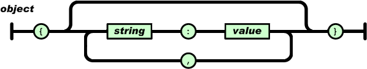
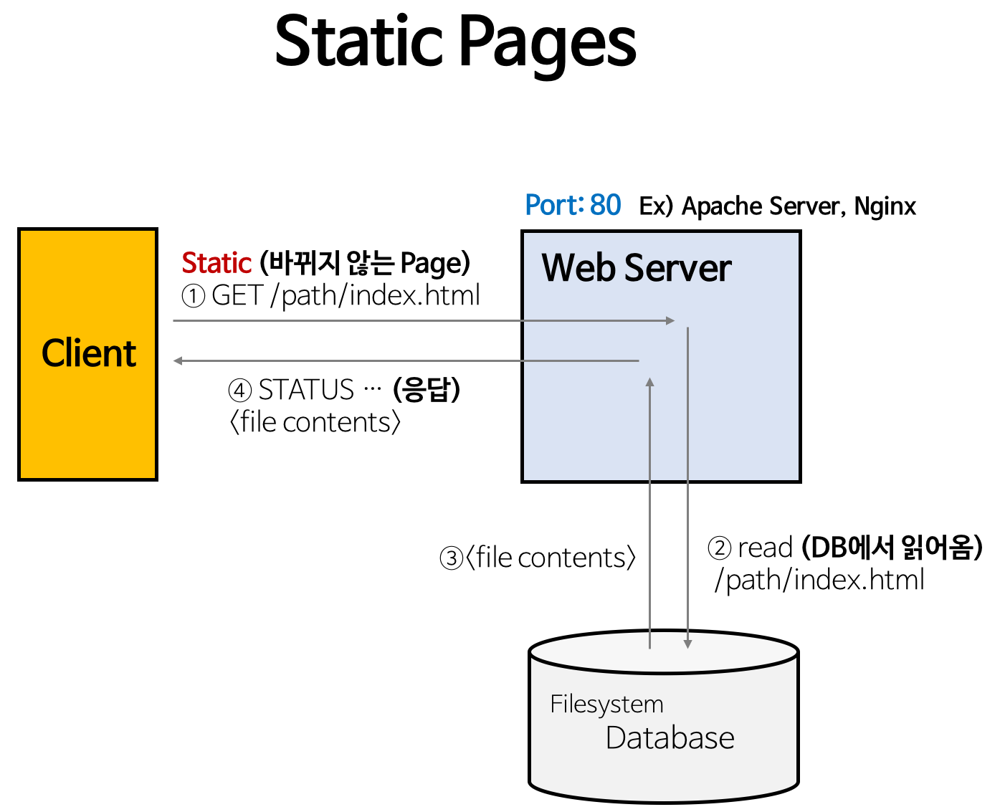
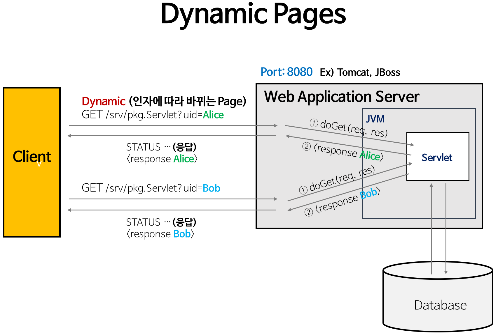
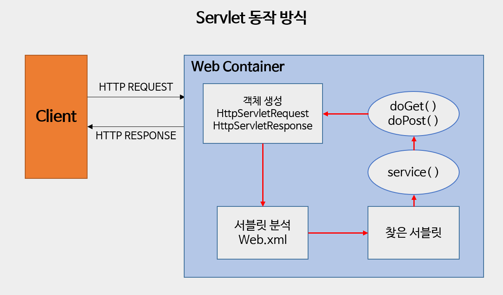

## ✔️Background


### 1. HTTP(하이퍼텍스트 트랜스퍼 프로토콜)


**HTTP**(Hyper Text Transfer Protocol)의 약자이며 **통신 규약**이라는 뜻이다.

맨 처음 **하이퍼텍스트(HT, Hyper Text)**는 **'다른 문서로 향하는 링크가 있는 텍스트'**로 시작했다.


이렇게 문서 내에서 하이퍼텍스트(HT)를 지정하려면, 

특별히 **하이퍼텍스트 마크업 언어(HTML, Hyper Text Markup Language)**를 사용해야 한다.


오늘날의 HTTP는 HTML 문서를 주고받던 간단한 프로토콜에서 벗어나

그림 파일, 동영상, 3D 등 다양한 미디어(HM, Hyper Media) 리소스를 주고 받는 형태로 발전했다.

마찬가지로 HTML도 단순히 하이퍼링크를 위한 마크업 언어에서 다양한 시각적 기능을 제공하는 마크업 언어로 발전했다.


사용자는 브라우저라는 클라이언트를 통해 서버에 HTTP 요청을 전송할 수 있다.

브라우저의 주소창에 URL을 입력하고 엔터를 누르면 브라우저는 HTTP **GET 요청** 을 해당 URL서버로 전송하고 

그 결과인 HTTP 응답을 브라우저에 렌더링(화면에 디스플레이)하는 것이다.


다음의 HTTP 요청에는 송신자의 다양한 정보가 담겨있다. 송신자는 google.com으로 요청을 전송하려 한다. 


**HTTP 요청**에는 ***GET***, ***POST***, ***PUT***, ***DELETE*** 와 같은 메서드를 지정할 수 있다.

이런 메서드는 호스트에 지정한 리소스에 어떤 작업을 하고 싶은지 알려주는 역할을 한다.


HTTP 메서드가 이런 기능을 한다고 하지만 이는 전적으로 API를 개발하는 개발자에게 달려 있다.

각 메서드에 연결되는 API는 개발자가 작성해야 하는 것이고, HTTP 메서드를 통해 실행할  API를 작성해 보아야 한다.


HTTP 요청과 비슷하게 HTTP 응답도 여러 가지 정보를 담고 있다.

HTTP / 1.1 옆에 숫자가 적여 있는데, 이것이 응답코드이다. 


**Content-Type**은 응답의 미디어 타입을 의미한다. 

미디어 타입에는 _text/html, text/css, application/json, video/mpeg_ 등이 있다.


마지막으로 **응답 바디(Response Body)**가 있다.

서버 애플리케이션은 보통 *HTTP 응답 바디* 에 요청 처리 결과를 보낸다.


예를 들어, www.google.com에 **GET 요청**을 보내면 Google은 응답 바디에 Google의 랜딩 페이지 HTML을 넣어 반환한다.


---


### 2. 자바스크립트 오브젝트 노테이션 (JSON, JavaScript Object Notation)


**JSON** (Javascript Object Notation)은 문자열이다.

그냥 문자열이 아니고 **오브젝트**를 표현하는 문자열이다. 

서로 다른 브라우저는 서로 언어도 다르고 아키텍처도 다르다면 둘 다 이해할 수 있는 형태로 오브젝트를 변환해야 한다.





이렇게 전송을 위해 메모리상의 오브젝트를 다른 형태로 변환하는 작업을 **직렬화(Serialization)**라고 하고, 

그 반대 작업을 **역직렬화(Deserialization)**라고 한다. 그럼 이제 어떤 형태로 오브젝트를 직렬화할 것인가에 대한 질문만 남는데,

이에 대한 대답이 **JSON**이다.


```java
// Java, TodoItem 오브젝트

public class TodoItem{
    String title;
    boolean done;
    
    public TodoItem(String title, boolean done){
        this.title = title;
        this.done = done;
    }
}
```


```json
// JSON 자료형

{
    "myString" : "Hello",
    "number" : 10,
    "myStringArray" : [
        "abc",
        "def"
    ],
    
    // JSON, TOdoItem 오브젝트
    "myObject" : {
        "myString" : "title",
        "done" : false
    }
}
```


그런데 왜 이런 형태의 문자를 다른 이름이 아니라 자바스크립트 오브젝트 노테이션이라고 부를까?

그 이유는 이 형식이 자바스크립트에서 오브젝트를 생성하는 형식과 같기 때문이다.


```javascript
var object = {
    "title" : "myTitle",
    "done" : false
}
```


이렇게 자바스크립트에서 오브젝트를 생성하는 문법과 유사해 **자바스크립트 오브젝트 노테이션(JSON)**이라는 이름이 붙었다.


만약, 클라이언트와 서버가 JSON을 이용해 통신하기로 약속했다고 가정하면,

<도시>와 <온도단위>를 나타내는 오브젝트를 JSON 형태의 문자열로 변환 후, 

HTTP 요청의 바디 부분에 변환한 JSON을 넣어 요청을 전송한다. 


요청을 받은 서버는 HTTP 요청의 바디 부분에서 JSON을 꺼내  요청사항을 처리하고 다시 응답을 보낸다.


---


### 3. 서버란?


서버란, 프로그램이다.

이 프로그램은 지정된 포트, 예를 들어 8080포트에 소켓을 열고 클라이언트가 연결할 때까지 무한 대기하며 기다린다.

그러다가 클라이언트가 연결하면 해당 클라이언트 소켓에서 요청을 받아와 수행하고 응답을 작성해 전달한다.


```java
import java.net.ServerSocket;
import java.net.Socket;

public class WebServer {
    public static void main(String[] args) {
        new WebServer().run();
    }
    
    public void run(){
        try {
            ServerSocket serverSocket = new ServerSocket(8080);
            while(true) {
                try {
                    Socket client = serverSocket.accept();
                    new Thread(() -> handleClient(client)).start();
                } catch (Exception e) {
                    e.printStackTrace();
                }
            }
        } catch(Exeption e) {
            e.printStackTrace();
        }
    }
    
    private static void handleClient(Socket client) {
        // (1) 클라이언트의 요청 읽어오기
        // (2) 클라이언트의 요청에 맞는 작업 수행하기
        // (3) 클라이언트에게 응답 작성하기
        // (4) 소켓 닫기
    }
}
```


위의 서버에서 클라이언트에게 요청(Request)을 읽어올 때 또는 응답(Response)을 작성할 때, 

파일 트랜스퍼 프로토콜(FTP, File Transfer Protocol)을 사용한다면 FTP 서버가 되는 것이고, 

하이퍼텍스트 트랜스퍼 프로토콜(HTTP, Hyper Text Transfer Protocol)을 사용한다면 HTTP 서버가 되는 것이다.


---


### 4. 정적 웹 서버 (Static Web Server)


**정적 웹 서버(Static Web Server)란**, HTTP 서버 중에서도 리소스 파일을 리턴하는 서버를 의미한다.





클라이언트가 포트번호 80번으로 /index.html HTTP요청을 서버로 보내면 

정적 웹 서버인 이 서버는 지정된 디렉터리 경로에서 index.html을 찾아 그 내용을 HTTP 응답 바디에 넣어 전송한다.

이때, 서버는 해당 html 파일에 아무 작업도 하지 않고 파일을 있는 그대로 리턴한다.

그래서 **정적 웹 서버(Static Web Server)**인 것이다.


---


### 5. 동적 웹 서버 (Dynamic Web Server)


**동적 웹 서버란(Dynamic Web Server)**란, 

클라이언트의 요청을 처리한 후 처리한 결과에 다라 응답 바디를 재구성하거나 HTML 템플릿 파일에 결과를 대체해 보낸다.





클라이언트는 요청에 요청 매개 변수를 보낼 수 있다. 여기에서는 *uid=Alice* 라는 매개변수와 값을 보낸다.

이를 확인한 서버는 요청과 매개변수에 맞는 작업을 수행한 후 그 자리에서 html 파일을 구성하거나 템플릿 html 파일에서 

적절한 값을 대체하는 방식으로 html을 구성해 리턴한다. 따라서 어떤 클라이언트가 요청하든 같은 응답을 리턴하는 

정적 웹 서버와 달리 동적 웹 서버는 클라이언트가 누군지, 어떤 매개변수를 보내는지에 따라 같은 요청이라도 다른 응답을 받을 수 있다.


각 요청과 매개변수에 따라 로직을 작성하는 것이 대부분의 백엔드 개발자가 해야 할 일이다.

그러나 유추할 수 있듯이 비즈니스 요구사항에 따라 이 로직은 변한다.


그렇다면 백엔드 개발자들은 처음부터 끝까지 소켓 프로그래밍, HTTP 파싱, 스레드 풀 관리 등 모든 것을 새로 다 작성해야 할까?

다행히 자바 프로그램 중에 동적 웹 서버 구현을 도와주는 프로그램이 있다.

이것이 바로 서블릿 엔진이며, 아파치 톰캣이 서블릿 엔진에 해당한다.


---


### 6. 자바 서블릿 컨테이너 / 엔진 (Servlet Container / Engine)


**서블릿 컨테이너(Servlet Container)** 또는 **서블릿 엔진(Servlet Engine)**은 서버 프로그램이다.

개발자는 서블릿 엔진을 설치한 후 서블릿 엔진에게 자기가 개발한 비즈니스 로직, 

즉 클래스 파일과 해당 클래스 파일을 어느 요청에서 실행해야 하는지 알려줘야 한다.


이때 개발자는 서블릿 엔진이 이해할 수 있는 형태로 클래스 파일을 작성해야 한다.

구체적으로 서블릿이 이해할 수 있는 클래스란 **javax.servlet.http.HttpServlet**의 상속받는 서브 클래스를 의미한다.

우리는 HttpServlet을 상속받는 클래스를 작성해 특정 형식에 맞춰 압축해 전달해 준다.





1) 클라이언트가 URL을 클릭하면 HTTP Request를 Servlet Container로 전송
2) HTTP Request를 전송받은 Servlet Container는 HttpServletRequest, HttpServletResponse 두 객체를 생성
3) Web.xml은 사용자가 요청한 URL을 분석하여 어느 서블릿에 대해 요청한 것인지 찾음
4) 해당 서블릿에서 service메소드를 호출한 후 클라이언트의 POST, GET 여부에 따라 doGet( ), doPost( )를 호출
5) doGet( ), doPost( ) 메소드는 동적 페이지를 생성한 후 HttpServletResponse객체에 응답을 보낸다
6) 응답이 끝나면 HttpServletRequest, HttpServletResponse 두 객체를 소멸시킨다


서블릿 엔진을 이용해 개발자는 서버를 처음부터 구현하지 않고도 각기 다른 비즈니스 로직을 구현하고 배포할 수 있다.


스프링 부트도 내부적으로는 서블릿 엔진의 사용을 위해 서블릿을 상속 및 구현한다.


---

