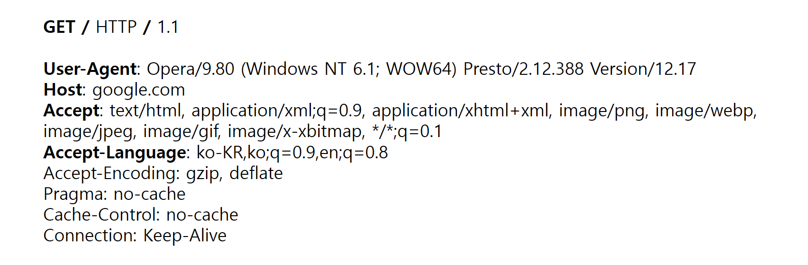
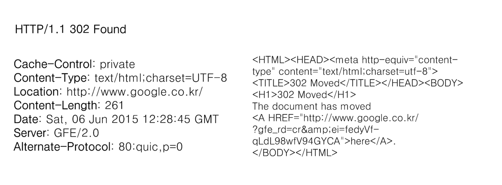
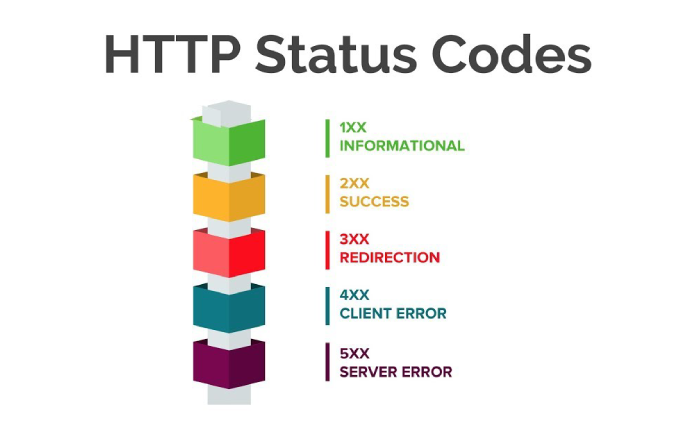

## ✔️Background

### 1. HTTP(하이퍼텍스트 트랜스퍼 프로토콜)

**HTTP**(Hyper Text Transfer Protocol)의 약자이며 **통신 규약**이라는 뜻이다.

맨 처음 **하이퍼텍스트(HT, Hyper Text)**는 **'다른 문서로 향하는 링크가 있는 텍스트'**로 시작했다.

이렇게 문서 내에서 하이퍼텍스트(HT)를 지정하려면, 

특별히 **하이퍼텍스트 마크업 언어(HTML, Hyper Text Markup Language)**를 사용해야 한다.

오늘날의 HTTP는 HTML 문서를 주고받던 간단한 프로토콜에서 벗어나

그림 파일, 동영상, 3D 등 다양한 미디어(HM, Hyper Media) 리소스를 주고 받는 형태로 발전했다.

마찬가지로 HTML도 단순히 하이퍼링크를 위한 마크업 언어에서 다양한 시각적 기능을 제공하는 마크업 언어로 발전했다.

사용자는 브라우저라는 클라이언트를 통해 서버에 HTTP 요청을 전송할 수 있다.

브라우저의 주소창에 URL을 입력하고 엔터를 누르면 브라우저는 HTTP **GET 요청** 을 해당 URL서버로 전송하고 

그 결과인 HTTP 응답을 브라우저에 렌더링(화면에 디스플레이)하는 것이다.

다음의 HTTP 요청에는 송신자의 다양한 정보가 담겨있다. 송신자는 google.com으로 요청을 전송하려 한다. 

**HTTP 요청**에는 ***GET***, ***POST***, ***PUT***, ***DELETE*** 와 같은 메서드를 지정할 수 있다.

이런 메서드는 호스트에 지정한 리소스에 어떤 작업을 하고 싶은지 알려주는 역할을 한다.

HTTP 메서드가 이런 기능을 한다고 하지만 이는 전적으로 API를 개발하는 개발자에게 달려 있다.

각 메서드에 연결되는 API는 개발자가 작성해야 하는 것이고, HTTP 메서드를 통해 실행할  API를 작성해 보아야 한다.

HTTP 요청과 비슷하게 HTTP 응답도 여러 가지 정보를 담고 있다.

HTTP / 1.1 옆에 숫자가 적여 있는데, 이것이 응답코드이다. 

**Content-Type**은 응답의 미디어 타입을 의미한다. 

미디어 타입에는 _text/html, text/css, application/json, video/mpeg_ 등이 있다.

마지막으로 **응답 바디(Response Body)**가 있다.

서버 애플리케이션은 보통 *HTTP 응답 바디* 에 요청 처리 결과를 보낸다.

예를 들어, www.google.com에 **GET 요청**을 보내면 Google은 응답 바디에 Google의 랜딩 페이지 HTML을 넣어 반환한다.

---

### 2. 자바스크립트 오브젝트 노테이션

JSON(Javascript Object Notation) 

