# Today I Learn(2022.01.10 ~ )


### 📙 01/10 Mon

>  스크럼 회의

```
따로 회의실을 잡거나 서류를 통해 업무 내용을 보고하는 방식이 아닌,
자리에 일어나 구두로 업무 내용을 구성원들과 공유하는 회의방식

- 어제한일 / 오늘할일 / 내일할일 1분정도 브리핑!
- 회의 도중 이슈가 튀어나오면, 회의를 마친 후 이슈에 대한 회의일정을 따로 잡는것이 낫다.
```


> SEO 검색최적화

```
- Search Engine Optimization
- 검색엔진이 이해하기 쉽도록 홈페이지의 구조와 페이지를 개발해 검색 결과 상위에 노출될 수 있도록 하는 작업
```


> SEO로 구글 상위 랭크되는 방법

1. 문법에 맞는 HTML 작성하기 
2. 구체적인 페이지 제목 만들기 
3. 메타 태그 활용하기 
4. 이미지에 alt 속성 기재 
5. 이미지 맵에 중요한 링크 사용 피하기 
6. 플래시 전용 페이지 피하기 
7. anchor 태그를 활용한 적절한 키워드 배치
8. 여러 개의 페이지로 나누어진 콘텐츠 검색 최적화 – 시리즈/연재

9. 모든 페이지가 유입 페이지가 되도록 사이트 구성
10. HTTPS 사용 권장


---

### 📙 01/11 Tue

> git commit 컨벤션


- 규칙 1
  - 첫 글자는 대문자로 작성한다. ex) Fix, Add, Change
- 규칙2
  - "고침", "추가", "변경" 등 명령어로 시작하기 ex) Feat : 추가 get data api 함수


```
지금부터 README를 업로드할 때, Docs:수정 README
```


### 왜 자바스크립트가 인기가 많을까?

- frontend에서 쓸 수 있는 유일한 언어

- 모든 브라우저에 내장되어 있어서 설치할 필요가 없다.


### 📙 01/12 Wed

> 화면설계 이미지 생성하기


| 페이지 화면                                                  | 기타                                                         |
| ------------------------------------------------------------ | ------------------------------------------------------------ |
|  | 메인페이지<br /><br /><br /><br />- Hover  기능?<br />- 카테고리 어떻게?<br />- 글 내용 조금 보이기 or not? |
|  | 글 작성 페이지<br /><br /> <br />\- 사진 필수?<br />-카테고리 분류 선택? Or 해시태그 검색<br /><br />-공연 선택? Or 자동문자열 완성? |
|  | 공연 상세 페이지                                             |
|  | SNS 글 상세 페이지                                           |


### 📙 01/13 Thr

> 기능정의서 수정하기


1. SNS 상세페이지


2. 공연정보 상세페이지


3. 프로필 관리


4. 로그인 관리


### 📙 01/14 Fri

> 리액트 공부하기

​	

### JSX의 규칙

1. 태그는 꼭 닫혀있어야 한다. 

2. 모든 태그는 2개이상이 된다면 꼭 하나로 감싸져야 한다.

```react
import React from "react";
class App extends React.Component{
  render(){
     return (
      <div>
         <div>
          첫 번째 div입니다.
         </div>
         <div>
          두 번째 div입니다.
        </div>
     </div>
      )       
    }
}

export default App; 
```

- `<div>`가 2개이기 때문에 그 위에 `<div>`로 감싸줘야만 오류가 나지 않는다 .


### 컴포넌트

- 컴포넌트를 통해 UI를 재사용 가능한 개별적인 여러 조각으로 나누고, 각 조각을 개별적으로 살펴볼 수 있다.

```react
function Welcome(props) {
  return <h1>Hello, {props.name}</h1>;
}
```

**주의: 컴포넌트의 이름은 항상 대문자로 시직한다.**


### 📙 01/17 Mon

# Git 이력 옮기는 방법

1. 원본 저장소의 모든 이력 복사

```bash
git clone --mirror [원본저장소 경로]
```


### 💡 **잠.깐.!!**  

### 오류가 나서 찾아봤더니 mirror대신 bare를 사용했고, 오류를 해결할 수 있었다!!


1. clone한 폴더로 이동

```bash
cd [원본 저장소 이름].git
```

1. 이동할 원격 저장소 경로 지정

```bash
git remote set-url --push origin [이동할 저장소 경로]
```

1. 원격 저장소로 push

```bash
git push --mirror
```

------


# Git Push 취소하는 방법

- 일반적으로 push를 취소하려면 아래와 같이 입력하면 된다.

```bash
git reset HEAD^
```

- 1개를 취소할 때는, HEAD~1, 2개는 HEAD~2와 같이 최근 푸쉬로부터 취소할 개수를 입력해 줄 수도 있다.

```bash
git reset HEAD~2
```

B.U.T. 그러나!!

First Commit만은 쉽게 취소가 되지 않는다!! 그럴때 쓰는 방법!!

```bash
git update-ref -d HEAD
git rm --cached -r .
```

를 입력해주고

```bash
git push -f origin master
```

를 하면 First Commit 마저 지운 깨끗한 상태를 만들 수 있다.


>  리액트의 Virtual DOM


- 변화(Mutation)가 일어날 필요가 있다면, mutation 대신 데이터가 바뀌면 기존의 뷰를 날려버리고 새로 만들어버리면 어떨까? 하는 마음으로 리액트 개발이 시작되었다. 

- 그래서 존재하는 것이 가상의 DOM (실제로 브라우저의 DOM에 새로운 것을 넣는것이 아니라 자바스크립트로 만들어진 가상의 DOM에 렌더링하고 기존의 DOM과 비교해서 정말 변화필요한 DOM에만 업데이트 해준다.)


- 참고 유튜브 

```
https://www.youtube.com/watch?v=BYbgopx44vo
```


### 📙 01/18 Tue


> 리액트가 왜 필요할까?

- 메이저 SNS들 보면, 새로고침 없이 웹 탐색이 가능하다. 

- Web-app은 실제로 앱이 아니지만, 앱과 사용성이 비슷한 것들이다.
- Web-app을 쉽게 만들 수 있는 React / Angular / Vue

- 그중 가장 사용자가 많은 React

- 장점 
  - 모바일앱으로 발행이 쉽다. 
  - 앱처럼 뛰어난 UX
  - 그냥 웹사이트보다 비즈니스적 강점(그래서 요즘 웹개발자의 필수소양)

- 단점
  -  문법 어려움 

---

### React 설치하기

1. 리액트 설치하기

```react
npx create-react-app [프로젝트명]
```

2. 방금 만든 프로젝트명의 폴더 열기
   - **src 폴더 아래 App.js (메인페이지에 들어갈 HTML코드 짜는 곳)**


- 그렇다면 실제 메인페이지는 어디?? (public 폴더 아래 Index.html)


- 즉, App.js에 있는 코드들을 index.html에 다 넣도록 명령!!

​	

3. 내가 만든 프로젝트명 확인(blog)


4. 미리보기를 띄워보고 싶으면, 

```react
npm start
```


---

### react 폴더 기본 구성

Q. nodejs 왜 설치?


- create-react-app 라이브러리를 사용하기 위해서 설치한 것!

- 그러면 npm툴 이용 가능하다. 


Q. node_modules?


- 설치한 라이브러리 모음


Q. public 폴더는?


- 잘 바뀌지 않는 static 파일 보관함

- 왜 public에 보관? 
- 빌드 발행할 때 우리가 짰던 코드들이 압축이 되는데, public폴더에 들어가있으면 압축안되고 보관하기 좋다. 


Q. src 폴더는?


- src는 소스코드 보관함


Q. package.json 파일은?


- 설치한 라이브러리 목록

---

## JSX를 이용해 HTML 페이지 제작하기

HTML처럼 생겼지만, JSX이다. 


- `<header>`태그 다 지워주기 


- 그냥 이 괄호 안에 내가 알던 HTML코딩하기


- HTML에서 class="" 했던 것과 달리 JSX에서는 className을 쓴다. 그 이유는 자바스크립트 문법에 class가 있기 때문!!


- 태그에 class를 주고 싶을땐, 

```react
<div className="클래스명"></div>
```


|                            App.js                            |                           App.css                            |
| :----------------------------------------------------------: | :----------------------------------------------------------: |
|  |  |

- 결과물 검정 navbar 완성


- HTML이랑 비슷한데 왜 react를 쓰는거지?

  - 데이터 바인딩이 쉽기 때문!!
  - 바인딩 : [국어사전]프로그램에서 모든 주소를 절대 주소로 바꾸어 주기억 장치의 고정된 부분에 묶어 놓는 일.

  - 데이터바인딩 : 서버에서 데이터를 가져와서 보여주는것 


|                   전통 자바스크립트 바인딩                   |                   리액트 바인딩 : {변수명}                   |
| :----------------------------------------------------------: | :----------------------------------------------------------: |
|  |  |

- 훨씬 직관적이고 쉽다.

- 변수명 뿐 아니라, 함수도 가능 (html을 동적으로 만들 수 있다. )


- 이미지 가져오기


```
src, id, href 등의 속성에도 {변수명, 함수 등}
```

- 거의 상상하는 모든곳에 {} 중괄호 활용가능


---

### JSX에서 style을 바꾸고싶다!?


- 이런식으로 하면 오류가 난다!! 자바스크립트에서 쓸 수 있는 민감한 기호가 많기 때문!
- 무조건 object 형식으로 넣어야 한다!!!!
- 무조건 중괄호!!!


- style = {object 자료형으로 만든 스타일}

```react
<div style={ { color : 'blue' } }
```


- font-size : '30px'과 같이 쓸 수가 없다. 자바스크립트 상에서 -(dash)는 뺄셈을 의미하기 때문


- camelCase 작명습관을 가지도록 하자!!! 
- 스타일 속성 2개 이상을 넣어줄때는 콤마를 이용하자!

```react
<div style = { {color : 'blue', fontSize : '30px' } }
```


- 변수명으로 넣어서 활용도 가능


- posts변수를 만들어서 


- 이렇게도 가능하다.

---


### 📙 01/19 Wed


### 블로그 글 목록 만들기 / State 개념 배우기

> 중요한 데이터는 변수말고 리액트 state로 만들자!!


|                            App.js                            |                           App.css                            |
| :----------------------------------------------------------: | :----------------------------------------------------------: |
| 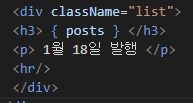 |  |

- 지금 현재 , posts라는 변수에 데이터를 저장하고, { post }에서 데이터 바인딩


> 데이터 보관방법은 2가지 

 - 변수에 보관
 - state에 보관


> state 만들자


- 리액트에 있는 내장함수 하나를 쓰겠습니다! 라고 한것
  - useState를 쓰겠습니다.


```react
useState('남자 코트 추천'); 
```

- 이런식으로 하면, array(배열)이 [a, b]와 같은 형태로 남는다. 
  - a에는 남자 코트 추천 (진짜데이터)
  - b에는 남자 코트 추천 state 정정해주는 함수

- 그러니 변수에 저장을 해주자.

```
let [글제목,글제목변경] = useState('남자 코트 추천');
```

- a랑 b라는 변수를 만들겠습니다. 
- userState에 있던 a, b를 각각 넣어주세요 


>  ES6 destructuring 문법

- array, object에 있던 자료를 변수에 쉽게 담고싶을때!

  ex) var [a, b] = [10, 100]; 데이터를 각각 변수에 담고싶다면?

  var a = 10

  var b = 100


- 웹이 앱처럼 동작하게 만들고 싶으면, 중요한 데이터는 모두 state에 보관해야 한다.
- state에 만들어진 데이터가 바뀌면 *HTML이 새로고침 없이 스무스하게 재 랜더링*된다!!

- 그냥 변수에 저장된 것을 고치면 재랜더링이 아니라 ***새로고침***이 된다.


```react
# App.js

import React, { useState } from 'react';
import logo from './logo.svg';
import './App.css';

function App() {

  let [글제목,글제목변경] = useState(['남자 코트 추천','추천2','추천3']); 

  let posts = '강남 고기 맛집';
  return (
    <div className="App">
      <div className="black-nav">
        <div>개발 Blog</div>
      </div>
      <div className="list">
      <h3> { 글제목[0] } </h3>
      <p> 1월 18일 발행 </p>
      <hr/>
      </div>
      <div className="list">
      <h3> { 글제목[1] } </h3>
      <p> 1월 19일 발행 </p>
      <hr/>
      </div>
      <div className="list">
      <h3> { 글제목[2] } </h3>
      <p> 1월 19일 발행 </p>
      <hr/>
      </div>
    </div>
  );
}

export default App;
```


### eslint 

- 노란색 경고는 괜찮다! - 잘못된 코딩 습관을 잡아주는  라이브러리!

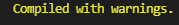

- warning을 제거하고 싶으면 맨 위 상단에

```
/* eslint-disable */
```


- 좋아요 버튼을 만들어보자

- 클릭하면 좋아요 수가 올라가게하려면
  - 자바스크립트였다면, addEventListner를 활용했을 것이다. 
  - 그러나 리액트는 
  - `onClick={클릭될때 실행할 JS}`

```
<span onClick="">
```


- 따봉변경은 따봉을 대체할 함수


```react
 let [따봉,따봉변경] = useState(0);

<h3> { 글제목[0] } <span onClick={ ()=> {따봉변경(따봉+1)} }>👍</span> {따봉} </h3>
```

- 내가 했던 실수 
  - 따봉 변수를 {} 중괄호로 감싸주지 않음
  - onclick다음에 "" 따옴표를 제거하지 않음
  - let변수 선언 이후 ; 세미콜론을 적지 않음


- '제목바꾸기()' 
  - 만약 소괄호와 함께 작성하면 바로 실행
  - 클릭을 했을때 실행하려면 소괄호 없이 써야한다. '제목바꾸기'


```react
function 제목바꾸기(){
    글제목변경(['여자 코트 추천','추천2','추천3']);
  }
```

- 이거는 너무 하드코딩 스럽다!! 개발자 스럽게 하려면?


- copy는 deep copy 해야한다. 

- array나 object는 그냥 복사가 아니라 값 공유를 하게된다. 

- reference data type 특징이다.


> Spread Operator

```
var newArray = [...글제목];
```

- ...을 붙이면, '중괄호 대괄호를 다 제거해주세요 라는 의미'
- 그런데 그 바깥에 다시 [] 대괄호를 붙였으므로 딥 카피 완료!

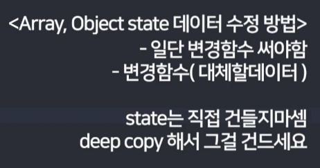

```react
function 제목바꾸기(){
    var newArray = [...글제목];
    newArray[0] = '여자코트 추천';
    글제목변경( newArray );
  }
```


정렬을 하려면? -> .sort()

```
function 제목바꾸기(){
    var newArray = [...글제목];
    newArray.sort();
    글제목변경( newArray );
  }
```


---

## 글 상세페이지 UI 만들기

- 페이지 구분은 라우터를 써야하는데, 일단 pass

- 간단하게 Modal창으로 띄우는 상세페이지

```react
# App.js

	<div className="modal">
        <h2> 제목 </h2>
        <p> 날짜 </p>
        <p> 상세내용 </p>
    </div>
```


```react
# App.css

.modal {
  margin-top : 20px;
  padding : 20px;
  background : #eee
}
```


- return 소괄호 안에 div가 연달아서 쓸 수 없다. 
- 항상 하나의 html태그만 / 여러개 평행 불가능 
- 여러개 평행하고싶으면 감싸서 만들자!!!


- div가 너무 많아서 복잡해보일때, 

### HTML태그를 한 단어로 줄여서 쓸 수 있는 방법! -> Component!

리액트의 Component 문법

- 나만의 단어로 치환해서 HTML 쓸 수 있다. 

```
<Modal></Modal>
```


## Component 만들기


```react
import React, { useState } from 'react';
import logo from './logo.svg';
import './App.css';

function App() {

  let [글제목,글제목변경] = useState(['여성 코트 추천','아이 코트 추천','남성 코트 추천']); 
  let posts = '강남 고기 맛집';
  let [따봉,따봉변경] = useState(0);

  // function 제목바꾸기(){
  //   var newArray = [...글제목];
  //   newArray.sort();
  //   글제목변경( newArray );
  // }


  return (
    <div className="App">
      <div className="black-nav">
        <div>개발 Blog</div>
      </div>
      {/* <button onClick={ 제목바꾸기 } >버튼 </button> */}
      <div className="list">
      <h3> { 글제목[0] } <span onClick={ ()=> {따봉변경(따봉+1)} }>👍</span> {따봉} </h3>
      <p> 1월 18일 발행 </p>
      <hr/>
      </div>
      <div className="list">
      <h3> { 글제목[1] } </h3>
      <p> 1월 19일 발행 </p>
      <hr/>
      </div>
      <div className="list">
      <h3> { 글제목[2] } </h3>
      <p> 1월 19일 발행 </p>
      <hr/>
      </div>

      <Modal />

    </div>
  );
}

function Modal(){
  return(
      <div className="modal">
        <h2> 제목 </h2>
        <p> 날짜 </p>
        <p> 상세내용 </p>
      </div>
  ) 
}

export default App;
```


> Component 유의사항

 1. 이름은 항상 대괄호

    - 소괄호로 만들면 랜더링이 되지않는다!!!

    

	2. return() 안에 있는건 태그 하나로 묶어야 한다. 

    - 주로`<div></div>`로 묶는데, 
    - 이렇게 묶기 싫다면 fragment를 사용한다. `<></>`


- Html 덩어리들은 여러개를 나란히 쓸 수 있다. 

```react
function Modal(){
  return(
      <div className="modal">
        <h2> 제목 </h2>
        <p> 날짜 </p>
        <p> 상세내용 </p>
      </div>
  ) 
}

function Nav(){
  return(
    <div className="black-nav">
      <div>개발 Blog</div>
    </div>
  ) 
}

function List(){
  let [글제목,글제목변경] = useState(['여성 코트 추천','아이 코트 추천','남성 코트 추천']); 
  let posts = '강남 고기 맛집';
  let [따봉,따봉변경] = useState(0);

  return(
  <>
  <div className="list">
  <h3> { 글제목[0] } <span onClick={ ()=> {따봉변경(따봉+1)} }>👍</span> {따봉} </h3>
  <p> 1월 18일 발행 </p>
  <hr/>
  </div>
  <div className="list">
  <h3> { 글제목[1] } </h3>
  <p> 1월 19일 발행 </p>
  <hr/>
  </div>
  <div className="list">
  <h3> { 글제목[2] } </h3>
  <p> 1월 19일 발행 </p>
  <hr/>
  </div>
  </>
  ) 
}
```

- 아래에 따로 컴포넌트를 관리하니까 훨씬 간편해졌다. 

```react
function App() {

  return (
    <div className="App">
      <Nav />

      <List />

      <Modal />

    </div>
  );
}
```


> Component 만드는 기준

- 반복 출현하는 HTML덩어리들

- 자주 변경되는 HTML UI들 (성능면에서 좋다.)

- 다른페이지 만들때도 컴포넌트로 만듦
- Component 많이 만들면 어떤 단점이 있을까?
  - 모든 변수의 범위는 function안에 있기 때문에 state 쓸 때 복잡해진다.	
  - 그러려면 상위 component에서 만든 state를 쓰렴녀 props 문법을 이용해야 한다.

---

### 클릭하면 동작하는 Modal창 만드는 방법

- 자바스크립트 방식은 
  - 모달창을 만들어놓고, 
  - style = "display : none" 했다가,
  - style = "display : block"

- 리액트 방식은
  - if문 안에  `<Modal />`을 넣어서??


- 자바스크립트 표현식 넣기 위해서 {}중괄호 넣어서 쓰면 될거같지만, 
- if문은 인식이 안된다. if 대신에 쓸 수 있는 문법이 있다!!!!
- 자바스크립트 문법 ***삼항연산자!***


### 삼항연산자

- if else문의 대체문법

- { 조건 ? True : False }


- 중괄호 내 사용가능


- 다음형태로 정리해서 많이 쓴다!


- 모달창이 보이고 안보이고 어떻게?
  - 리액트에선 UI를 만들때 데이터를 이용한다.
  - 스위치 켜고 끄기?
  - state 데이터를 이용한다. 
  - 즉, state로 UI보임 / 안보임 스위치를 넣는다. 


- 사이트를 첫 로드할때 모닫ㄹ창이 안보였다가, 제목을 누르면 모달창 보이게 하기
- 글제목을 누르면 모달창이 열리게 어떻게?


- 내 시도 (틀림)
  - onClick 중괄호 안에 함수부터 해줘야하는데 깜빡함
  - 중괄호로 한번 더 감싸줘야 함

```react
<h3 onClick={modal변경(true)}> { 글제목[2] } </h3>
```

- 정답

```
<h3 onClick={ () => {modal변경(true)}}> { 글제목[2] } </h3>
```


### State에는

- 데이터도 들어가고

- UI의 상태도 들어간다.(true / false)


```react
import React, { useState } from 'react';
import logo from './logo.svg';
import './App.css';

function App() {

  let [modal, modal변경] = useState(false);

  let [글제목,글제목변경] = useState(['여성 코트 추천','아이 코트 추천','남성 코트 추천']); 
  let posts = '강남 고기 맛집';
  let [따봉,따봉변경] = useState(0);

  return(
    <div className="App">
      <Nav />

      <div className="list">
      <h3> { 글제목[0] } <span onClick={ ()=> {따봉변경(따봉+1)} }>👍</span> {따봉} </h3>
      <p> 1월 18일 발행 </p>
      <hr/>
      </div>
      <div className="list">
      <h3> { 글제목[1] } </h3>
      <p> 1월 19일 발행 </p>
      <hr/>
      </div>
      <div className="list">
      <h3 onClick={ () => {modal변경(true)}}> { 글제목[2] } </h3>
      <p> 1월 19일 발행 </p>
      <hr/>
      </div>

      {
        modal === true
        ? <Modal />
        : null
      }

    </div>
  );
}

function Modal(){
  return(
      <div className="modal">
        <h2> 제목 </h2>
        <p> 날짜 </p>
        <p> 상세내용 </p>
      </div>
  ) 
}

function Nav(){
  return(
    <div className="black-nav">
      <div>개발 Blog</div>
    </div>
  ) 
}

export default App;
```


### 버튼 클릭할때마다 모달창 생겼다 없어졌다 하기

```react
<button onClick={ () => { modal === false ? modal변경(true) : modal변경(false) } }>버튼</button>
```

라고 했는데, 이런 방법도 있다. 

```react
<button onClick = {() => {modal변경(!modal)}}>열고닫는버튼</button>
```

- ! 느낌표 기호를 modal이라는 state에 붙이면 지금 state를 반대로 만들어준다. 


---


### 📕 01/24 Mon


### 반복문

- 리액트에선 HTML도 반복문으로 반복시킬 수 있다. 


### 반복문 쓰는법

- 중괄호 안에는 {변수명, 함수명}만 넣을 수 있다.
  - {} 중괄호 안에 for 등을 못 넣는다. 
- 반복문을 쓰려면 중괄호 안에 map()함수를 써야한다.
  - map() 함수는 array에 붙일 수 있는 함수
  - 

```react
var 어레이 = [2,3,4];

var 뉴어레이 = 어레이.map(function(a){
    return a * 2
  });

-> 뉴어레이 = [4,6,8]이 된다!!
```

- a라는 파라미터는 array안에 있던 하나하나의 데이터들에 2씩 곱해서 새로운 array를 만들어준다.

- map함수는 반복문 역할


```react
let [글제목,글제목변경] = useState(['여성 코트 추천','아이 코트 추천','남성 코트 추천']); 

{
    글제목.map(function(){
        return <div>안녕</div>
    })
    
}
```


```react
{
    글제목.map(function(){
        return (
        <div className="list">
            <h3> { 글제목[1] } </h3>
            <p> 1월 19일 발행 </p>
            <hr/>
      	</div>
      )
    })
    
}
```

- 보통 html들을 소괄호로 감싸준다.


- 그러면 다음과 같이..같은 데이터만 세번 반복되는 것을 확인할 수 있다.


- 이럴때는 파라미터를 이용해준다. - array안에 있던 하나하나의 데이터 

```react
{
        글제목.map(function( 글 ){
            return (
            <div className="list">
                <h3> { 글 } </h3>
                <p> 1월 19일 발행 </p>
                <hr/>
            </div>
          )
})
```

- 다음과 같이 글 이라는 파라미터를 활용하면 


- 리스트 안에 있던 요소들이 각각 나와서 제목이 되는 것을 확인할 수 있다. 


### 따봉도 반복이 가능한가?


- 하나의 state라서... 공유가 되기 때문에 값이 같이 올라가는 것을 확인할 수 있다. 


> 반복문을 쓰고 싶다면?


```react
function 반복된UI(){

    var 어레이 = [];

    for (var i = 0; i < 3; i++){
      어레이.push(<div>안녕</div>);
    }

    return 어레이
  }

  

  return(

      { 반복된UI() }
```


- for in 과 for of는 원래 기능과 동일하다.


- 각각 좋아요 만들기

```react
function App() {
  let [title, titleSet] = useState([
    "남자 코트 추천",
    "강남 우동 맛집",
    "리액트 독학"
  ]);
  let [like, setLike] = useState([0, 0, 0]);

  return (
    <div className="App">
      <div className="black-nav">
        <div>개발 Blog</div>
      </div>
      {title.map((a, i) => {
        return (
          <div className="list" key={a}>
            <h3>
              {a}
              <button
                onClick={() =>
                  setLike((arr) =>
                    arr.map((el, idx) => (idx === i ? el + 1 : el))
                  )
                }
              >
                <span role="img" aria-label="good">
                  ğŸ‘
                </span>
              </button>
              <button
                onClick={() =>
                  setLike((arr) =>
                    arr.map((el, idx) => (idx === i ? el - 1 : el))
                  )
                }
              >
                <span role="img" aria-label="bad">
                  ğŸ‘
                </span>
              </button>
              {like[i]}
            </h3>
            <p>2월 18일 발행</p>
            <hr />
          </div>
        );
      })}
    </div>
  );
}
```


---

### Props 

>  자식이 부모의 state를 가져다 쓰고 싶을땐 말하고 쓰기!!


전해주고 싶은 데이터를 


App이라는 컴포넌트 안에 Modal컴포넌트 넣어놨다. 


- App이 가진 State를 쓸 수 있게 전송을 해줘야 자식컴포넌트는 부모 컴포넌트가 가진 state를 사용 가능하다.


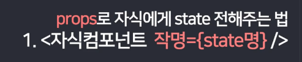

- 보통은 작명을 생략하고 state명과 똑같이 써준다.

```react
<Modal title={title} />
```


- 자식컴포넌트는 부모컴포넌트가 가진 state를 쓰려면 props로 전송해줘야 쓸 수 있다. 

```react
function Modal(props){
  return(
      <div className="modal">
        <h2> {props.title[0]} </h2>
        <p> 날짜 </p>
        <p> 상세내용 </p>
      </div>
  ) 
}
```

---

### 그렇다면 제목을 누를때 각각 모달창이 뜨게 어떻게 할 수 있나?

- 몇번째 제목 눌렀는지 상태정보를 state에 저장하고

- state에 따라서 UI가 수정되게 만든다.
  - if문을 쓰든, for반복문을 쓰든..


```react
let [num, numSet] = useState(0);

{
    modal === true
    ? <Modal title={title} num={num} />
    : null
}


function Modal(props){
  return(
      <div className="modal">
        <h2> {props.title[props.num]} </h2>
          <p> 날짜 </p>
        <p> 상세내용 </p>
      </div>
  ) 
}
```


```react
	  <button onClick={ ()=> {numSet(0)} } >버튼1</button>
      <button onClick={ ()=> {numSet(1)} } >버튼2</button>
      <button onClick={ ()=> {numSet(2)} } >버튼3</button>
```


- map함수의 두번째 파라미터 i는 1씩 증가되는 파라미터


```react 
{
        title.map(function( a, i ){
            return (
              <div className="list" key={a}>
              <h3 onClick={ ()=> {numSet(i)} }>
                {a}
                  .....
```

---

### react에서 사용자의 input을 받는법


- onChange()와 onInput()은 같다. 


- input창에 글자를 쓸때마다, 콘솔에 안녕 출력하기


- 안녕 말고 사용자가 입력한 값을 출력하려면?


- e는 event / value는 이벤트가 동작한 곳 

- onChange라는건 input에 무언가 입력할 때마다 특정 함수를 동작시키고 싶을 때 사용헌다. 

  그래서 입력할 때마다 console.log(e.target.value)를 콘솔창에 출력하라고 써놓은 것 

  e.target이라는건 쌩자바스크립트 문법으로 '지금 이벤트가 동작하는 HTML요소'

  .value라는건 input등에 입력한 값을 의미한다. 

```react
<input onChange={ ()=>{ e.target.value } } />
```


- 오잉 왜 오류가 뜨는거지?


```react
<input onChange={ (e)=>{ console.log(e.target.value) } } />
```

- 일단 이렇게 하니까 오류가 해결되었다.


- 다음과 같이 input에 입력된 값들 출력


### input값을 state에 저장하려면?

```react
<input onChange={ (e)=>{ inputValueSet(e.target.value) } } />
{inputValue}
```


- 콘솔창에 등장하는 warning은 error가 아니다. 잘 동작은 한다.

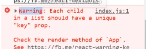


- key를 적어줘야 warning이 생기지 않는다.

```react
 {
        title.map(function( a, i ){
            return (
              <div className="list" key={a}>
              <h3 onClick={ ()=> {numSet(i)} }>
                {a}
```

---

### 블로그 글 발행기능을 만들어보자


| App.js                                                       | App.css                                                      |
| ------------------------------------------------------------ | ------------------------------------------------------------ |
| 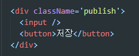 |  |


Q. 글 발행기능 만들기 - 글 적고 저장버튼 누르면 글이 위에 하나 떠야한다.


- 사용자가 입력한 글을 state로 저장하기

```react
<input onChange={ (e)=> { inputValueSet(e.target.value) }  } />
```


- 저장버튼을 누르고 글 목록을 추가하기
  - 원래있던 배열에 데이터 하나를 추가해주면 된다.
  - .unshift(); - 배열 앞에 값을 추가

```react
title.unshift(inputValue);
```

- 이렇게 state 데이터를 직접 변경하는 것은 나쁜 관습!! 

- 그럼 어떻게?? 사본을 만들어서 수정하기

```react
<div className='publish'>
        <input onChange={ (e)=> { inputValueSet(e.target.value) }  } />
        <button onClick={ () => { 
            var arrayCopy = [...title];
            arrayCopy.unshift(inputValue);
            titleSet( arrayCopy );
          } }>저장</button>
</div>
```


---

### react bootstrap 적용하기

```bash
npm install react-bootstrap bootstrap@5.1.3
```

- bash에 다음과 같은 명령어 입력하기

```bash
yarn add react-bootstrap bootstrap@5.1.3
```

- npm install 혹은 yarn add 둘중 하나 이용


- index.html에 복붙하기
- cdn방식으로 라이브러리 첨부하기

```html
<link
      rel="stylesheet"
      href="https://cdn.jsdelivr.net/npm/bootstrap@5.1.3/dist/css/bootstrap.min.css"
      integrity="sha384-1BmE4kWBq78iYhFldvKuhfTAU6auU8tT94WrHftjDbrCEXSU1oBoqyl2QvZ6jIW3"
      crossorigin="anonymous"
/>
```


---

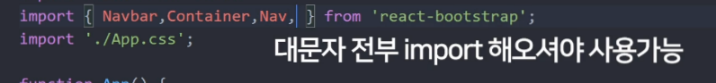

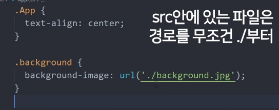


- src에 넣은 파일은 파일명 변경 + 압축된다.
- public 폴더에 넣은 파일은 보존된다.


- 3등분 하고싶다?

```js
<div className="container">
    <div className="row">
        <div className="col-md-4"> 박스 </div>
 		<div className="col-md-4"> 박스 </div>
 		<div className="col-md-4"> 박스 </div>
	</div>
</div>
```


---

### import 와 export 사용하기

- 데이터 바인딩할 상품데이터 3개
- 하나하나의 상품 정보를 object {} 자료형에 담았으며 이거 3개를 하나의 array에다가 담았다.

```react
[
  {
    id : 0,
    title : "White and Black",
    content : "Born in France",
    price : 120000
  },

  {
    id : 1,
    title : "Red Knit",
    content : "Born in Seoul",
    price : 110000
  },

  {
    id : 2,
    title : "Grey Yordan",
    content : "Born in the States",
    price : 130000
  }
] 
```


- 연습용 데이터가 너무 길어서 다른파일로 잘라내자.
  - 그 다음에 state로 저장하고 데이터바인딩 할것!


### useState를 쓸때는 꼭 import 잊지말고 할것

```
import React, {useState} from 'react';
```


- 새로운 js파일을 만들었다면, export default 적기 


### 📙 01/25 Tue

### 프로젝트 적용 - 아이콘 바꾸기

- 위에 아이콘 바꾸기!

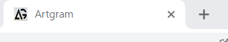

- 기본 세팅


- 아래로는 스크롤 내릴 수 있고, 옆으로는 스크롤바 없게 만들기

- border-box 사이즈로 지정해주기

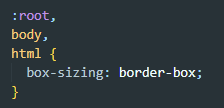


- 내가 쓸 모든 html 태그들에 일괄 적용해주기

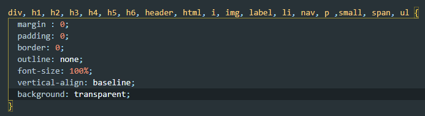


- 일단 2개 설치해준다. 

```bash
$ yarn add react-router-dom@5
```

```bash
$ yarn add styled-components
```


- LoginPage.js에서 잠시 작업해주고, App.js로 간다.

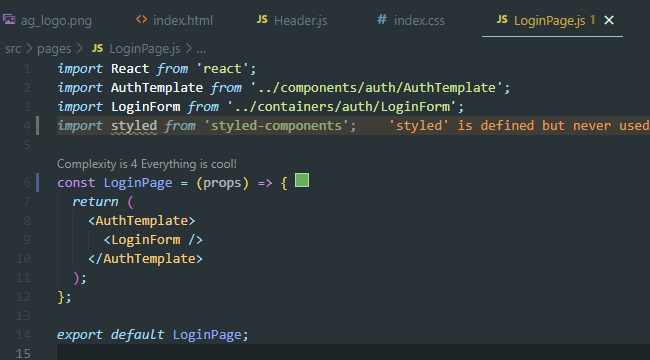


---


```react
import logo from '../../images/ag_logo.png'

<NavLink to="/" className="logo" >
            </img>
</NavLink>

```

- 네브바에 로고가 잘 적용이 되지 않는다. 보류...

- 열심히 적어두었지만, 네브바가 중복되어 일단 보류~~

```react
const Nav = styled.nav`
  max-width: 1128px;
  margin: auto;
  padding: 12px 0 16px;
  display: flex;
  align-items: center;
  position: relative;
  justify-content: space-between;
  flex-wrap: nowrap;

  & > a {
    width: 135px;
    height: 34px;
    @media(max-width: 768px){
      padding: 0.5px
    }
  }

`;


const Join = styled.a`
  font-size: 16px;
  padding: 10px 12px;
  text-decoration: NamedNodeMap;
  border-radius: 6px;
  color: rgba(0, 0, 0, 0.6);
  margin-right: 12px
  &:hover {
    background-color : rgba(0, 0, 0, 0.08);
    color : rgba(0, 0, 0, 0.9);
    text-decoration: none;
  }
`;
```


### 📙 01/26 Wed

> 오류와의 싸움...!!


팀원들은 이상 없이 실행이 된다는데,, 같은 코드로 나만 실행이 되지 않았다..

npm이나 yarn 어떤 명령어를 써도 실행이 되지 않았기 때문에..

오류 해결에 들어갔다.

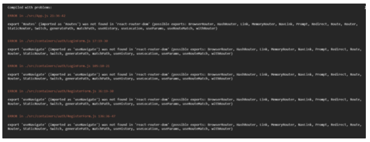

우선, 오류들을 쭉 보니까

<aside> 💡 was not found in 'react-router-dom'

</aside>

라는 오류 문구가 공통적으로 있었다.

거기서 react-router-dom 부분이 문제가 있구나 라는 생각이 들어서 위로 올라가서

```bash
import { Route, Routes } from "react-router-dom";
```

import 부분에서 BrowserRouter as ~~~ 라는식으로도 바꿔보았지만.. 해결되지 않았다.

그래서 구글링을 통해 해결 방법을 모색했다.

react-router-dom 관련 오류 블로그 중

```bash
$ yarn add react-router-dom
$ yarn add cross-env --dev
$ npm install react-router-dom --save
```

이 명령어들도 활용해 봤지만... 해결되지 않았다.

그래서 다른 방법을 찾아보기로 했다.

------

내가 참고했던 블로그에서 yarn 과 npm 관련 정리내용을 가져왔다.

yarn과 npm에 대해 정리해보았다.

### npm

- 노드 패키지 매니저
- js 프로그래밍을 위한 패키지 관리자
- node.js의 기본 패키지 관리자

### yarn

- npm의 비결정적인 구조, 속도가 느린 문제점을 해결하기 위해 개발된 도구
- npm과 호환되므로 같이 사용 가능

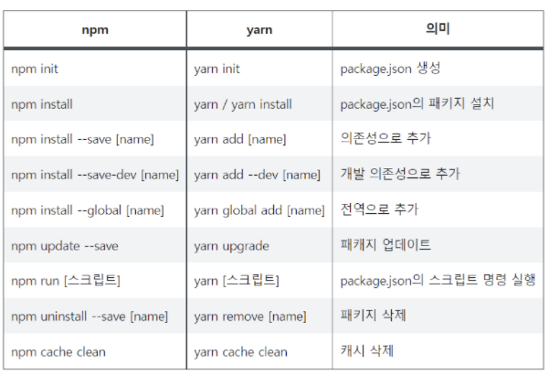

출처 : https://velog.io/@uoayop/React-Failed-to-compile.-Module-not-found-Cant-resolve-react-router-dom

------

구글링을 통해

다음으로 의심 되는 부분은 node-modules이다...

그래서 npm 모듈을 재설치 하기로 마음먹었다.

1. package-lock.json파일 삭제
2. node_modules 삭제
3. npm설치

```bash
$ npm install
```

결과는...

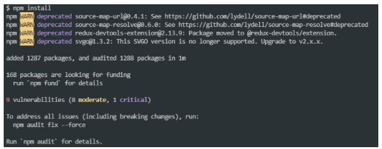

아무것도 해결된 것이 없었다...

------

다음으로 의심되는 부분은 proxy의 포트 4000으로 되어있다고 하니까.. 3000으로 실행해보기

- 명령어를 통한 구동 실패..

```bash
PORT=3000 npm start
```

- package.json 파일을 수정해봐도 안된다...

```bash
"scripts": {
    "start": "set PORT=3000 && react-scripts start",
```

------

다음으로 검색한 것은

<aside> 💡 export 'Routes' (imported as 'Routes') was not found in 'react-router-dom’

</aside>

이대로 구글링을 해봤더니

신빙성 있는 두 가지 사례가 있었다.

1. npm과 Yarn이 충돌난 것. 둘중 하나를 지우고 하나만 이용하기

2. react-router와 react-router-dom의 버전이 다를 수 있다는 것.

   따라서 둘을 삭제하고 다시 설치해보기

   

```bash
$ npm uninstall react-router
$ npm uninstall react-router-dom
$ npm install react-router react-router-dom
```

이로써 겨우 해결 완료 😭


