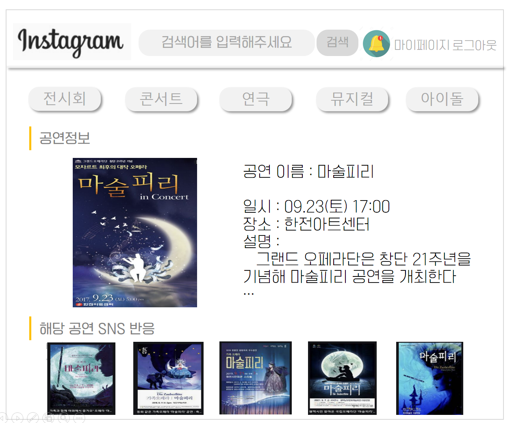

# Today I Learn(2022.01.10 ~ )


### 📙 01/10 Mon

>  스크럼 회의

```
따로 회의실을 잡거나 서류를 통해 업무 내용을 보고하는 방식이 아닌,
자리에 일어나 구두로 업무 내용을 구성원들과 공유하는 회의방식

- 어제한일 / 오늘할일 / 내일할일 1분정도 브리핑!
- 회의 도중 이슈가 튀어나오면, 회의를 마친 후 이슈에 대한 회의일정을 따로 잡는것이 낫다.
```


> SEO 검색최적화

```
- Search Engine Optimization
- 검색엔진이 이해하기 쉽도록 홈페이지의 구조와 페이지를 개발해 검색 결과 상위에 노출될 수 있도록 하는 작업
```


> SEO로 구글 상위 랭크되는 방법

1. 문법에 맞는 HTML 작성하기 
2. 구체적인 페이지 제목 만들기 
3. 메타 태그 활용하기 
4. 이미지에 alt 속성 기재 
5. 이미지 맵에 중요한 링크 사용 피하기 
6. 플래시 전용 페이지 피하기 
7. anchor 태그를 활용한 적절한 키워드 배치
8. 여러 개의 페이지로 나누어진 콘텐츠 검색 최적화 – 시리즈/연재

9. 모든 페이지가 유입 페이지가 되도록 사이트 구성
10. HTTPS 사용 권장


---

### 📙 01/11 Tue

> git commit 컨벤션


- 규칙 1
  - 첫 글자는 대문자로 작성한다. ex) Fix, Add, Change
- 규칙2
  - "고침", "추가", "변경" 등 명령어로 시작하기 ex) Feat : 추가 get data api 함수


```
지금부터 README를 업로드할 때, Docs:수정 README
```


### 왜 자바스크립트가 인기가 많을까?

- frontend에서 쓸 수 있는 유일한 언어

- 모든 브라우저에 내장되어 있어서 설치할 필요가 없다.


### 📙 01/12 Wed

> 화면설계 이미지 생성하기


| 페이지 화면                                                  | 기타                                                         |
| ------------------------------------------------------------ | ------------------------------------------------------------ |
|  | 메인페이지<br /><br /><br /><br />- Hover  기능?<br />- 카테고리 어떻게?<br />- 글 내용 조금 보이기 or not? |
|  | 글 작성 페이지<br /><br /> <br />\- 사진 필수?<br />-카테고리 분류 선택? Or 해시태그 검색<br /><br />-공연 선택? Or 자동문자열 완성? |
|  | 공연 상세 페이지                                             |
|  | SNS 글 상세 페이지                                           |


### 📙 01/13 Thr

> 기능정의서 수정하기


1. SNS 상세페이지


2. 공연정보 상세페이지


3. 프로필 관리


4. 로그인 관리


### 📙 01/14 Fri

> 리액트 공부하기

​	

### JSX의 규칙

1. 태그는 꼭 닫혀있어야 한다. 

2. 모든 태그는 2개이상이 된다면 꼭 하나로 감싸져야 한다.

```react
import React from "react";
class App extends React.Component{
  render(){
     return (
      <div>
         <div>
          첫 번째 div입니다.
         </div>
         <div>
          두 번째 div입니다.
        </div>
     </div>
      )       
    }
}

export default App; 
```

- `<div>`가 2개이기 때문에 그 위에 `<div>`로 감싸줘야만 오류가 나지 않는다 .


### 컴포넌트

- 컴포넌트를 통해 UI를 재사용 가능한 개별적인 여러 조각으로 나누고, 각 조각을 개별적으로 살펴볼 수 있다.

```react
function Welcome(props) {
  return <h1>Hello, {props.name}</h1>;
}
```

**주의: 컴포넌트의 이름은 항상 대문자로 시직한다.**


