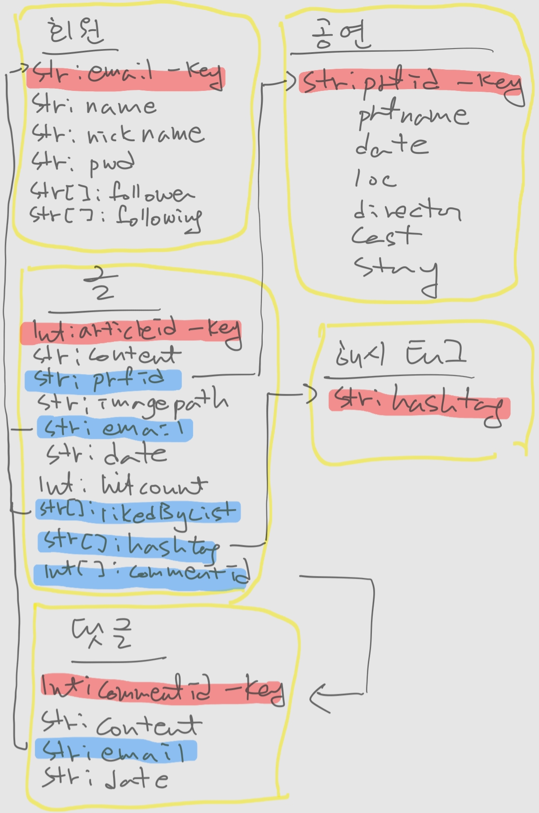

# 계절학기
## PJT와 아이디어에 대해
- 많은 아이디어를 내어 정리하기
- PJT는 실제 제품으로 쓸만한 것(보여주기식 PJT 지양)

## 공부 조언
- 좋은 개발문화에 어울리는 태도를 함양할 것(ex 옳게 질문하는 방법)
- 어설프게 다양하게 하지 말고 잘 하는 거, 1인분 한다할 것 만들기
- 코테준비는 꾸준히. 문제 200개는 풀어보라
- FE
    - HTML, CSS, JS
    - framework 공식문서 읽고 담긴 철학, 개념 학습
    - 컴포넌트 기반 포트폴리오
    - Vue.js보단 React
- BE
    - 구현은 누구나 가능하지만
    - DI, IoC, AOP의 개념 정확히 대답하는 사람은 그보다 적다.
    - 공식문서 끼고 살 것
    - 도서 토비의 스프링, 강의는 백기선 추천, 버전은 바뀌어도 개념은 동일하다.
    - Redis, mongoDB, JPA에 관심둘 것, 단순이 최신이라서가 아니라 필요해서
    - Django보단 Spring
## 취준 정보
- 개발 취준의 3기둥은 **CS, PJT, 코테**
- 목표회사에 따라 다른 전략 필요
    - 유명 기술기업(네카라쿠배 등) 
        - 코테는 플레4 이상이면 무난
        - 수시채용의 경우 PJT 중요하며 바로 1인분 할 사람 선호
    - 대기업 
        - 코테는 골드4 이상이면 무난
        - 개발실력보단 인성 위주
        - PJT는 서류 훑는 정도
        - 회사의 비즈니스에 대한 관심 필요
        - 도망 안갈 거 같은 못갈 거 같은? 사람 선호

# 1월 10일
## 2학기 간략 안내
### 2학기에 늘 할 것
팀 repo 기준으로
- 1일 1커밋
- 1주 40시간어치 JIRA
### 1주차
- 개인평가
- 기획, 설계
### 2~3주차
- 팀평가
- 구현
- 3주 마지막날 발표
### 4~5주차
- 5주차까진 마무리되어야
- 그 후 검증, 배포, 유지보수
### 기타
- 구린 기술스택 지양(jQuery, JSP 등)
- 도전적인 스택으로 어필(채팅의 경우 firebase보단 웹소켓 + Redis)

## 기획에 대해 받은 피드백
- SNS라면 검색에 잘 걸릴 수 있어야(SSR, meta tag나 SEO 등에 대해 고민할 것)
- 작품 위주든 커뮤니티 위주든 둘 다 괜찮아보이고 작품 위주의 경우 초반 유입에 유리하며 커뮤니티 확대로 유인할 수 있다.

## 좋은 코드를 많이 보라는 피드백
좋은 코드를 알아보려면?
- 일단 모두가 동의하는 완벽한 코드는 없음
- 의견이 덜 갈리는 책(클린코드나 유명한 디자인패턴 책을 추천받음)을 교과서로 삼아 자기 눈을 기르기

그 후엔? 나도 어느정도 눈이 생기고 내 눈과 남 눈이 갈릴테니 각자의 주장과 근거를 살피고 열심히 고민하여 내 판단과 기준을 갈고 닦으라는 말씀인 거 같다.

# 1월 11일
## 오전교육 - git flow
### git의 의의
- 개인: 코드 관리, 백업
- 집단: 협업 flow 관리, 코드 리뷰, 배포 자동화, 변경점 파악(cf 커밋 컨벤션)
### branch
협업에서 병렬적으로 개발이 진행되고 이 병렬적인 흐름을 branch로 나누며 branch를 관리하는 전략으로
- 운영(master), 개발(develop), 스테이징(release) 로 나누기도 하고
- 다른 것도 있는데 그것 경험이 좀 되어야 된다함
### 유의사항
- .gitignore로 뺄 건 빼기
- 커밋 컨벤션 잘 맞추어 내역 확인 용이하게 하기
- 자기 name과 email 통일시켜 분신술로 혼란주지 않기
### git 학습
다음 자료들을 이용하여
- [pro git](https://git-scm.com/book/ko/v2): 레퍼런스 문서
- [git with d3](https://onlywei.github.io/explain-git-with-d3/): 명령어에 따른 작동을 시각화해주는 연습사이트
- [learngitbranching.js.org](https://learngitbranching.js.org/?locale=ko): 브랜칭 시각화해주는 연습사이트
1. 기본 개념과 명령어 숙지
2. flow를 이해하고 상황에 맞는 전략도 이해하고 고민
3. 컨벤션을 경험

## BE 학습 조언
- Java, Spring 잘 숙지(JVM, GC, Collection, ..)
- 면접에서 묻는 자료구조도 java의 자료구조를 주로 생각하며 묻는 것이니 java의 collection 잘 익히기
- MVC, DI, IoC, AOP 개념도 잘 숙지
- 공부자료는 토비, 백기선
- RDBsms vlftn + NoSql(mongoDB, Redis)
- CS도 필수(쓰레드와 프로세스 차이, 배열과 링크드리스트 차이, HashMap과 HashTable 차이, ...)
- 단순 구현이 아니라 자기 기술스택을 깊게 고민하고 생각하며 다뤄야(면접은 내가 바닥을 보일 때까지 꼬리질문한다.)
- 부하가 걸리는 상황: 주니어에겐 무리인 상황이지만 묻긴 하더라. 어찌 처리해야하는지 방향성, 프레임워크를 고민이라도 해볼 것(대기업 기술 블로그 등 간접적으로)

## 팀 회의
- 우리는 git branch를 develop과 master 투트랙으로 간다.
- 근데 커밋이 어느 부분인지 헷갈릴 수 있다는 의견에 develop의 경우 FE, BE 따로 있어서 결국 developFE, developBE, master 3개 브랜치
- (근데 지금 생각해보니 충돌로 고생 좀 하고 번거로울 수도 있는데다 커밋 컨벤션에 내용을 명확히 하거나 파트를 명시(ex feat/BE)하면 되지 않을까..?)
- 컨벤션은 웹에서 찾은 일반적인 컨벤션을 따르며 몇 번 하다보면 자주 쓰이는 것 위주로 굳어질 거 같다.

## git 공부
콘솔 명령어의 경우 익히긴 익히는데 지금 쓰는 sourceTree에 비해 명령어가 뭐가 더 좋은지 모르겠다.. 오히려 GUI쪽이
- 실수할 가능성도 줄고
- 스테이징이나, 변경내역 비교나, 브랜치나 눈에 더 잘 들어오고
- GUI 못 띄울 환경도 드문데 잘은 몰라도 그런 환경이면 애초에 git 잘 안쓰일 거 같은데

배우긴 배우지만 좀 더 생각해보고 어디까지 배워야할지 결정해야겠다.

# 1월 12일
## 코치님 피드백
- SEO: 한다면 next.js, 플젝 후반에
- 배치: Spring 기본 스케쥴러 써도 되고 Spring batch 써도 되고 둘 다 해도 되고
- 사용자배려: 가입 후 로그인 화면으로 돌릴 게 아니라 바로 로그인 시켜주기
- NoSql: SNS 특성상 관계형 DB보단 NoSql이 유리(게시글, 댓글, 대댓글, ...)
- 검색 성능: 매번 DB 검색은 무리, 항상 최신화라는 신화는 포기하고 이런저런 기법 도입(짬 날 때마다 **캐싱** 등)

그리고 BE에 내주신 숙제로 다음 내용 공부하고 올 것:
1. 문자열 기반 검색
2. mongoDB

## FE 학습조언
- HTML, CSS, JS는 필수
- SPA framework 하나 정해서 깊게
- 렌더링 라이프사이클, 저장소의 쓰임을 깊게 생각
- 공식문서!
- TypeScript
- UI/UX는 주로 대기업의 가이드를 레퍼런스로(google, apple 등)
- 어느정도 됐다싶으면 vanilla js도 깊게 익혀서 자신만의 composite set 구현해보기

## 팀 회의
### FE
- 웹 중심의 반응형 디자인
- 메인페이지는 비회원에게도 사이트의 컨텐츠를 노출
- 게시글엔 사진 첨부를 강제하며 이용자가 첨부하지 않을시 기본이미지 첨부
- 게시글은 한 화면에 2 * 4 개 정도 노출하며 인피니트 스크롤
### BE
- elastic search 적용 고려
- NoSql(mongoDB) 적용 고려

## 개인 공부 - NoSql과 mongoDB
### NoSql
Not only Sql의 약자로 
- 일관성을 좀 포기하고(ACID X)
- 데이터를 통으로 저장하는 특징이 있다.

이로 인해
- 속도가 빠르며
- 분산저장에 용이하고
- 데이터를 코드에서 익숙한 형태로 바로 다룰 수 있고
- 스키마가 따로 필요 없어 필드의 이름만 잘 유지하면 됨

### mongoDB
NoSql 중 하나로 Document model을 따름, 그냥 DB가 JSON을 뭉테기로 쌓아놓은 것 같다.
- 용어:
    - Document: Row
    - Collection: Table
    - Collection의 집합: DB 
- Document model: K-V model과 비슷하되 좀 더 발전시켜 V값에 document를 계층적으로 사용 가능(OOP의 composite같은?)

# 1월 13일
## 라이브 - 웹프로젝트 주제 기획
- 주제와 방향 정하기는 원래 힘들다.
- 프로젝트와 팀의 목적 및 목표ㅛ를 잘 정하자
- 주제의 비중은 프로젝트의 절반
- 실수와 갈아엎기는 원래 빈번하다. 잘 배우고 반복 안하면 됨

## 웹 서비스 유형
- 정보 재가공
- 컨텐츠 생성
- 생산자 소비자 연결

## 주제 기획 tip 5
1. 불평: 불만이 있어야 개선과 해결이 나온다.
2. 사용자 입장에서 생각: 나만 좋을 게 아니라 시장 니즈가 있어야.
3. 작게 시작: 너무 거창하게 준비하느라 시간 끌기 X
4. 서비스 추가시 3번 이유 묻기: 서비스가 산으로 가지 않도록
5. 사회 문제에 관심

## 아침 미팅 - 부족에 받아들여지는 과정
을 취업으로 보자면 사실 나도 그 부족원과 비슷한 놈이예요 라는 동질감을 어필하는 게 좋은데 그 어필은
1. 비슷한 기술스택
2. 비슷한 기술문서 양식
3. 외모
4. 학습법(기술문서!)
5. 코딩 컨벤션 습관

등등 을 통해 아 얘가 우리랑 비슷하네 우리 부족에 연착륙하겠네 라는 인상을 주는 게 좋다.

## 팀 회의
- FE는 React template을 써서 디자인에 힘을 덜쓰자.
- 1차적으론 공연 관한 SNS 추천, 2차적으로 '된다면' 관련 공연 추천
- 알람(좋아요, 팔로우 등) 구현도 2차적

## BE 회의
- mongoDB(v5.0.1)를 도커에 올려 사용
- express와의 충돌문제 해결할 것
- Redis 사용 고려
- db_schema(잠정적)

## mongoDB 환경 세팅
