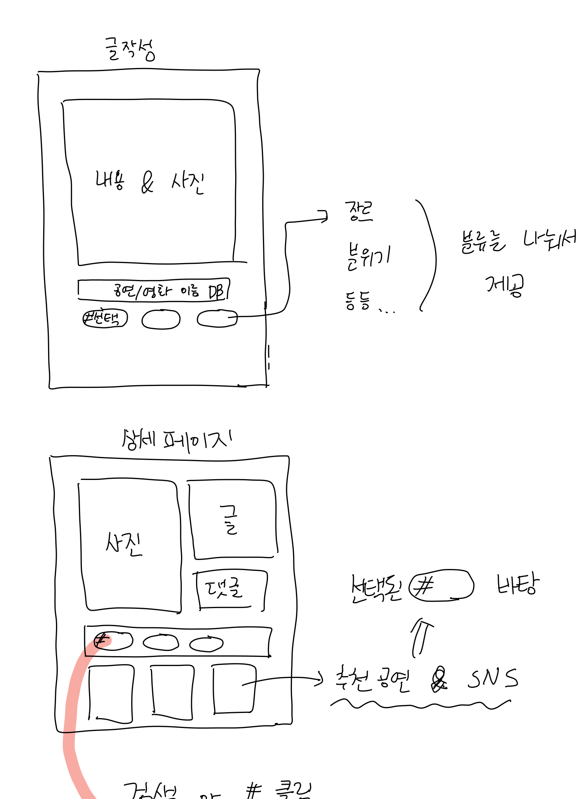
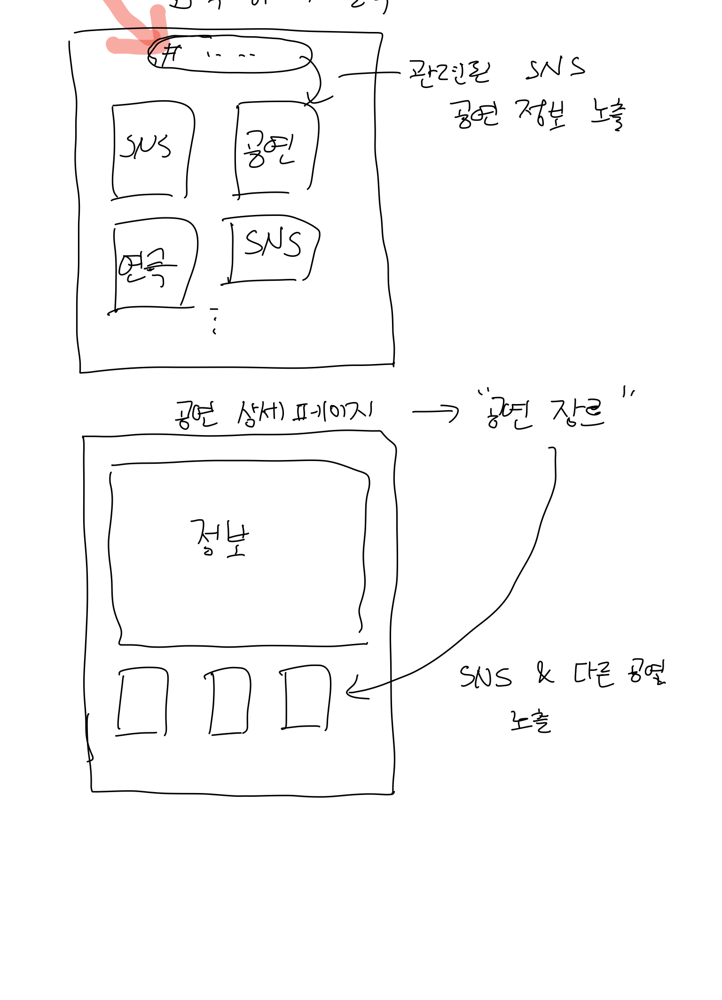

## 22.01.11(월)

### 1. UI 설계(글작성, 상세페이지, 검색, 공연 상세 페이지)





### 2. React를 사용하는 이유?

####  :raising_hand: 무엇을 개발하는가?

프로젝트의 주제는 웹 큐레이션 SNS로, 이용자가 글을 작성하고 이에 대해 다른 이용자의 상호작용이 필수적이다. 


예를 들어, 게시글에 좋아요 기능이 존재하고 누군가가 좋아요 버튼을 누른다면 해당하는 값이 1 올라야 한다.

이 값을 업데이트하여 실시간으로 반영해야 하는데 좋아요 요소를 찾아 내부를 일일이 수정하는 것은 애플리케이션 규모가 커진다면 매우 복잡해지고 성능도 떨어질 것이다.


이러한 단점을 개선하기 위해, 데이터가 변할 때마다 기존 뷰를 날려 버리고 처음부터 새로 렌더링하는 방식을 채용한 것이다. 그런데 여기까지 생각 했을 때, 하나의 정보를 수정하기 위해 전체를 렌더링한다면 사용자 경험이 떨어지게 될거라고 예상할 수 있다.


#### :ok_woman: 리액트의 기능

리액트는 자바스크립트 라이브러리로 다른 프레임워크와 달리 오직 View만 신경 쓰는 라이브러리이다.


1. 초기 렌더링

   리액트에서 사용하는 render 함수는 컴포넌트가 어떻게 생겼는지를 정의하는 역할을 한다. 이 함수는 html 형식의 문자열을 반환하는 것이 아니라, 뷰가 어떻게 생겼고 어떻게 작동하는지에 대한 정보를 지낸 객체를 반환한다.

   렌더링 작업을 통해 지니고 있는 정보들을 사용하여 HTML 마크업을 만들고, 이를 우리가 정하는 실제 페이지의 DOM 요소 안에 주입하게 된다.


2. 업데이트

   여기서 리액트가 어떻게 사용자 경험을 살리면서 렌더링을 하는지 알 수 있다. 컴포넌트는 데이터를 업데이트 했을 때 단순히 업데이트한 값을 수정하는 것이 아니라, 새로운 데이터를 통해 render함수를 다시 호출하게 된다.

   그렇다면 이 데이터를 가진 새로운 뷰가 생성될텐데, 이전에 render함수가 만들었던 컴포넌트 정보와 현재 render함수가 만든 텀포넌트 정보를 비교한 후 둘의 차이를 알아내 DOM 트리를 업데이트 하는 것이다.


3. Virtual DOM

   Virtual DOM을 사용하면 실제 DOM에 접근하여 조작하는 대신, 이를 추상화한 자바스크립트 객체를 구성하여 사용한다.

   리액트에서 데이터가 변하여 웹 브라우저에 실제 DOM을 업데이트 할 때는 다음 세 가지 절차를 밟는다.

   - 데이터를 업데이트하면 전체 UI를 Virtual DOM에 리렌더링 한다.
   - 이전 Virtual DOM에 있던 내용과 현재 내용을 비교한다.
   - 바뀐 부분만 실제 DOM에 적용한다.

   물론 Virtual DOM을 사용한다고 해서 무조건 더 빠른 사용자 경험을 제공하는 것은 아니다. 하지만, 지속적으로 데이터가 변화하는 대규모 애플리케이션 구축에서는 강점을 지닌다.


## 22.01.11(화)

### 1. Git 사용법 

분명 공부를 하면서 git을 사용하기는 하는데, 내가 할 수 있는 거라곤 git add 와 git commit 밖에 없었다...

이번에 git을 공부해야 될 상황이 생겨, 추후에 나같은 사람이나 git을 까먹을 미래의 나를 위해 정리하기로 했다..!

 

### [**Git 커밋**](https://kimcookie-lab.tistory.com/entry/Git-1#Git%--%EC%BB%A-%EB%B-%-B)

커밋이란 Git 저장소에 나의 디렉토리에 있는 **모든 파일에 대한 스냅샷을 기록**하는 것이다. 각 커밋은 저장소의 이전 버전과 다음 버전의 변경내역을 저장하기 때문에, 대부분의 커밋이 그 커밋 위의 부모 커밋을 가리킨다.

 

### [**Git 브랜치**](https://kimcookie-lab.tistory.com/entry/Git-1#Git%--%EB%B-%-C%EB%-E%-C%EC%B-%--)

브랜치는 특정 커밋에 대한 참조라고 할 수 있다. 브랜치를 많이 만들어도 메모리나 디스크 공간에 부담이 되지 않기 때문에, 작업을 할 때 작은 단위로 잘게 나누는 것이 좋다.

 

**하나의 커밋과 그 부모 커밋들을 포함하는 작업 내역**

 

git branch [브랜치 이름] : 브랜치 생성git checkout [브랜치 이름] : 브랜치로 이동

 

### [**브랜치와 합치기(Merge)**](https://kimcookie-lab.tistory.com/entry/Git-1#%EB%B-%-C%EB%-E%-C%EC%B-%--%EC%--%--%--%ED%--%A-%EC%B-%--%EA%B-%B--Merge-)

작업을 하다보면 여러개의 브랜치가 생성되게 될 텐데, 이 브랜치를 합치는 몇가지 방법을 알아볼 것이다. merge는 두 개의 부모를 가리키는 특별한 커밋을 만들어 낸다. 두 개의 부모가 있는 커밋이라는 것은 **한 부모의 모든 작업내역과 나머지 부모의 모든 작업 내역, 그리고 그 두 모의 모든 부모들의 작업내역을 포함**한다.

 

1. bugFix 브랜치를 main 브랜치에 merge

```
$ git merge bugFix
```

두 브랜치가 합쳐지면서 main이 두 부모가 있는 커밋을 가리키게 된다.

 

2. main 브랜치에 bugFix를 merge

```
$ git checkout bugFix
$ git merge main
```

bugFix가 main의 부모쪽에 있었기 때문에, git이 별다른 일을 할 필요가 없어진다.

 

### [**Git 리베이스(Rebase)**](https://kimcookie-lab.tistory.com/entry/Git-1#Git%--%EB%A-%AC%EB%B-%A-%EC%-D%B-%EC%-A%A--Rebase-)

브랜치끼리의 작업을 접목하는 두번째 방법은 리베이스이다. 리베이스는 기본적으로 커밋들을 모아서 복사한 뒤, 다른 곳에 떨궈 놓는 것을 의미한다.

이를 이용하면, 커밋들의 흐름을 보기 좋게 한 줄로 만들 수 있다는 장점이 있다.

 

브랜치를 사용해 두 개의 작업을 수행했을 때, rebase를 통해 합친다면 실제로는 두 기능을 따로 개발했지만 마치 순서대로 개발한 것처럼 보이게 된다.

 

1. bugFix 브랜치를 생성해 작업한 후 bugFix 브랜치를 선택

```
$ git branch bugFix
$ git checkout bugFix
```

 

2. rebase

```
$ git rebase main
```

bugFix 브랜치의 작업 내용이 main을 부모로 하게 되는 한 줄의 커밋을 생성

(기존 커밋은 어딘가에 아직 남아있고 main 위에 올려진것은 복사본)

 

3. main 브랜치를 bugFix 브랜치쪽으로 리베이스

```
$ git checkout main
$ git rebase bugFix
```

main 브랜치를 선택하고 리베이스


### [**HEAD**](https://kimcookie-lab.tistory.com/entry/Git-2?category=1023358#HEAD)

"HEAD"는 현재 체크아웃된 커밋을 가리킨다. 즉 현재 작업중인 커밋을 의미한다.

 

HEAD는 항상 작업트리의 가장 최근 커밋을 가리키므로 작업트리에 변화를 주는 git 명령어들은 대부분 HEAD를 변경하는것으로 시작한다.

 

일반적으로 HEAD는 브랜치의 이름을 가리키고 있는데, 커밋을 하게 되면 해당 브랜치의 상태가 바뀌고 이 변경은 HEAD를 통해서 확인이 가능하다.

 

#### [**HEAD 분리하기**](https://kimcookie-lab.tistory.com/entry/Git-2?category=1023358#HEAD%--%EB%B-%--%EB%A-%AC%ED%--%--%EA%B-%B-)

HEAD를 분리한다는 것은 HEAD를 브랜치 대신 커밋에 붙이는 것을 의미한다. 명령어를 사용하기 전의 모습은

 

HEAD -> main -> C1

 

이다.

```
$ git checkout [commit 해시]
```

다음 명령어를 통해,

HEAD -> C1

으로 변경한다.

 

#### [**상대참조**](https://kimcookie-lab.tistory.com/entry/Git-2?category=1023358#%EC%--%--%EB%-C%--%EC%B-%B-%EC%A-%B-)

실제 Git에서 해시는 매우 길기 때문에, 해시 자리에 앞의 4글자만 입력해줘도 된다.

 

하지만, 커밋들을 해시로 구분하고 사용하는것이 그렇게 썩 편하지는 않다. Git의 상대 참조를 활용하면 내가 기억할 만한 지점에서 출발하여 이동한 후 다른 지점에 도달해 작업을 할 수 있다.

 

상대 커밋의 방법 중 두가지가 있다.

```
한 번에 한 커밋 위로 움직이는 ^
한 번에 여러 커밋 위로 올라가는 ~<num>
```

 

C2(main) -> C1 -> C0

 

다음과 같은 구조에서

```
$ git checkout main^
```

명령어를 실행하게 되면, HEAD가 C1을 가리키게 된다.

 

이번에는, 한번에 커밋을 두번 옮겨보도록 하자.

```
$ git checkout main~2
```

위 명령어를 통해, HEAD는 C0를 가리키게 된다.

 

### [**브랜치 강제로 옮기기**](https://kimcookie-lab.tistory.com/entry/Git-2?category=1023358#%EB%B-%-C%EB%-E%-C%EC%B-%--%--%EA%B-%--%EC%A-%-C%EB%A-%-C%--%EC%--%AE%EA%B-%B-%EA%B-%B-)

C4(main, bugFix*) -> C3 -> C2 -> C1 -> C0

 

상대 참조를 통해 브랜치를 강제로 옮길 수 있다. " -f " 옵션을 이용하여 브랜치를 특정 커밋에 직접적으로 재지정 할 수 있다.

 

main 브랜치를 HEAD에서 세번 뒤로 옮기고 싶다면 다음 명령어를 실행하면 된다.

```
$ git branch -f main HEAD~3
```

C4(bugFix*) -> C3 -> C2 -> C1(main) -> C0

 

### [**Git 에서 작업 되돌리기**](https://kimcookie-lab.tistory.com/entry/Git-2?category=1023358#Git%--%EC%--%--%EC%--%-C%--%EC%-E%--%EC%--%--%--%EB%--%--%EB%-F%-C%EB%A-%AC%EA%B-%B-)

Git에는 작업한 것을 되돌리는 여러가지 방법이 존재한다. 변경내용을 되돌리는 것도 커밋과 마찬가지로 낮은 수준의 일(개별 파일이나 묶음을 스테이징 하는 것)과 높은 수준의 일(실제 변경이 복구되는 방법)이 있다. 우선, 여기서 후자에 대해 알아보자.

 

Git에서 변경한 내용을 되돌리는 방법은 크게 두가지가 있는데, "git reset"과 "git revert"이다.

 

#### [**Git 리셋(reset)**](https://kimcookie-lab.tistory.com/entry/Git-2?category=1023358#Git%--%EB%A-%AC%EC%--%-B-reset-)

git reset은 브랜치로 하여금 예전의 커밋을 가리키도록 이동시키는 방식으로 변경 내용을 되돌린다. 즉, 애초에 커밋하지 않은 것처럼 예전 커밋으로 브랜치를 옮기는 것이다.

 

#### [**Git 리버트(revert)**](https://kimcookie-lab.tistory.com/entry/Git-2?category=1023358#Git%--%EB%A-%AC%EB%B-%--%ED%-A%B--revert-)

각자의 컴퓨터에서 작업하는 로컬 브랜치의 경우 리셋을 효율적으로 사용할 수 있다. 하지만 "히스토리를 고쳐쓴다"는 점 때문에 다른 사람이 작업하는 리모트 브랜치에는 사용할 수 없게 된다.

 

내용을 되돌리고, 이 되돌린 내용을 다른 사람들과 공유하기 위해서는, git revert를 써야한다.

 

C2(main) -> C1 -> C0

 

```
$ git revert HEAD
```

C2`(main) - > C2 -> C1 -> C0

위 코드를 실행하면, HEAD 바로 위의 커밋으로 되돌릴 수 있다. 그런데, 우리가 되돌리려고 한 커밋의 아래에 새로운 커밋이 생기게 된다.

 

바로 이 커밋이, 되돌리고자 하는 내용을 담은 변경내용이 기록된다. 이 변경 내역을 push 하여 다른 사람과 공유할 수 있다.


### [**Git 체리-픽(Cherry-pick)**](https://kimcookie-lab.tistory.com/entry/Git-3?category=1023358#Git%--%EC%B-%B-%EB%A-%AC-%ED%--%BD-Cherry-pick-)

```
$ git cherry-pick <Commit1> <Commit2> <...>
```

이 명령어는 현재 위치(HEAD) 아래에 있는 일련의 커밋들에 대한 복사본을 만들겠다는 것을 의미한다.

 


HEAD가 C5를 가르키고 있을 때, C2와 C4의 내용의 복사본을 다음과 같이 손쉽게 붙일 수 있다.

 

### [**Git 인터렉티브 리베이스**](https://kimcookie-lab.tistory.com/entry/Git-3?category=1023358#Git%--%EC%-D%B-%ED%--%B-%EB%A-%--%ED%-B%B-%EB%B-%-C%--%EB%A-%AC%EB%B-%A-%EC%-D%B-%EC%-A%A-)

인터렉티브 리베이스 대화창을 통해 3가지 기능을 수행 할 수 있다.

\- 적용할 커밋들의 순서를 UI를 통해 바꿀 수 있다.

\- 원하지 않는 커밋들을 뺄 수 있다.

\- 커밋을 스쿼시 할 수 있다.(커밋을 합칠 수 있다.)

 

```
$ git rebase -i HEAD~2
```

 

## 22.01.12(수)

### JSX

맨 처음, 리액트로 앱을 생성해 App.js 파일을 열어보면 다음의 코드를 볼 수 있다.

```
function App() {
  return (
    <div className="App">
      <header className="App-header">
        
        <p>
          Edit <code>src/App.js</code> and save to reload.
        </p>
        <a
          className="App-link"
          href="https://reactjs.org"
          target="_blank"
          rel="noopener noreferrer"
        >
          Learn React
        </a>
      </header>
    </div>
  );
}
```

이 코드는 App이라는 컴포넌트를 만들어 준다!

 

function 키워드를 사용하여 컴포넌트를 만들게 되는데 이러한 컴포넌트를 함수 컴포넌트라고 부른다.

이 함수가 반환하는 부분을 보면 마치 HTML을 작성한 것 처럼 보이지만, 이 코드는 HTML이 아니다. 이러한 코드를 바로 JSX라고 부른다.

 

### [**JSX란?**](https://kimcookie-lab.tistory.com/entry/JSX#JSX%EB%-E%--%-F)

JSX는 자바스크립트의 확장 문법이며 XML과 매우 비슷하게 생겼다. 이런 형식으로 작성한 코드는 브라우저에서 실행되기 전에 코드가 번들링되는 과정에서 바벨을 사용하여 일반 자바스크립트 형태의 코드로 변환된다.

 

### [**JSX 문법**](https://kimcookie-lab.tistory.com/entry/JSX#JSX%--%EB%AC%B-%EB%B-%--)

JSX를 올바르게 사용하기 위해서는 몇 가지 규칙을 준수해야 한다.

 

#### [1. 감싸인 요소](https://kimcookie-lab.tistory.com/entry/JSX#--%--%EA%B-%--%EC%-B%B-%EC%-D%B-%--%EC%-A%--%EC%--%-C)

컴포넌트에 여러 요소가 있다면 반드시 **부모 요소 하나**로 감싸야 한다.

```
function App() {
	return (
    	<h1>Hello, World!</h1>
        <h2>Hello, World!</h2>
    )
}
```

이런 형태의 코드는 제대로 작동하지 않는다. 어째서 이러한 일이 발생하는 것일까?

 

Virtual DOM에서 컴포넌트 변화를 감지해 낼 때 효율적으로 비교할 수 있도록 컴포넌트 내부는 하나의 DOM 트리 구조로 이루어져야 한다는 규칙이 존재한다. 따라서 위 코드를 div 요소로 묶어준다면 정상적으로 작동하는 것을 확인할 수 있다.

 

#### [2. 자바스크립트 표현](https://kimcookie-lab.tistory.com/entry/JSX#--%--%EC%-E%--%EB%B-%--%EC%-A%A-%ED%--%AC%EB%A-%BD%ED%-A%B-%--%ED%--%-C%ED%--%--)

JSX 안에서는 자바스크립트 표현식을 사용할 수 있다. 자바스크립트 표현식을 작성하려면 JSX 내부에서 코드를 { }로 감싸면 된다.

```
function App() {
  const name = '쿠키';
  return (
    <>
      <h1>{name} 안녕!</h1>
    </>
  );
}
```

name 이라는 상수를 const를 사용하여 선언하였는데 만약 동적인 값을 담고싶다면 let을 사용해 선언할 수 있다.

 

#### [3. If 문 대신 조건부 연산자](https://kimcookie-lab.tistory.com/entry/JSX#--%--If%--%EB%AC%B-%--%EB%-C%--%EC%-B%A-%--%EC%A-%B-%EA%B-%B-%EB%B-%--%--%EC%--%B-%EC%--%B-%EC%-E%--)

JSX 내부의 자바스크립트 표현식에서 if 문을 사용할 수는 없다. 하지만 조건에 따라 다른 내용을 렌더링 해야한다면 JSX밖에서 if 문을 사용하거나, { } 안에 조건부 연산자를 사용하면 된다. 

```
function App() {
  const name = '쿠키';
  return (
    <div>
      {name === '쿠키' ? (
        <h1>쿠키입니다.</h1>
      ) : (
        <h1>쿠키가 아닙니다.</h1>
      )}      
    </div>
  );
}
```

이렇게 코드를 작성한 후 저장하면 브라우저에서는 '쿠키입니다.' 라는 문구를 볼 수 있다. 하지만 name 값을 변경하면 '쿠키가 아닙니다.' 라는 문구가 출력된다.

 

#### [4. undefined를 렌더링하지 않기](https://kimcookie-lab.tistory.com/entry/JSX#--%--undefined%EB%A-%BC%--%EB%A-%-C%EB%-D%--%EB%A-%--%ED%--%--%EC%A-%--%--%EC%--%-A%EA%B-%B-)

리액트 컴포넌트에서는 함수에서 undefined만 반환하여 렌더링하면 오류가 발생한다.

```
function App() {
  const name = undefined;
  return name;
}
```

이 코드는 오류가 발생하기 때문에 OR( || ) 연산자를 사용하여 해당 값이 undefined일 때 사용할 값을 지정하는 식으로 오류를 방지할 수 있다.

 

#### [5. 인라인 스타일링](https://kimcookie-lab.tistory.com/entry/JSX#--%--%EC%-D%B-%EB%-D%BC%EC%-D%B-%--%EC%-A%A-%ED%--%--%EC%-D%BC%EB%A-%--)

리액트에서 DOM 요소에 스타일을 적용할 때는 객체 형태로 넣어 주어야 한다. 스타일 이름 중에서 background-color 처럼 - 문자가 포함되는 이름은 - 문자를 없애고 카멜 표기법으로 작성해야 한다.

 

#### [6. class 대신 className](https://kimcookie-lab.tistory.com/entry/JSX#--%--class%--%EB%-C%--%EC%-B%A-%--className)

일반 HTML에서 CSS 클래스를 사용할 때는 <div class="myclass"></div> 와 같이 class라는 속성을 설정해야 한다. 하지만 JSX에서는 class가 아닌 className으로 설정해주어야 한다.

 

#### [7. 꼭 닫아야 하는 태그](https://kimcookie-lab.tistory.com/entry/JSX#--%--%EA%BC%AD%--%EB%-B%AB%EC%--%--%EC%--%BC%--%ED%--%--%EB%-A%--%--%ED%--%-C%EA%B-%B-)

HTML 코드를 작성할 때 가끔 태그를 닫지 않은 상태로 코드를 작성하기도 한다. 하지만 JSX에서는 태그를 닫지 않으면 오류가 발생한다.


### props

리액트에서 컴포넌트의 기능은 단순한 템플릿 이상이라고 볼 수 있다. 데이터가 주어졌을 때 이에 맞추어 UI를 만들어 주고, 라이프사이클 API를 이용하여 컴포넌트가 화면에서 나타날 때, 사라질 때, 변화가 일어날 때 주어진 작업들을 처리할 수 있으며, 임의 메서드를 만들어 특별한 기능을 붙여 줄 수 있다.

 

### [**클래스형 컴포넌트**](https://kimcookie-lab.tistory.com/entry/props?category=1047913#%ED%--%B-%EB%-E%--%EC%-A%A-%ED%--%--%--%EC%BB%B-%ED%-F%AC%EB%--%-C%ED%-A%B-)

앞서 살펴봤던 컴포넌트는 함수 컴포넌트라고 설명했다. 그렇다면 클래스형 컴포넌트는 어떻게 이루어질까?

```
import React, { Component } from 'react';

class App extends Component {
  render() {
    const name = '쿠키';
    return <div className='cookie'>{name}</div>;
  }
}
```

 

클래스형 컴포넌트와 함수 컴포넌트의 차이점은 클래스형 컴포넌트의 경우 state의 기능 및 라이프사이클 기능을 사용할 수 있다는 것이다.

 

클래스형 컴포넌트에서는 render 함수가 꼭 있어야 하고, 그 안에서 보여 주어야 할 JSX를 반환해야 한다.

 

그렇다면 함수 컴포넌트는 어느 상황에 사용해야 할까?

 

함수 컴포넌트의 장점은 클래스형 컴포넌트보다 선언하기가 훨씬 편하다는 점이 있다. 메모리 자원도 클래스형 컴포넌트에 비해 덜 사용하고 프로젝트를 완성하여 빌드한 후 배포할 때도 함수 컴포넌트를 사용하는 것이 결과물의 크기가 더 작다.

 

하지만 함수 컴포넌트의 주요 단점은 앞서 말한 state와 라이프사이클 API의 사용이 불가능하다는 점이다. 그런데 이러한 장점은 리액트의 기능인 Hooks 를 사용하여 클래스형 컴포넌트와 동일하지는 않지만 비슷한 작업을 할 수 있게 되었다.

 

리액트 공식 매뉴얼에서도 함수 컴포넌트와 Hooks를 사용하도록 권장한다고 하니 되도록이면 함수 컴포넌트를 사용하는 것이 좋은것 같다.

 

### [**props**](https://kimcookie-lab.tistory.com/entry/props?category=1047913#props)

props 기능을 사용하기 위해 MyComponent 컴포넌트를 새로 만들어보자. 우선 MyComponent.js 파일을 생성 후 다음 컴포넌트를 생성한다.

```
const MyComponent = () => {
  return <div>나의 새로운 컴포넌트!</div>;
}

export default MyComponent;
```

화살표 함수 문법을 통해 위와 같은 코드를 작성해 주었다. 이때 아래에 적인 export 코드는 다른 파일에서 이 파일을 import 한다면, 위에서 선언한 MyComponent 클래스를 불러오겠다는 의미이다.

 

이제 이 컴포넌트를 App 컴포넌트에서 불러와서 사용해 보자!

```
import MyComponent from "./MyComponent";

const App = () => {
  return (
    <MyComponent />
  );
}

export default App;
```

이를 통해, 결과적으로 브라우저에 '나의 새로운 컴포넌트!' 문구를 출력할 수 있다.

 

#### [**JSX 내부에서 props 렌더링**](https://kimcookie-lab.tistory.com/entry/props?category=1047913#JSX%--%EB%--%B-%EB%B-%--%EC%--%--%EC%--%-C%--props%--%EB%A-%-C%EB%-D%--%EB%A-%--)

App에서 props 값을 전달해 MyComponent 컴포넌트에서 렌더링해보도록 하자. 우선 App.js 에서 props 값 지정은 다음과 같이 수행할 수 있다.

```
import MyComponent from "./MyComponent";

const App = () => {
  return (
    <MyComponent name="쿠키" />
  );
}

export default App;
```

위 코드를 통해 MyComponent 컴포넌트에 name: "쿠키" props를 전달해 줄 수 있다.

 

MyComponent 에서는 JSX 내부에서 { } 기호로 감싸 주는 것을 통해 props 값을 렌더링 할 수 있다.

```
const MyComponent = props => {
  return <div>안녕하세요, 제 이름은 {props.name}입니다.</div>;
}

export default MyComponent;
```

#### [ ](https://kimcookie-lab.tistory.com/entry/props?category=1047913#%C-%A-)

#### [**props 기본값 설정**](https://kimcookie-lab.tistory.com/entry/props?category=1047913#props%--%EA%B-%B-%EB%B-%B-%EA%B-%--%--%EC%--%A-%EC%A-%--)

props 값을 따로 지정하지 않았을 때 보여 줄 기본값은 defaultProps 를 통해 설정할 수 있다.

```
const MyComponent = props => {
  return <div>안녕하세요, 제 이름은 {props.name}입니다.</div>;
};

MyComponent.defaultProps = {
  name: "쿠키"
};

export default MyComponent;
```

위 코드를 통해, 내가 props에 name을 설정해주지 않아도 기본으로 name 값에 "쿠키"가 설정된다.

 

#### [**태그 사이의 내용을 보여주기**](https://kimcookie-lab.tistory.com/entry/props?category=1047913#%ED%--%-C%EA%B-%B-%--%EC%--%AC%EC%-D%B-%EC%-D%--%--%EB%--%B-%EC%-A%A-%EC%-D%--%--%EB%B-%B-%EC%--%AC%EC%A-%BC%EA%B-%B-)

리액트 컴포넌트에는 컴포넌트 태그 사이의 내용을 보여 주는 props가 존재하는데 이것이 바로 children이다.

 

App 컴포넌트를 다음과 같이 수정해보자.

```
import MyComponent from "./MyComponent";

const App = () => {
  return <MyComponent>쿠키</MyComponent>;
}

export default App;
```

위 코드에서 MyComponent 태그 사이에 작성한 쿠키라는 문자열을 MyComponent 로 가져가보자.

 

```
const MyComponent = props => {
  return (
    <div>
      안녕하세요, 제 이름은 {props.name}입니다.
      <br />
      제 다른 이름은 {props.children}입니다.
    </div>
  );  
};

MyComponent.defaultProps = {
  name: "cookie"
};

export default MyComponent;
```

위 코드를 통해 두번째 줄에 '제 다른 이름은 쿠키입니다.' 구문을 출력할 수 있다.

 

#### [**비구조화 할당 문법**](https://kimcookie-lab.tistory.com/entry/props?category=1047913#%EB%B-%--%EA%B-%AC%EC%A-%B-%ED%--%--%--%ED%--%A-%EB%-B%B-%--%EB%AC%B-%EB%B-%--)

현재 MyComponent에서 props를 사용할 때마다 props. 를 붙여 주고 있다. 이러한 작업을 편리하게 하기 위해서 내부 값을 바로 추출하는 방법이 있다.

 

```
const MyComponent = props => {
  const { name, children } = props
  return (
    <div>
      안녕하세요, 제 이름은 {name}입니다.
      <br />
      제 다른 이름은 {children}입니다.
    </div>
  );  
};

MyComponent.defaultProps = {
  name: "cookie"
};

export default MyComponent;
```

위와 같이 MyComponent 컴포넌트를 변경한다면, 더 짧은 코드로 사용할 수 있다.

 

이처럼 객체에서 값을 추출하는 문법을 비구조화 할당이라고 부른다. 이는 함수의 파라미터 부분에서도 사용할 수 있는데, 함수의 파라미터가 객체라면 그 값을 바로 비구조화해서 사용할 수 있다.

 

```
const MyComponent = ({ name, children }) => {
  return (
    <div>
      ...
    </div>
  );  
};
...
```

이처럼 새로 선언하지 않고 훨씬 편리하게 사용할 수 있다.

 

#### [**propTypes**](https://kimcookie-lab.tistory.com/entry/props?category=1047913#propTypes)

컴포넌트의 필수 props를 지정하거나 props의 타입을 지정할 때는 propTypes를 사용해 지정할 수 있다.

만약 name 값을 무조건 문자열 형태로 전달하고 싶다면 다음과 같이 입력하면 된다. 같은 방식으로 필수 propTypes는 isRequired를 사용하여 설정할 수 있다.

```
import PropTypes from 'prop-types';

const MyComponent = ({ name, children }) => {
  return (...);  
};
...
MyComponent.propTypes = {
  name: PropTypes.string
};
...
```

 

#### [**클래스형 컴포넌트에서 props 사용하기**](https://kimcookie-lab.tistory.com/entry/props?category=1047913#%ED%--%B-%EB%-E%--%EC%-A%A-%ED%--%--%--%EC%BB%B-%ED%-F%AC%EB%--%-C%ED%-A%B-%EC%--%--%EC%--%-C%--props%--%EC%--%AC%EC%-A%A-%ED%--%--%EA%B-%B-)

클래스형 컴포넌트에서 props를 사용할 때는 render 함수에서 this.props를 조회하여 사용할 수 있다.

```
import React, {Component} from 'react';
import PropTypes from 'prop-types';

class MyComponentClass extends Component {
  render() {
    const { name, children } = this.props;
    return (
      <div>
        안녕하세요, 제 이름은 {name}입니다.
        <br />
        children 값은 {children}입니다.
      </div>
    );
  }
}

MyComponentClass.defaultProps = {
  name: '기본 이름'
};

MyComponentClass.propTypes = {
  name: PropTypes.string.isRequired,
};

export default MyComponentClass;
```


### state

리액트에서 state는 컴포넌트 내부에서 바뀔 수 있는 값을 의미한다.

 

### [**클래스형 컴포넌트의 state**](https://kimcookie-lab.tistory.com/entry/state?category=1047913#%ED%--%B-%EB%-E%--%EC%-A%A-%ED%--%--%--%EC%BB%B-%ED%-F%AC%EB%--%-C%ED%-A%B-%EC%-D%--%--state)

state를 사용해보기 위해 새로운 컴포넌트를 Counter.js 에 생성해보자.

```
import React, { Component } from 'react';

class Counter extends Component {
  constructor(props) {
  	super(props);
    this.state = {
    	number: 0
  };

  render() {
    const { number } = this.state;    

    return (
      <div>
        <h1>{number}</h1>
        <button
          onClick={() => {
            this.setState({ number: number + 1 });
          }}
        >
          +1
        </button>
      </div>
    );
  }
}

export default Counter
```

우선, 각 코드가 어떤 역할을 하는지 살펴보자.

 

컴포넌트에 state를 설정할 때는 다음과 같이 constructor 메서드를 작성하여 설정한다.

constructor(props) {

 super(props);

 this.state = {

  number: 0

};

이는 컴포넌트의 생성자 메서드로, 클래스형 컴포넌트에서 constructor를 작성할 때는 반드시 super(props)를 호출해 주어야 한다. 이 함수가 호출되면 현재 클래스형 컴포넌트가 상속받고 있는 리액트의 Component 클래스가 지닌 생성자 함수를 호출해 준다.

 

이후에는 this.state를 통해 초기값을 설정해준다. 이때 컴포넌트의 state는 객체 형식으로 작성한다.

 

render 함수에서 현재 state를 조회할 때는 this.state를 통해 조회한다. 그리고 button 안에 onClick 이라는 값을 props로 넣어주어 이벤트를 설정해준다. 추후에 배울 이벤트에서 설정할 함수를 넣어 줄 때는 화살표 함수를 사용하여 넣어주어야 한다. 이때 this.setState라는 함수를 사용하여 state 값을 변경한다.

 

이 컴포넌트를 App에서 불러와 실행시키면 버튼을 누를때마다 숫자가 1씩 증가하는 브라우저를 확인할 수 있다.

 

#### [**constructor 없이 state 사용하기**](https://kimcookie-lab.tistory.com/entry/state?category=1047913#constructor%--%EC%--%--%EC%-D%B-%--state%--%EC%--%AC%EC%-A%A-%ED%--%--%EA%B-%B-)

state의 초기값을 설정해주는 또다른 방법은 다음과 같다.

```
import React, { Component } from 'react';

class Counter extends Component {
  state = {
    number: 0,
    fixedNumber: 0,
  };

  render() {
    const { number, fixedNumber } = this.state;    

    return (...);
  }
}

export default Counter
```

 

#### [**this.setState에 객체 대신 함수 인자 전달하기**](https://kimcookie-lab.tistory.com/entry/state?category=1047913#this-setState%EC%--%--%--%EA%B-%-D%EC%B-%B-%--%EB%-C%--%EC%-B%A-%--%ED%--%A-%EC%--%--%--%EC%-D%B-%EC%-E%--%--%EC%A-%--%EB%-B%AC%ED%--%--%EA%B-%B-)

만약 onClick에 설정한 함수 내부에서 this.setState를 두 번 호출하면 어떻게 될까? 별다른 설정없이 this.setState를 두 번 사용하면 동일한 코드를 작성해도 숫자가 1씩 더해진다.

 

이에 대한 해결책은 this.setState를 사용할 때 객체 대신에 함수를 인자로 넣어주는 것이다. 이는 다음과 같은 형식을 통해 사용할 수 있다.

```
this.setState((prevState, props) => {
	return {
    	// 업데이트 내용
    }
})
```

이 때, prevState는 기존 상태를 의미하고 props는 현재 지니고 있는 props를 가리킨다. 이를 사용해 Counter 컴포넌트를 수정해보자.

```
<button
  onClick={() => {
    this.setState((prevState) => {
      return {
        number: prevState.number + 1
      };
    });

    this.setState(prevState => ({
      number: prevState.number + 1
    }));
  }}
>
  +1
</button>
```

이제 브라우저에서 버튼을 누른다면 숫자가 2씩 올라가는 것을 확인할 수 있다.

 

#### [**this.setState가 끝난 후 특정 작업 실행하기**](https://kimcookie-lab.tistory.com/entry/state?category=1047913#this-setState%EA%B-%--%--%EB%--%-D%EB%--%-C%--%ED%-B%--%--%ED%-A%B-%EC%A-%--%--%EC%-E%--%EC%--%--%--%EC%-B%A-%ED%--%--%ED%--%--%EA%B-%B-)

setState를 사용하여 값을 업데이트 한 후, 특정 작업을 수행하고 싶다면 두 번째 파라미터로 콜백함수를 등록하면 된다.

```
render() {
    const { number } = this.state;    

    return (
      <div>
        <h1>{number}</h1>
        <button
          onClick={() => {
            this.setState(
              { number: number + 1 },
              // 두 번째 파라미터
              () => {
              	console.log('setState 호출, 1 증가');
              }
            );
          }}
        >
          +1
        </button>
      </div>
    );
  }
}
```

 

### [**함수 컴포넌트에서 useState 사용하기**](https://kimcookie-lab.tistory.com/entry/state?category=1047913#%ED%--%A-%EC%--%--%--%EC%BB%B-%ED%-F%AC%EB%--%-C%ED%-A%B-%EC%--%--%EC%--%-C%--useState%--%EC%--%AC%EC%-A%A-%ED%--%--%EA%B-%B-)

함수 컴포넌트도 useState를 사용하면 state를 사용할 수 있다. 이 과정에서 Hooks를 사용하게 되는데, 우선 useState만 알아보자.

 

#### [**배열 비구조화 할당**](https://kimcookie-lab.tistory.com/entry/state?category=1047913#%EB%B-%B-%EC%--%B-%--%EB%B-%--%EA%B-%AC%EC%A-%B-%ED%--%--%--%ED%--%A-%EB%-B%B-)

Hooks를 사용하기 이전에, 배열 비구조화 할당에 대해 알아야 한다.

배열 비구조화 할당은 객체 비구조화 할당과 비슷한데, 배열 안에 있는 값을 쉽게 추출할 수 있도록 해주는 문법이다.

 

만약 다음과 같은 코드가 있다고 하자.

```
const array = [1, 2];
const one = array[0];
const two = array[1];
```

이는 array 안에 있는 값을 one과 two에 담아 주는 코드이다. 이를 배열 비구조화 할당을 사용하면 다음과 같이 표현할 수 있다.

```
const array = [1, 2];
const [one, two] = array;
```

 

#### [**useState 사용**](https://kimcookie-lab.tistory.com/entry/state?category=1047913#useState%--%EC%--%AC%EC%-A%A-)

useState를 사용하기에 앞서 새로운 컴포넌트인 Say 컴포넌트를 생성해보자.

입장버튼과 퇴장버튼을 통해 각각 인사말을 출력해 볼 것이다.

```
import React, { useState } from 'react';

const Say = () => {
  const [message, setMessage] = useState('');
  const onClickEnter = () => setMessage('안녕하세요');
  const onClickLeave = () => setMessage('안녕히 가세요');

  return (
    <div>
      <button onClick={onClickEnter}>입장</button>
      <button onClick={onClickLeave}>퇴장</button>
      <h1>{message}</h1>
    </div>
  );
};

export default Say;
```

useState 함수의 인자에는 상태의 초기값을 넣어준다. 클래스형 컴포넌트에서는 state 초기값을 객체 형태로 넣어주었지만, useState에서는 반드시 객체가 아니여도 상관없다.

 

함수를 호출하면 배열이 반환되는데, 배열의 첫 번째 원소는 현재 상태이고, 두 번째 원소는 상태를 바꾸어 주는 함수를 의미한다. 이 함수를 Setter 함수라고 부른다. 현재는 message와 setMessage로 이름이 설정되어 있지만, 이름은 자유롭게 변경할 수 있다.

 

#### [**여러개의 useState 사용하기**](https://kimcookie-lab.tistory.com/entry/state?category=1047913#%EC%--%AC%EB%-F%AC%EA%B-%-C%EC%-D%--%--useState%--%EC%--%AC%EC%-A%A-%ED%--%--%EA%B-%B-)

useState는 여러 번 사용해도 문제가 발생하지 않는다. 이번에는 버튼을 클릭해 글씨의 색상을 변경해보자.

```
import React, { useState } from 'react';

const Say = () => {
  const [message, setMessage] = useState('');
  const onClickEnter = () => setMessage('안녕하세요');
  const onClickLeave = () => setMessage('안녕히 가세요');

  const [color, setColor] = useState('black');

  return (
    <div>
      <button onClick={onClickEnter}>입장</button>
      <button onClick={onClickLeave}>퇴장</button>
      <h1 style={{ color }}>{message}</h1>
      <button 
        style={{ color: 'red' }}
        onClick={() => setColor('red')}
      >
      Red
      </button>
    </div>
  );
};

export default Say;
```

기존 message 에 style을 추가하여 "Red"버튼을 클릭하면 빨간색으로 글씨색이 변환되게 만들어주었다. 같은 방식으로 다른 색깔로 변경이 가능하다.


## 22.01.14 (목)

### 이벤트 핸들링

사용자가 웹 브라우저에서 DOM 요소들과 상호 작용하는 것을 이벤트(event)라고 한다. 다음과 같은 코드를 HTML 파일로 저장하여 웹 브라우저로 실행시켜 보면 Click me 버튼이 생성될 것이다.

```
<!DOCTYPE html>
<html>
<head>
  <meta charset="utf-8">
  <meta name="viewport" content="width=device-width">
  <title>JS Bin</title>
</head>
<body>
  <button onClick="alert('executed')">
    Click me
  </button>
</body>
</html>
```

버튼에 설정된 onClick 이벤트를 통해 " " 사이에 있는 자바스크립트를 실행하도록 코드를 작성한다.


### **이벤트 시스템**

state 포스트에서 작성한 버튼 코드를 다시 한 번 살펴보자.

```
import React, { useState } from 'react';

const Say = () => {
  const [message, setMessage] = useState('');
  const onClickEnter = () => setMessage('안녕하세요!');
  const onClickLeave = () => setMessage('안녕히 가세요.');

  const [color, setColor] = useState('black');

  return (
    <div>
      <button onClick={onClickEnter}>입장</button>
      <button onClick={onClickLeave}>퇴장</button>
      <h1 style={{ color }}>{message}</h1>

      <button
        style={{ color : 'Black' }}
        onClick={() => setColor('Black')}
      >
        Black
      </button>
      <button
        style={{ color : 'red' }}
        onClick={() => setColor('red')}
      >
        Red
      </button>
    </div>
  );
}

export default Say;
```


#### **이벤트를 사용할 때 주의 사항**

\1. 이벤트 이름은 카멜 표기법으로 작성한다.

HTML 에서의 onclick은 리액트에서 onClick으로 작성해야 한다.


\2. 이벤트에 실행할 함수 형태의 값을 전달한다.

HTML 에서는 " " 안에 실행할 코드를 넣었지만, 리액트에서는 함수 형태의 객체를 전달한다. 위 코드에서 버튼에서도 화살표 함수 문법으로 함수를 만들어 전달한 것을 볼 수 있다.


\3. DOM 요소에만 이벤트를 설정할 수 있다.

div, button, input, form 등의 DOM 요소에는 이벤트를 설정할 수 있지만, 내가 직접 만든 컴포넌트에는 이벤트를 자체적으로 설정할 수 없다.


### **onChange 이벤트**

input 요소를 렌더링하는 코드와 해당 요소에 onChange 이벤트를 설정하는 코드를 작성해보자.

```
import React, { Component } from 'react';

class EventPractice extends Component {
  render() {
    return (
      <div>
        <input
          type="text"
          name="message"
          placeholder="아무거나 입력해 보세요"
          onChange={
            (e) => {
              console.log(e)
            }
          }
        >
        </input>
      </div>
    );
  }
}

export default EventPractice;
```

개발자 도구를 키고 input 에 아무값이나 입력하면 콘솔에 e 객체가 기록되는 것을 확인할 수 있다. 이 e 객체는 SyntheticEvent로 웹 브라우저의 네이티브 이벤트를 감싸는 객체이다.


SyntheticEvent는 네이티브 이벤트와 달리 이벤트가 끝나고 나면 이벤트가 초기화되므로 정보를 참조할 수 없다. 따라서 비동기적으로 이벤트 객체를 참조할 일이 있다면 e.persist( ) 함수를 호출해 주어야 한다.


예를 들어 onChange 이벤트가 발생할 때, 앞으로 변할 인풋 값인 e.target.value를 콘솔에 기록해보자.

```
onChange={
  (e) => {
    console.log(e.target.value);
  }
}
```

코드를 위와 같이 수정하면 값이 바뀔 때마다 바뀌는 값이 콘솔에 기록되는 것을 확인할 수 있다.


## 22.01.14(금)

### ref

일반 HTML에서 DOM 요소에 이름을 달 때는 주로 id를 사용한다. 특정 DOM 요소에 id를 달면 CSS 에서 특정 id에 특정 스타일을 적용하거나 자바스크립트에서 해당 id를 가진 요소를 찾아서 작업할 수 있다.

 

이렇게 HTML에서 id를 사용하여 DOM에 이름을 다는 것처럼 리액트 프로젝트 내부에서 DOM에 이름을 다는 방법이 바로 ref 개념이다.

 

### [**ref를 사용하는 상황**](https://kimcookie-lab.tistory.com/entry/ref#ref%EB%A-%BC%--%EC%--%AC%EC%-A%A-%ED%--%--%EB%-A%--%--%EC%--%--%ED%--%A-)

우선 ref는 어떤 상황에 사용해야 하는지 짚고 넘어가야 한다. 특정 DOM에 작업을 해야 할 때에 ref를 사용한다고 하였는데, 정확히 어떤 작업을 할 때 ref를 사용해야 할까?

 

그것은 DOM을 반드시 직접적으로 건드려야 할 때이다. 좀 더 감을 잡기 위해 새로운 컴포넌트를 생성해보자.

 

**Validation.css**

```
.success {
  background-color: lightgreen;
}
.failure {
  background-color: lightcoral;
}
```

**Validation.js**

```
import React, { Component } from 'react';
import './Validation.css';

class Validation extends Component {
  state = {
    password: '',
    clicked: false,
    validated: false,
  }

  handleChange = (e) => {
    this.setState({
      password: e.target.value,
    });
  }

  handleButtonClick = (e) => {
    this.setState({
      clicked: true,
      validated: this.state.password === '0000'
    })
  }

  render() {
    return (
      <div>
        <input
          type='password'
          value={this.state.password}
          onChange={this.handleChange}
          className={this.state.clicked ? 
            (this.state.validated ? 'success' : 'failure')
            :
            ''
          }
        >
        </input>
        <button
          onClick={this.handleButtonClick}
        >
          확인
        </button>
      </div>
    );
  }
}

export default Validation;
```

위 코드를 보면, input에서 onChange 이벤트가 발생하면 handleChange를 호출하여 state에 저장되어 있는 password의 값을 업데이트 하였다.

button에서 onClick 이벤트가 발생하면 handleButtonClick을 통해 clicked 값을 참으로 설정하였고, validated 검증을 실시한다.

따라서, input에 값을 입력한 후 버튼을 클릭하면 검증 결과에 따라 success, failure에 따라 배경색상이 변경되게 된다.

 

#### [**DOM을 꼭 사용해야 하는 상황**](https://kimcookie-lab.tistory.com/entry/ref#DOM%EC%-D%--%--%EA%BC%AD%--%EC%--%AC%EC%-A%A-%ED%--%B-%EC%--%BC%--%ED%--%--%EB%-A%--%--%EC%--%--%ED%--%A-)

지금까지 구현한 코드에서는 state를 사용하여 기능을 구현했지만, 가끔 state만으로 해결할 수 없는 기능이 존재한다.

- 특정 input에 포거스 주기
- 스크롤 박스 조작하기
- Canvas 요소에 그림 그리기 등

이러한 경우에는 어쩔 수 없이 DOM에 직접적으로 접근해야 하는데, 이를 위해 ref를 사용하는 것이다.

 

### [**ref 사용**](https://kimcookie-lab.tistory.com/entry/ref#ref%--%EC%--%AC%EC%-A%A-)

#### [**콜백 함수를 통한 ref 설정**](https://kimcookie-lab.tistory.com/entry/ref#%EC%BD%-C%EB%B-%B-%--%ED%--%A-%EC%--%--%EB%A-%BC%--%ED%--%B-%ED%--%-C%--ref%--%EC%--%A-%EC%A-%--)

ref를 만드는 가장 기본적인 방법은 콜백 함수를 사용하는 것이다. ref를 달고자 하는 요소에 ref라는 콜백 함수를 props로 전달해 주면된다. 이 콜백 함수는 ref 값을 파라미터로 전달받게된다.

```
<input ref={(ref) => {this.input=ref}} />
```

위 코드에서 this.input은 input 요소의 DOM을 가리키게 된다. ref의 이름은 원하는 것으로 자유롭게 작성할 수 있다. this.myInput = ref 처럼 자유롭게 지정할 수 있다.

 

#### [**createRef를 통한 ref 설정**](https://kimcookie-lab.tistory.com/entry/ref#createRef%EB%A-%BC%--%ED%--%B-%ED%--%-C%--ref%--%EC%--%A-%EC%A-%--)

ref를 만드는 또 다른 방법은 리액트에 내장되어 있는 createRef라는 함수를 사용하는 것이다.

```
class RefSample extends Component {
  input = React.createRef();

  handleFocus = () => {
    this.input.current.focus();
  }

  render() {
    return (
      <div>
        <input ref={this.input}></input>
      </div>
    );
  }
}
```

createRef를 사용하여 ref를 만들려면 우선 컴포넌트 내부에서 멤버 변수로 React.createRef() 를 담아주어야 한다. 그리고 ref를 달고자 하는 요소에 ref props로 넣어 주면 ref 설정이 완료된다.

 

이후, ref를 설정해 준 DOM에 접근하려면 this.input.current를 조회하면 된다.

 

#### [**적용하기**](https://kimcookie-lab.tistory.com/entry/ref#%EC%A-%--%EC%-A%A-%ED%--%--%EA%B-%B-)

앞서 작성한 Validation 컴포넌트는 검증 버튼을 클릭하면 포커스가 버튼으로 넘어가면서 인풋 요소의 텍스트 커서가 보이지 않게 된다. 버튼을 눌렀을 때, 자동으로 포커스가 input 요소로 옮겨가도록 변경해보자.

```
...
  handleButtonClick = (e) => {
    this.setState({
      ...
    });
    this.input.focus();
  }

  render() {
    return (
      <div>
        <input
          ref={(ref) => this.input=ref}
          ...
        >
        ...
```

input 요소에 this.input 이라는 ref를 달아주었고, handleButtonClick 함수에서 this.input.focus()를 통해 this.input으로 포커스가 넘어가도록 설정해주었다.

 

이제 값을 입력한 후, 버튼을 누르면 자동으로 input 요소로 포커스가 옮겨가게 되고, 커서가 깜빡이는 것을 볼 수 있다.

 

### [**컴포넌트에 ref 달기**](https://kimcookie-lab.tistory.com/entry/ref#%EC%BB%B-%ED%-F%AC%EB%--%-C%ED%-A%B-%EC%--%--%--ref%--%EB%-B%AC%EA%B-%B-)

리액트에서는 컴포넌트에도 ref를 달 수 있다. 이 방법은 주로 컴포넌트 내부에 있는 DOM을 컴포넌트 외부에서 사용할 때 사용하게 된다.

 

이번에는 스크롤 박스가 있는 컴포넌트를 생성해 확인해 보도록 하자.

```
import React, { Component } from 'react';

class ScrollBox extends Component {
  render() {
    const style = {
      border: '1px solid black',
      height: '300px',
      width: '300px',
      overflow: 'auto',
      position: 'relative',
    };
    
    const innerStyle = {
      width: '100%',
      height: '650px',
      background: 'linear-gradient(white, black)',
    };

    return (
      <div
        style={style}
        ref={(ref) => this.box=ref}
      >
        <div style={innerStyle}></div>  
      </div>
    );
  }
}

export default ScrollBox;
```

 

#### [**컴포넌트에 메서드 생성**](https://kimcookie-lab.tistory.com/entry/ref#%EC%BB%B-%ED%-F%AC%EB%--%-C%ED%-A%B-%EC%--%--%--%EB%A-%--%EC%--%-C%EB%--%-C%--%EC%--%-D%EC%--%B-)

컴포넌트에 스크롤바를 맨 아래쪽으로 내리는 메서드를 생성해보자. 이를 구현하기 위해서는 DOM 노드가 가진 다음 값들을 사용하게 된다.

- scrollTop: 세로 스크롤바 위치
- scrollHeight: 스크롤이 있는 박스 안의 div 높이
- clientHeight: 스크롤이 있는 박스의 높이

```
import React, { Component } from 'react';

class ScrollBox extends Component {
  scrollToBottom = () => {
    const { scrollHeight, clientHeight } = this.box;
    this.box.scrollTop = scrollHeight - clientHeight;
  }
  ...
}

export default ScrollBox;
```

 

#### [**컴포넌트에 ref 달고 내부 메서드 사용하기**](https://kimcookie-lab.tistory.com/entry/ref#%EC%BB%B-%ED%-F%AC%EB%--%-C%ED%-A%B-%EC%--%--%--ref%--%EB%-B%AC%EA%B-%A-%--%EB%--%B-%EB%B-%--%--%EB%A-%--%EC%--%-C%EB%--%-C%--%EC%--%AC%EC%-A%A-%ED%--%--%EA%B-%B-)

그럼 이제 App 컴포넌트에서 ScrollBox에 ref를 달고 버튼을 만들어 누르면, ScrollBox 컴포넌트의 scrollToBottom 메서드를 실행하도록 만들어보자.

```
class App extends Component {
  render() {
    return (
      <div>
        <ScrollBox ref={(ref) => this.scrollBox=ref}/>
        <button
          onClick={() => this.scrollBox.scrollToBottom()}
        >
          밑으로 이동
        </button>
      </div>
    );
  }
}
```

button을 클릭할 시 this.scrollBox가 가리키는 ScrollBox 컴포넌트를 바라보게 되고, 그 안에 있는 scrollToBottom을 실행하게 되는 것이다.


## 22.01.17(월)

### 이벤트 핸들링

사용자가 웹 브라우저에서 DOM 요소들과 상호 작용하는 것을 이벤트(event)라고 한다. 다음과 같은 코드를 HTML 파일로 저장하여 웹 브라우저로 실행시켜 보면 Click me 버튼이 생성될 것이다.

```
<!DOCTYPE html>
<html>
<head>
  <meta charset="utf-8">
  <meta name="viewport" content="width=device-width">
  <title>JS Bin</title>
</head>
<body>
  <button onClick="alert('executed')">
    Click me
  </button>
</body>
</html>
```

버튼에 설정된 onClick 이벤트를 통해 " " 사이에 있는 자바스크립트를 실행하도록 코드를 작성한다.

 

### [**이벤트 시스템**](https://kimcookie-lab.tistory.com/entry/%EC%9D%B4%EB%B2%A4%ED%8A%B8-%ED%95%B8%EB%93%A4%EB%A7%81#%EC%-D%B-%EB%B-%A-%ED%-A%B-%--%EC%-B%-C%EC%-A%A-%ED%--%-C)

state 포스트에서 작성한 버튼 코드를 다시 한 번 살펴보자.

```
import React, { useState } from 'react';

const Say = () => {
  const [message, setMessage] = useState('');
  const onClickEnter = () => setMessage('안녕하세요!');
  const onClickLeave = () => setMessage('안녕히 가세요.');

  const [color, setColor] = useState('black');

  return (
    <div>
      <button onClick={onClickEnter}>입장</button>
      <button onClick={onClickLeave}>퇴장</button>
      <h1 style={{ color }}>{message}</h1>

      <button
        style={{ color : 'Black' }}
        onClick={() => setColor('Black')}
      >
        Black
      </button>
      <button
        style={{ color : 'red' }}
        onClick={() => setColor('red')}
      >
        Red
      </button>
    </div>
  );
}

export default Say;
```

 

#### [**이벤트를 사용할 때 주의 사항**](https://kimcookie-lab.tistory.com/entry/%EC%9D%B4%EB%B2%A4%ED%8A%B8-%ED%95%B8%EB%93%A4%EB%A7%81#%EC%-D%B-%EB%B-%A-%ED%-A%B-%EB%A-%BC%--%EC%--%AC%EC%-A%A-%ED%--%A-%--%EB%--%-C%--%EC%A-%BC%EC%-D%--%--%EC%--%AC%ED%--%AD)

\1. 이벤트 이름은 카멜 표기법으로 작성한다.

HTML 에서의 onclick은 리액트에서 onClick으로 작성해야 한다.

 

\2. 이벤트에 실행할 함수 형태의 값을 전달한다.

HTML 에서는 " " 안에 실행할 코드를 넣었지만, 리액트에서는 함수 형태의 객체를 전달한다. 위 코드에서 버튼에서도 화살표 함수 문법으로 함수를 만들어 전달한 것을 볼 수 있다.

 

\3. DOM 요소에만 이벤트를 설정할 수 있다.

div, button, input, form 등의 DOM 요소에는 이벤트를 설정할 수 있지만, 내가 직접 만든 컴포넌트에는 이벤트를 자체적으로 설정할 수 없다.

 

### [**onChange 이벤트**](https://kimcookie-lab.tistory.com/entry/%EC%9D%B4%EB%B2%A4%ED%8A%B8-%ED%95%B8%EB%93%A4%EB%A7%81#onChange%--%EC%-D%B-%EB%B-%A-%ED%-A%B-)

input 요소를 렌더링하는 코드와 해당 요소에 onChange 이벤트를 설정하는 코드를 작성해보자.

```
import React, { Component } from 'react';

class EventPractice extends Component {
  render() {
    return (
      <div>
        <input
          type="text"
          name="message"
          placeholder="아무거나 입력해 보세요"
          onChange={
            (e) => {
              console.log(e)
            }
          }
        >
        </input>
      </div>
    );
  }
}

export default EventPractice;
```

개발자 도구를 키고 input 에 아무값이나 입력하면 콘솔에 e 객체가 기록되는 것을 확인할 수 있다. 이 e 객체는 SyntheticEvent로 웹 브라우저의 네이티브 이벤트를 감싸는 객체이다.

 

SyntheticEvent는 네이티브 이벤트와 달리 이벤트가 끝나고 나면 이벤트가 초기화되므로 정보를 참조할 수 없다. 따라서 비동기적으로 이벤트 객체를 참조할 일이 있다면 e.persist( ) 함수를 호출해 주어야 한다.

 

예를 들어 onChange 이벤트가 발생할 때, 앞으로 변할 인풋 값인 e.target.value를 콘솔에 기록해보자.

```
onChange={
  (e) => {
    console.log(e.target.value);
  }
}
```

코드를 위와 같이 수정하면 값이 바뀔 때마다 바뀌는 값이 콘솔에 기록되는 것을 확인할 수 있다.

 

#### [**state 에 input 값 담기**](https://kimcookie-lab.tistory.com/entry/%EC%9D%B4%EB%B2%A4%ED%8A%B8-%ED%95%B8%EB%93%A4%EB%A7%81#state%--%EC%--%--%--input%--%EA%B-%--%--%EB%-B%B-%EA%B-%B-)

이번에는 이전에 배운 state에 input 값을 담아보자. 생성자 메서드인 constructor에서 state 초기값을 설정하고, 이벤트 핸들링 내부에서 this.setState 메서드를 호출하여 state를 업데이트 하면 된다.

```
class EventPractice extends Component {
  state = {
    message: '',
  }

  render() {
    return (
      <div>
        <input
          type="text"
          name="message"
          placeholder="아무거나 입력해 보세요"
          value={this.state.message}
          onChange={
            (e) => {
              this.setState({
                message: e.target.value
              })
            }
          }
        >
        </input>
      </div>
    );
  }
}
```

인풋에 아무것이나 입력하였을 때, 오류가 발생하지 않고 제대로 입력이 가능하다면 state에 input 값을 잘 저장했다고 볼 수 있다.

 

그렇다면 정말로 내가 입력한 값이 state에 잘 들어갔는지 확인해보자. 버튼을 하나 생성하여 버튼을 클릭 할 시 현재 state에 저장되어있는 message 값을 출력하도록 만들어보자.

```
import React, { Component } from 'react';

class EventPractice extends Component {
  state = {
    message: '',
  }

  render() {
    return (
      <div>
        <input
          ...
        >
        </input>
        <button
          onClick={
            (e) => {
              alert(this.state.message);
              this.setState({
                message: '',
              });
            }
          }
        >
          확인
        </button>
      </div>
    );
  }
}

export default EventPractice;
```

 

### [**임의 메서드 만들기**](https://kimcookie-lab.tistory.com/entry/%EC%9D%B4%EB%B2%A4%ED%8A%B8-%ED%95%B8%EB%93%A4%EB%A7%81#%EC%-E%--%EC%-D%--%--%EB%A-%--%EC%--%-C%EB%--%-C%--%EB%A-%-C%EB%--%A-%EA%B-%B-)

앞서 배운 주의 사항에서 "이벤트에 실행할 함수 형태의 값을 전달한다"라고 했었다. 그렇기 때문에 지금까지 이벤트를 처리할 때 렌더링을 하는 동시에 함수를 만들어서 전달해주었다.

그런데, 이 방법 대신 함수를 미리 준비하는 방법도 존재한다. 성능상으로는 차이가 크게 없지만, 가독성은 훨씬 높아진다.

 

위에서 작성한 코드에서 onChange와 onClick에 전달한 함수를 밖으로 빼내서 컴포넌트 임의 메서드를 생성해보자.

```
import React, { Component } from 'react';

class EventPractice extends Component {
  state = {
    message: '',
  }

  constructor(props) {
    super(props);
    this.handleChange = this.handleChange.bind(this);
    this.handleClick = this.handleClick.bind(this);
  }

  handleChange(e) {
    this.setState({
      message: e.target.value,
    });
  }

  handleClick(e) {
    alert(this.state.message);
    this.setState({
      message: '',
    });
  }

  render() {
    return (
      <div>
        <input
          type="text"
          name="message"
          placeholder="아무거나 입력해 보세요"
          value={this.state.message}
          onChange={this.handleChange}
        >
        </input>
        <button
          onClick={this.handleClick}
        >
          확인
        </button>
      </div>
    );
  }
}

export default EventPractice;
```

함수가 호출될 때 this는 호출부에 따라 결정되므로, 클래스의 임의 메서드가 특정 HTML 요소의 이벤트로 등록되는 과정에서 메서드와 this의 관계가 끊어지게 된다. 이 때문에 임의 메서드가 이벤트로 등록되어도 this를 컴포넌트 자신으로 제대로 가리키기 위해서는 메서드를 this와 바인딩하는 작업이 필요하다.

 

위 코드에서는 constructor 함수에서 함수를 바인딩하는 작업이 이루어지고 있다.

 

#### [**Property Initializer Syntax를 사용한 메서드 작성**](https://kimcookie-lab.tistory.com/entry/%EC%9D%B4%EB%B2%A4%ED%8A%B8-%ED%95%B8%EB%93%A4%EB%A7%81#Property%--Initializer%--Syntax%EB%A-%BC%--%EC%--%AC%EC%-A%A-%ED%--%-C%--%EB%A-%--%EC%--%-C%EB%--%-C%--%EC%-E%--%EC%--%B-)

메서드 바인딩은 생성자 메서드에서 하는 것이 정석이다. 하지만 새 메서드를 만들 때마다 constructor도 수정해야 하는 불편함이 존재한다. 이러한 작업을 바벨의 transform-class-properties 문법을 사용하여 화살표 함수 형태로 메서드를 정의하면 간단하게 바꿀 수 있다.

```
import React, { Component } from 'react';

class EventPractice extends Component {
  state = {
    message: '',
  }

  handleChange = (e) => {
    this.setState({
      message: e.target.value,
    });
  }

  handleClick = (e) => {
    alert(this.state.message);
    this.setState({
      message: '',
    });
  }

  render() {
  	...
}

export default EventPractice;
```

이처럼 constructor를 작성하지 않고 훨씬 깔끔하게 작성할 수 있다!

 

### [**input 여러 개 사용하기**](https://kimcookie-lab.tistory.com/entry/%EC%9D%B4%EB%B2%A4%ED%8A%B8-%ED%95%B8%EB%93%A4%EB%A7%81#input%--%EC%--%AC%EB%-F%AC%--%EA%B-%-C%--%EC%--%AC%EC%-A%A-%ED%--%--%EA%B-%B-)

input 값을 여러 개 만들어야 할 때 메서드를 여러 개 만드는 것 또한 방법이 될 수 있다. 하지만 event 객체를 활용하면 더 쉽게 처리가 가능하다.

 

e.target.name 값을 사용하면 이벤트를 실행하였을 때 해당 이벤트와 묶여 있는 name 값을 가리키게 된다. 이를 이용해 각각의 상황에 맞춰서 메서드를 사용할 수 있다.

 

현재 작성된 코드에서 message 말고 username 이라는 state를 추가해보자. 이 값도 onChange를 통해 state에 저장할 것이다.

```
import React, { Component } from 'react';

class EventPractice extends Component {
  state = {
    username: '',
    message: '',
  }

  handleChange = (e) => {
    this.setState({
      [e.target.name]: e.target.value,
    });
  }

  handleClick = (e) => {
    alert(this.state.username + ': ' + this.state.message);
    this.setState({
      message: '',
    });
  }

  render() {
    return (
      <div>
        <input
          type="text"
          name="username"
          placeholder='이름을 입력하세요'
          value={this.state.username}
          onChange={this.handleChange}
        >
        </input>
        <input
          type="text"
          name="message"
          placeholder="아무거나 입력해 보세요"
          value={this.state.message}
          onChange={this.handleChange}
        >
        </input>
        <button
          onClick={this.handleClick}
        >
          확인
        </button>
      </div>
    );
  }
}

export default EventPractice;
```

여기서 handleChange 부분의 객체 key 값이 [ ] 로 감싸져 있는 것을 확인할 수 있다. 객체 안에서 key를 [ ] 로 감싸면 그 안에 넣은 레퍼런스가 가리키는 실체 값이 key 값으로 사용된다.

 

### [**onKeyPress 이벤트 핸들링**](https://kimcookie-lab.tistory.com/entry/%EC%9D%B4%EB%B2%A4%ED%8A%B8-%ED%95%B8%EB%93%A4%EB%A7%81#onKeyPress%--%EC%-D%B-%EB%B-%A-%ED%-A%B-%--%ED%--%B-%EB%--%A-%EB%A-%--)

이번에는 키를 눌렀을 때 발생하는 이벤트를 처리하는 방법에 대해 알아보자. 여기서는 comment 인풋에서 Enter 키를 눌렀을 때 handleClick 메서드를 호출하도록 만들 것이다.

```
import React, { Component } from 'react';

class EventPractice extends Component {
  state = {
    username: '',
    message: '',
  }

  handleChange = (e) => {
    this.setState({
      [e.target.name]: e.target.value,
    });
  }

  handleClick = (e) => {
    alert(this.state.username + ': ' + this.state.message);
    this.setState({
      message: '',
    });
  }

  handleKeyPress = (e) => {
    if(e.key == 'Enter') {
      this.handleClick();
    }
  }

  render() {
    return (
      <div>
        <input
          type="text"
          name="username"
          placeholder='이름을 입력하세요'
          value={this.state.username}
          onChange={this.handleChange}
        >
        </input>
        <input
          type="text"
          name="message"
          placeholder="아무거나 입력해 보세요"
          value={this.state.message}
          onChange={this.handleChange}
          onKeyPress={this.handleKeyPress}
        >
        </input>
        <button
          onClick={this.handleClick}
        >
          확인
        </button>
      </div>
    );
  }
}

export default EventPractice;
```

위 코드에서 추가된 handleKeyPress 메서드를 살펴보면, 두 번째 인풋에서 키를 입력하였는데 그 값이 "Enter" 키 라면 handleClick을 수행하도록 되어있다.

 

### [**함수 컴포넌트로 구현하기**](https://kimcookie-lab.tistory.com/entry/%EC%9D%B4%EB%B2%A4%ED%8A%B8-%ED%95%B8%EB%93%A4%EB%A7%81#%ED%--%A-%EC%--%--%--%EC%BB%B-%ED%-F%AC%EB%--%-C%ED%-A%B-%EB%A-%-C%--%EA%B-%AC%ED%--%--%ED%--%--%EA%B-%B-)

그럼 지금까지 작업한 내용을 함수 컴포넌트로 구현해 보자.

```
import React, { useState } from 'react';

const EventPractice = () => {
  const [username, setUsername] = useState('');
  const [message, setMessage] = useState('');
  const onChangeUsername = e => setUsername(e.target.value);
  const onChangeMessage = e => setMessage(e.target.value);

  const onClick = () => {
    alert(username + ': ' + message);
    setUsername('');
    setMessage('');
  };

  const onKeyPress = e => {
    if (e.key === 'Enter') {
      onClick();
    }
  };

  return (
    <div>
      <input
        type='text'
        name='username'
        placeholder='이름을 입력하세요'
        value={username}
        onChange={onChangeUsername}
      >
      </input>
      <input
        type='text'
        name='message'
        placeholder='메시지를 입력하세요'
        value={message}
        onChange={onChangeMessage}
        onKeyPress={onKeyPress}
      >
      </input>
      <button
        onClick={onClick}
      >
        확인
      </button>
    </div>
  )
}

export default EventPractice;
```

자세히보면 위 코드에서는 e.target.name을 활용하지 않고 onChange 관련 함수를 따로 작성하여 만들었다. 이처럼 인풋이 두 개밖에 없는 경우에는 상관이 없겠지만, 인풋의 개수가 많아질 경우 e.target.name을 활용하는 것이 훨씬 좋을 것이다.

 

이번에는 useState를 통해 사용하는 상태에 문자열이 아닌 객체를 넣어보도록 하자.

```
import React, { useState } from 'react';

const EventPractice = () => {
  // 기존 두 개의 인풋을 form으로 묶기
  const [form, setForm] = useState({
    username: '',
    message: '',
  });
  const { username, message } = form;

  const onChange = e => {
    const changedForm = {
      // 1. 기존의 form 내용을 복사해서 가져오기
      ...form,

      // 2. 원하는 값(e.target.name)을 덮어 씌우기
      [e.target.name]: e.target.value,
    };
    setForm(changedForm);
  }

  const onClick = () => {
    alert(username + ': ' + message);
    setForm({
      username: '',
      message: '',
    });
  };

  const onKeyPress = e => {
    if (e.key === 'Enter') {
      onClick();
    }
  };

  return (
    <div>
      <input
        ...
        onChange={onChange}
      >
      </input>
      <input
        ...
        onChange={onChange}
        onKeyPress={onKeyPress}
      >
      </input>
      ...
    </div>
  )
}

export default EventPractice;
```


## 22.01.18(화)

### ref

일반 HTML에서 DOM 요소에 이름을 달 때는 주로 id를 사용한다. 특정 DOM 요소에 id를 달면 CSS 에서 특정 id에 특정 스타일을 적용하거나 자바스크립트에서 해당 id를 가진 요소를 찾아서 작업할 수 있다.

 

이렇게 HTML에서 id를 사용하여 DOM에 이름을 다는 것처럼 리액트 프로젝트 내부에서 DOM에 이름을 다는 방법이 바로 ref 개념이다.

 

### [**ref를 사용하는 상황**](https://kimcookie-lab.tistory.com/entry/ref#ref%EB%A-%BC%--%EC%--%AC%EC%-A%A-%ED%--%--%EB%-A%--%--%EC%--%--%ED%--%A-)

우선 ref는 어떤 상황에 사용해야 하는지 짚고 넘어가야 한다. 특정 DOM에 작업을 해야 할 때에 ref를 사용한다고 하였는데, 정확히 어떤 작업을 할 때 ref를 사용해야 할까?

 

그것은 DOM을 반드시 직접적으로 건드려야 할 때이다. 좀 더 감을 잡기 위해 새로운 컴포넌트를 생성해보자.

 

**Validation.css**

```
.success {
  background-color: lightgreen;
}
.failure {
  background-color: lightcoral;
}
```

**Validation.js**

```
import React, { Component } from 'react';
import './Validation.css';

class Validation extends Component {
  state = {
    password: '',
    clicked: false,
    validated: false,
  }

  handleChange = (e) => {
    this.setState({
      password: e.target.value,
    });
  }

  handleButtonClick = (e) => {
    this.setState({
      clicked: true,
      validated: this.state.password === '0000'
    })
  }

  render() {
    return (
      <div>
        <input
          type='password'
          value={this.state.password}
          onChange={this.handleChange}
          className={this.state.clicked ? 
            (this.state.validated ? 'success' : 'failure')
            :
            ''
          }
        >
        </input>
        <button
          onClick={this.handleButtonClick}
        >
          확인
        </button>
      </div>
    );
  }
}

export default Validation;
```

위 코드를 보면, input에서 onChange 이벤트가 발생하면 handleChange를 호출하여 state에 저장되어 있는 password의 값을 업데이트 하였다.

button에서 onClick 이벤트가 발생하면 handleButtonClick을 통해 clicked 값을 참으로 설정하였고, validated 검증을 실시한다.

따라서, input에 값을 입력한 후 버튼을 클릭하면 검증 결과에 따라 success, failure에 따라 배경색상이 변경되게 된다.

 

#### [**DOM을 꼭 사용해야 하는 상황**](https://kimcookie-lab.tistory.com/entry/ref#DOM%EC%-D%--%--%EA%BC%AD%--%EC%--%AC%EC%-A%A-%ED%--%B-%EC%--%BC%--%ED%--%--%EB%-A%--%--%EC%--%--%ED%--%A-)

지금까지 구현한 코드에서는 state를 사용하여 기능을 구현했지만, 가끔 state만으로 해결할 수 없는 기능이 존재한다.

- 특정 input에 포거스 주기
- 스크롤 박스 조작하기
- Canvas 요소에 그림 그리기 등

이러한 경우에는 어쩔 수 없이 DOM에 직접적으로 접근해야 하는데, 이를 위해 ref를 사용하는 것이다.

 

### [**ref 사용**](https://kimcookie-lab.tistory.com/entry/ref#ref%--%EC%--%AC%EC%-A%A-)

#### [**콜백 함수를 통한 ref 설정**](https://kimcookie-lab.tistory.com/entry/ref#%EC%BD%-C%EB%B-%B-%--%ED%--%A-%EC%--%--%EB%A-%BC%--%ED%--%B-%ED%--%-C%--ref%--%EC%--%A-%EC%A-%--)

ref를 만드는 가장 기본적인 방법은 콜백 함수를 사용하는 것이다. ref를 달고자 하는 요소에 ref라는 콜백 함수를 props로 전달해 주면된다. 이 콜백 함수는 ref 값을 파라미터로 전달받게된다.

```
<input ref={(ref) => {this.input=ref}} />
```

위 코드에서 this.input은 input 요소의 DOM을 가리키게 된다. ref의 이름은 원하는 것으로 자유롭게 작성할 수 있다. this.myInput = ref 처럼 자유롭게 지정할 수 있다.

 

#### [**createRef를 통한 ref 설정**](https://kimcookie-lab.tistory.com/entry/ref#createRef%EB%A-%BC%--%ED%--%B-%ED%--%-C%--ref%--%EC%--%A-%EC%A-%--)

ref를 만드는 또 다른 방법은 리액트에 내장되어 있는 createRef라는 함수를 사용하는 것이다.

```
class RefSample extends Component {
  input = React.createRef();

  handleFocus = () => {
    this.input.current.focus();
  }

  render() {
    return (
      <div>
        <input ref={this.input}></input>
      </div>
    );
  }
}
```

createRef를 사용하여 ref를 만들려면 우선 컴포넌트 내부에서 멤버 변수로 React.createRef() 를 담아주어야 한다. 그리고 ref를 달고자 하는 요소에 ref props로 넣어 주면 ref 설정이 완료된다.

 

이후, ref를 설정해 준 DOM에 접근하려면 this.input.current를 조회하면 된다.

 

#### [**적용하기**](https://kimcookie-lab.tistory.com/entry/ref#%EC%A-%--%EC%-A%A-%ED%--%--%EA%B-%B-)

앞서 작성한 Validation 컴포넌트는 검증 버튼을 클릭하면 포커스가 버튼으로 넘어가면서 인풋 요소의 텍스트 커서가 보이지 않게 된다. 버튼을 눌렀을 때, 자동으로 포커스가 input 요소로 옮겨가도록 변경해보자.

```
...
  handleButtonClick = (e) => {
    this.setState({
      ...
    });
    this.input.focus();
  }

  render() {
    return (
      <div>
        <input
          ref={(ref) => this.input=ref}
          ...
        >
        ...
```

input 요소에 this.input 이라는 ref를 달아주었고, handleButtonClick 함수에서 this.input.focus()를 통해 this.input으로 포커스가 넘어가도록 설정해주었다.

 

이제 값을 입력한 후, 버튼을 누르면 자동으로 input 요소로 포커스가 옮겨가게 되고, 커서가 깜빡이는 것을 볼 수 있다.

 

### [**컴포넌트에 ref 달기**](https://kimcookie-lab.tistory.com/entry/ref#%EC%BB%B-%ED%-F%AC%EB%--%-C%ED%-A%B-%EC%--%--%--ref%--%EB%-B%AC%EA%B-%B-)

리액트에서는 컴포넌트에도 ref를 달 수 있다. 이 방법은 주로 컴포넌트 내부에 있는 DOM을 컴포넌트 외부에서 사용할 때 사용하게 된다.

 

이번에는 스크롤 박스가 있는 컴포넌트를 생성해 확인해 보도록 하자.

```
import React, { Component } from 'react';

class ScrollBox extends Component {
  render() {
    const style = {
      border: '1px solid black',
      height: '300px',
      width: '300px',
      overflow: 'auto',
      position: 'relative',
    };
    
    const innerStyle = {
      width: '100%',
      height: '650px',
      background: 'linear-gradient(white, black)',
    };

    return (
      <div
        style={style}
        ref={(ref) => this.box=ref}
      >
        <div style={innerStyle}></div>  
      </div>
    );
  }
}

export default ScrollBox;
```

 

#### [**컴포넌트에 메서드 생성**](https://kimcookie-lab.tistory.com/entry/ref#%EC%BB%B-%ED%-F%AC%EB%--%-C%ED%-A%B-%EC%--%--%--%EB%A-%--%EC%--%-C%EB%--%-C%--%EC%--%-D%EC%--%B-)

컴포넌트에 스크롤바를 맨 아래쪽으로 내리는 메서드를 생성해보자. 이를 구현하기 위해서는 DOM 노드가 가진 다음 값들을 사용하게 된다.

- scrollTop: 세로 스크롤바 위치
- scrollHeight: 스크롤이 있는 박스 안의 div 높이
- clientHeight: 스크롤이 있는 박스의 높이

```
import React, { Component } from 'react';

class ScrollBox extends Component {
  scrollToBottom = () => {
    const { scrollHeight, clientHeight } = this.box;
    this.box.scrollTop = scrollHeight - clientHeight;
  }
  ...
}

export default ScrollBox;
```

 

#### [**컴포넌트에 ref 달고 내부 메서드 사용하기**](https://kimcookie-lab.tistory.com/entry/ref#%EC%BB%B-%ED%-F%AC%EB%--%-C%ED%-A%B-%EC%--%--%--ref%--%EB%-B%AC%EA%B-%A-%--%EB%--%B-%EB%B-%--%--%EB%A-%--%EC%--%-C%EB%--%-C%--%EC%--%AC%EC%-A%A-%ED%--%--%EA%B-%B-)

그럼 이제 App 컴포넌트에서 ScrollBox에 ref를 달고 버튼을 만들어 누르면, ScrollBox 컴포넌트의 scrollToBottom 메서드를 실행하도록 만들어보자.

```
class App extends Component {
  render() {
    return (
      <div>
        <ScrollBox ref={(ref) => this.scrollBox=ref}/>
        <button
          onClick={() => this.scrollBox.scrollToBottom()}
        >
          밑으로 이동
        </button>
      </div>
    );
  }
}
```

button을 클릭할 시 this.scrollBox가 가리키는 ScrollBox 컴포넌트를 바라보게 되고, 그 안에 있는 scrollToBottom을 실행하게 되는 것이다.


### 컴포넌트 반복

작업을 하다보면 반복되는 코드를 작성할 때가 있다. 코드가 작을 때는 상관없지만 좀 더 복잡해진다면 관리가 힘들어 질 것이다.

 

이러한 반복적인 내용을 효율적으로 보여주고 관리하는 방법에 대해 알아보자.

 

#### [**map() 함수**](https://kimcookie-lab.tistory.com/entry/%EC%BB%B4%ED%8F%AC%EB%84%8C%ED%8A%B8-%EB%B0%98%EB%B3%B5?category=1047913#map--%--%ED%--%A-%EC%--%--)

배열 객체의 내장 함수인 map 함수는 파라미터로 전달된 함수를 사용해서 배열 내 각 요소를 원하는 규칙에 따라 변환한 후 그 결과로 새로운 배열을 생성한다.

 

### [**데이터 배열을 컴포넌트 배열로 변환하기**](https://kimcookie-lab.tistory.com/entry/%EC%BB%B4%ED%8F%AC%EB%84%8C%ED%8A%B8-%EB%B0%98%EB%B3%B5?category=1047913#%EB%-D%B-%EC%-D%B-%ED%--%B-%--%EB%B-%B-%EC%--%B-%EC%-D%--%--%EC%BB%B-%ED%-F%AC%EB%--%-C%ED%-A%B-%--%EB%B-%B-%EC%--%B-%EB%A-%-C%--%EB%B-%--%ED%--%--%ED%--%--%EA%B-%B-)

기존 배열로 컴포넌트로 구성된 배열을 생성할 수 있다.

```
const Iteration = () => {
  const names = ['사과', '바나나', '수박', '딸기'];
  const nameList = names.map(name => <li>{name}</li>);
  return <ul>{nameList}</ul>;
}

export default Iteration;
```

nameList를 보면 names에 map 함수를 적용하여 name 값들을 각각 li 태그에 넣어주는 작업을 수행하였다. 이를 통해 name에 있는 모든 요소들이 li 태그에 들어간 상태로 새로운 배열이 생성된다.

 

하지만 브라우저를 열어서 개발자 도구를 열어보면 "key" prop이 없다는 경고 메시지를 확인할 수 있다.

 

### [**key**](https://kimcookie-lab.tistory.com/entry/컴포넌트-반복?category=1047913#key)

리액트에서 key는 컴포넌트 배열을 렌더링했을 때 어떤 원소에 변동이 있었는 지 알아내기 위해 사용한다. 유동적인 데이터를 다룰 때는 원소를 새로 생성할 수도 있고, 제거나 수정이 가능하다.

이때 key가 존재하지 않다면, Virtual DOM을 비교하는 과정에서 리스트를 순차적으로 비교하면서 변화를 감지해야 한다. 하지만 key가 있다면 이 값을 이용해 어디에 어떤 변화가 일어났는지 더욱 빠르게 알아낼 수 있다.

 

#### [**key 설정**](https://kimcookie-lab.tistory.com/entry/%EC%BB%B4%ED%8F%AC%EB%84%8C%ED%8A%B8-%EB%B0%98%EB%B3%B5?category=1047913#key%--%EC%--%A-%EC%A-%--)

key 값을 설정할 때는 map 함수의 인자로 전달되는 함수 내부에서 컴포넌트 props를 설정하듯이 설정하면 된다. 이때, key 값은 언제나 유일해야 한다. 따라서 데이터가 가진 고유값을 key 값으로 설정해야 한다.

 

나는 앞서 만들었던 컴포넌트에서 map 함수에 전달되는 콜백 함수의 인수인 index 값을 사용하여 key 값을 설정할 것이다.

```
const Iteration = () => {
  const names = ['사과', '바나나', '수박', '딸기'];
  const nameList = names.map((name, index) => <li key={index}>{name}</li>);
  return <ul>{nameList}</ul>;
}

export default Iteration;
```

이제 개발자 도구를 확인해보면, 경고 메시지가 사라진 것을 확인할 수 있다. 하지만 지금은 불가피하게 index 값을 key 값으로 사용했지만, 배열이 변경될 때 효율적으로 리렌더링하지 못하기 때문에 index를 key로 사용하는 것은 추천하지 않는다.

 

### [**응용해보기**](https://kimcookie-lab.tistory.com/entry/%EC%BB%B4%ED%8F%AC%EB%84%8C%ED%8A%B8-%EB%B0%98%EB%B3%B5?category=1047913#%EC%-D%--%EC%-A%A-%ED%--%B-%EB%B-%B-%EA%B-%B-)

index를 key로 사용하면 리렌더링이 비효율적이라는 것을 알기 때문에, 새로운 항목을 추가할 때 사용할 고유 id를 사용해 보자.

```
import React, { useState } from "react";

const Iteration = () => {
  const [names, setNames] = useState([
    { id: 1, text: '사과'},
    { id: 2, text: '바나나'},
    { id: 3, text: '수박'},
    { id: 4, text: '딸기'},
  ]);
  const [inputText, setInputText] = useState('');
  const [inputId, setInputId] = useState(5);

  const nameList = names.map(name => <li key={name.id}>{name.text}</li>);
  return <ul>{nameList}</ul>
}

export default Iteration;
```

이번에는 map 함수를 사용할 때 key 값을 index 대신 name.id 값으로 지정해주었다.

 

#### [**데이터 추가 기능 구현**](https://kimcookie-lab.tistory.com/entry/%EC%BB%B4%ED%8F%AC%EB%84%8C%ED%8A%B8-%EB%B0%98%EB%B3%B5?category=1047913#%EB%-D%B-%EC%-D%B-%ED%--%B-%--%EC%B-%--%EA%B-%--%--%EA%B-%B-%EB%-A%A-%--%EA%B-%AC%ED%--%--)

이제 새로운 이름을 등록할 수 있는 기능을 구현해 보자.

```
import React, { useState } from "react";

const Iteration = () => {
  const [names, setNames] = useState([
    { id: 1, text: '사과'},
    { id: 2, text: '바나나'},
    { id: 3, text: '수박'},
    { id: 4, text: '딸기'},
  ]);
  const [inputText, setInputText] = useState('');
  const [newId, setNewId] = useState(5);

  const onChange = e => setInputText(e.target.value);

  const onClick = () => {
    const newNames = names.concat({
      id: newId,
      text: inputText,
    });
    setNewId(newId + 1);
    setNames(newNames);
    setInputText('');
  };

  const nameList = names.map(name => <li key={name.id}>{name.text}</li>);
  
  return (
    <div>
      <input
        value={inputText}
        onChange={onChange}
      ></input>
      <button
        onClick={onClick}
      >추가</button>
      <ul>{nameList}</ul>
    </div>
  );
};

export default Iteration;
```

배열에 새 항목을 추가할 때 concat을 사용하였는데, concat은 새로운 배열을 만들어 주는 함수이다.

 

위 코드에서 input 요소에 값을 입력하면 onChange 를 통해 state에 있는 inputText가 변하게 된다.

이후 버튼을 클릭하면 newNames 라는 항목이 새롭게 생성되고 id 와 text 값을 가지게 된다. 그리고 nextId 값이 1 증가하게 만들어 추후에 다른 항목을 추가하더라도 id 값이 겹치지 않도록 구현하였다. 추가로 input의 내용이 비워지게 된다.

 

#### [**데이터 제거 기능 구현**](https://kimcookie-lab.tistory.com/entry/%EC%BB%B4%ED%8F%AC%EB%84%8C%ED%8A%B8-%EB%B0%98%EB%B3%B5?category=1047913#%EB%-D%B-%EC%-D%B-%ED%--%B-%--%EC%A-%-C%EA%B-%B-%--%EA%B-%B-%EB%-A%A-%--%EA%B-%AC%ED%--%--)

이번에는 각 항목을 더블클릭 했을 때 해당 항목을 제거하는 기능을 구현해보자. 배열의 특정 항목을 가리키기 위해서 filter 함수를 사용할 것이다.

```
import React, { useState } from "react";

const Iteration = () => {
  ...
  const onRemove = id => {
    const newNames = names.filter(name => name.id !== id);
    setNames(newNames);
  };

  const nameList = names.map(name => (
    <li 
      key={name.id}
      onDoubleClick={() => onRemove(name.id)}
    >
      {name.text}
    </li>
   ));
  
  return (
    ...
  );
};

export default Iteration;
```

항목을 더블클릭할 시 name.id 가 파라미터로 전달되고, onRemve 함수를 통해 전체 항목에서 파라미터로 전달된 id 값과 다른 id 를 가진 항목만으로 새로운 배열을 생성하고 이를 통해 names를 변경하게 된다.


## 22.01.19(수)

### 컴포넌트 반복

작업을 하다보면 반복되는 코드를 작성할 때가 있다. 코드가 작을 때는 상관없지만 좀 더 복잡해진다면 관리가 힘들어 질 것이다.

 

이러한 반복적인 내용을 효율적으로 보여주고 관리하는 방법에 대해 알아보자.

 

#### [**map() 함수**](https://kimcookie-lab.tistory.com/entry/%EC%BB%B4%ED%8F%AC%EB%84%8C%ED%8A%B8-%EB%B0%98%EB%B3%B5#map--%--%ED%--%A-%EC%--%--)

배열 객체의 내장 함수인 map 함수는 파라미터로 전달된 함수를 사용해서 배열 내 각 요소를 원하는 규칙에 따라 변환한 후 그 결과로 새로운 배열을 생성한다.

 

### [**데이터 배열을 컴포넌트 배열로 변환하기**](https://kimcookie-lab.tistory.com/entry/%EC%BB%B4%ED%8F%AC%EB%84%8C%ED%8A%B8-%EB%B0%98%EB%B3%B5#%EB%-D%B-%EC%-D%B-%ED%--%B-%--%EB%B-%B-%EC%--%B-%EC%-D%--%--%EC%BB%B-%ED%-F%AC%EB%--%-C%ED%-A%B-%--%EB%B-%B-%EC%--%B-%EB%A-%-C%--%EB%B-%--%ED%--%--%ED%--%--%EA%B-%B-)

기존 배열로 컴포넌트로 구성된 배열을 생성할 수 있다.

```
const Iteration = () => {
  const names = ['사과', '바나나', '수박', '딸기'];
  const nameList = names.map(name => <li>{name}</li>);
  return <ul>{nameList}</ul>;
}

export default Iteration;
```

nameList를 보면 names에 map 함수를 적용하여 name 값들을 각각 li 태그에 넣어주는 작업을 수행하였다. 이를 통해 name에 있는 모든 요소들이 li 태그에 들어간 상태로 새로운 배열이 생성된다.

 

하지만 브라우저를 열어서 개발자 도구를 열어보면 "key" prop이 없다는 경고 메시지를 확인할 수 있다.

 

### [**key**](https://kimcookie-lab.tistory.com/entry/컴포넌트-반복#key)

리액트에서 key는 컴포넌트 배열을 렌더링했을 때 어떤 원소에 변동이 있었는 지 알아내기 위해 사용한다. 유동적인 데이터를 다룰 때는 원소를 새로 생성할 수도 있고, 제거나 수정이 가능하다.

이때 key가 존재하지 않다면, Virtual DOM을 비교하는 과정에서 리스트를 순차적으로 비교하면서 변화를 감지해야 한다. 하지만 key가 있다면 이 값을 이용해 어디에 어떤 변화가 일어났는지 더욱 빠르게 알아낼 수 있다.

 

#### [**key 설정**](https://kimcookie-lab.tistory.com/entry/%EC%BB%B4%ED%8F%AC%EB%84%8C%ED%8A%B8-%EB%B0%98%EB%B3%B5#key%--%EC%--%A-%EC%A-%--)

key 값을 설정할 때는 map 함수의 인자로 전달되는 함수 내부에서 컴포넌트 props를 설정하듯이 설정하면 된다. 이때, key 값은 언제나 유일해야 한다. 따라서 데이터가 가진 고유값을 key 값으로 설정해야 한다.

 

나는 앞서 만들었던 컴포넌트에서 map 함수에 전달되는 콜백 함수의 인수인 index 값을 사용하여 key 값을 설정할 것이다.

```
const Iteration = () => {
  const names = ['사과', '바나나', '수박', '딸기'];
  const nameList = names.map((name, index) => <li key={index}>{name}</li>);
  return <ul>{nameList}</ul>;
}

export default Iteration;
```

이제 개발자 도구를 확인해보면, 경고 메시지가 사라진 것을 확인할 수 있다. 하지만 지금은 불가피하게 index 값을 key 값으로 사용했지만, 배열이 변경될 때 효율적으로 리렌더링하지 못하기 때문에 index를 key로 사용하는 것은 추천하지 않는다.

 

### [**응용해보기**](https://kimcookie-lab.tistory.com/entry/%EC%BB%B4%ED%8F%AC%EB%84%8C%ED%8A%B8-%EB%B0%98%EB%B3%B5#%EC%-D%--%EC%-A%A-%ED%--%B-%EB%B-%B-%EA%B-%B-)

index를 key로 사용하면 리렌더링이 비효율적이라는 것을 알기 때문에, 새로운 항목을 추가할 때 사용할 고유 id를 사용해 보자.

```
import React, { useState } from "react";

const Iteration = () => {
  const [names, setNames] = useState([
    { id: 1, text: '사과'},
    { id: 2, text: '바나나'},
    { id: 3, text: '수박'},
    { id: 4, text: '딸기'},
  ]);
  const [inputText, setInputText] = useState('');
  const [inputId, setInputId] = useState(5);

  const nameList = names.map(name => <li key={name.id}>{name.text}</li>);
  return <ul>{nameList}</ul>
}

export default Iteration;
```

이번에는 map 함수를 사용할 때 key 값을 index 대신 name.id 값으로 지정해주었다.

 

#### [**데이터 추가 기능 구현**](https://kimcookie-lab.tistory.com/entry/%EC%BB%B4%ED%8F%AC%EB%84%8C%ED%8A%B8-%EB%B0%98%EB%B3%B5#%EB%-D%B-%EC%-D%B-%ED%--%B-%--%EC%B-%--%EA%B-%--%--%EA%B-%B-%EB%-A%A-%--%EA%B-%AC%ED%--%--)

이제 새로운 이름을 등록할 수 있는 기능을 구현해 보자.

```
import React, { useState } from "react";

const Iteration = () => {
  const [names, setNames] = useState([
    { id: 1, text: '사과'},
    { id: 2, text: '바나나'},
    { id: 3, text: '수박'},
    { id: 4, text: '딸기'},
  ]);
  const [inputText, setInputText] = useState('');
  const [newId, setNewId] = useState(5);

  const onChange = e => setInputText(e.target.value);

  const onClick = () => {
    const newNames = names.concat({
      id: newId,
      text: inputText,
    });
    setNewId(newId + 1);
    setNames(newNames);
    setInputText('');
  };

  const nameList = names.map(name => <li key={name.id}>{name.text}</li>);
  
  return (
    <div>
      <input
        value={inputText}
        onChange={onChange}
      ></input>
      <button
        onClick={onClick}
      >추가</button>
      <ul>{nameList}</ul>
    </div>
  );
};

export default Iteration;
```

배열에 새 항목을 추가할 때 concat을 사용하였는데, concat은 새로운 배열을 만들어 주는 함수이다.

 

위 코드에서 input 요소에 값을 입력하면 onChange 를 통해 state에 있는 inputText가 변하게 된다.

이후 버튼을 클릭하면 newNames 라는 항목이 새롭게 생성되고 id 와 text 값을 가지게 된다. 그리고 nextId 값이 1 증가하게 만들어 추후에 다른 항목을 추가하더라도 id 값이 겹치지 않도록 구현하였다. 추가로 input의 내용이 비워지게 된다.

 

#### [**데이터 제거 기능 구현**](https://kimcookie-lab.tistory.com/entry/%EC%BB%B4%ED%8F%AC%EB%84%8C%ED%8A%B8-%EB%B0%98%EB%B3%B5#%EB%-D%B-%EC%-D%B-%ED%--%B-%--%EC%A-%-C%EA%B-%B-%--%EA%B-%B-%EB%-A%A-%--%EA%B-%AC%ED%--%--)

이번에는 각 항목을 더블클릭 했을 때 해당 항목을 제거하는 기능을 구현해보자. 배열의 특정 항목을 가리키기 위해서 filter 함수를 사용할 것이다.

```
import React, { useState } from "react";

const Iteration = () => {
  ...
  const onRemove = id => {
    const newNames = names.filter(name => name.id !== id);
    setNames(newNames);
  };

  const nameList = names.map(name => (
    <li 
      key={name.id}
      onDoubleClick={() => onRemove(name.id)}
    >
      {name.text}
    </li>
   ));
  
  return (
    ...
  );
};

export default Iteration;
```

항목을 더블클릭할 시 name.id 가 파라미터로 전달되고, onRemve 함수를 통해 전체 항목에서 파라미터로 전달된 id 값과 다른 id 를 가진 항목만으로 새로운 배열을 생성하고 이를 통해 names를 변경하게 된다.


## 22.01.20(목)

### 라이프사이클 메서드

리액트 컴포넌트에는 라이프사이클이 존재한다. 컴포넌트의 수명은 페이지에 렌더링되기 전인 준비 과정에서 시작하여 페이지에서 사라질 때 끝나게된다.

 

컴포넌트의 라이프사이클 메서드를 사용하게 되는데, 이것은 클래스형 컴포넌트에서만 사용할 수 있다. 대신에 함수 컴포넌트에서는 Hooks 기능을 사용하여 비슷한 작업을 처리할 수 있다.

 

### [**라이프사이클 메서드**](https://kimcookie-lab.tistory.com/entry/%EB%9D%BC%EC%9D%B4%ED%94%84%EC%82%AC%EC%9D%B4%ED%81%B4-%EB%A9%94%EC%84%9C%EB%93%9C1#%EB%-D%BC%EC%-D%B-%ED%--%--%EC%--%AC%EC%-D%B-%ED%--%B-%--%EB%A-%--%EC%--%-C%EB%--%-C)

Will 접두사가 붙은 메서드는 어떤 작업을 작동하기 전에 실행되는 메서드이고, Did 접두사가 붙은 메서드는 어떤 작업을 작동한 후에 실행되는 메서드이다.

 

이 메서드들은 컴포넌트 클래스에서 덮어 써 선언함으로써 사용할 수 있다.

 

라이프사이클은 마운트, 업데이트, 언마운트 카테고리로 나눌 수 있다.

 

#### [**마운트**](https://kimcookie-lab.tistory.com/entry/%EB%9D%BC%EC%9D%B4%ED%94%84%EC%82%AC%EC%9D%B4%ED%81%B4-%EB%A9%94%EC%84%9C%EB%93%9C1#%EB%A-%--%EC%-A%B-%ED%-A%B-)

DOM이 생성되고 웹 브라우저상에 나타나는 것을 마운트라고한다. 이때 호출하는 메서드는 다음과 같다.

- constructor: 컴포넌트를 새로 만들 때마다 호출되는 클래스 생성자 메서드이다.
- getDerivedStateFromProps: props에 있는 값을 state에 넣을 때 사용하는 메서드이다.
- render: 준비한 UI를 렌더링하는 메서드이다.
- componentDidMount: 컴포넌트가 웹 브라우저상에 나타난 후 호출하는 메서드이다.

 

#### [**업데이트**](https://kimcookie-lab.tistory.com/entry/%EB%9D%BC%EC%9D%B4%ED%94%84%EC%82%AC%EC%9D%B4%ED%81%B4-%EB%A9%94%EC%84%9C%EB%93%9C1#%EC%--%--%EB%-D%B-%EC%-D%B-%ED%-A%B-)

컴포넌트는 다음 4가지 경우에 대해 업데이트한다.

1. props가 바뀔 때
2. state가 바뀔 때
3. 부모 컴포넌트가 리렌더링 될 때
4. this.forceUpdate로 강제로 렌더링을 트리거할 때

이렇게 컴포넌트가 업데이트 되면 다음 메서드를 호출한다.

- getDerivedStateFromProps: props의 변화에 따라 state 값에도 변화를 주고 싶을 때 사용한다.
- shouldComponentUpdate: 컴포넌트가 리렌더링을 해야 할지 말지를 결정하는 메서드이다. 이 메서드는 true, false 값을 반환한다. true를 반환하면 다음 라이프사이클 메서드를 계속 실행하고, false를 반환하면 작업을 중지하며 리렌더링 되지 않는다. 만약 특정 함수에서 this.forceUpdate() 함수를 호출한다면 이 과정을 생략하고 바로 render 함수를 호출한다.
- render: 컴포넌트를 리렌더링한다.
- getSnapshotBeforeUpdate: 컴포넌트 변화를 DOM에 반영하기 바로 직전에 호출하는 메서드이다.
- componentDidUpdate: 컴포넌트의 업데이트 작업이 끝난 후 호출하는 메서드이다.

 

### [**언마운트**](https://kimcookie-lab.tistory.com/entry/%EB%9D%BC%EC%9D%B4%ED%94%84%EC%82%AC%EC%9D%B4%ED%81%B4-%EB%A9%94%EC%84%9C%EB%93%9C1#%EC%--%B-%EB%A-%--%EC%-A%B-%ED%-A%B-)

컴포넌트를 DOM에서 제거하는 것을 언마운트라고 한다. 이때 다음 메서드가 호출된다.

- componentWillUnmount: 컴포넌트가 웹 브라우저상에서 사라지기 전에 호출하는 메서드이다.


### [**render() 함수**](https://kimcookie-lab.tistory.com/entry/%EB%9D%BC%EC%9D%B4%ED%94%84%EC%82%AC%EC%9D%B4%ED%81%B4-%EB%A9%94%EC%84%9C%EB%93%9C2?category=1047913#render--%--%ED%--%A-%EC%--%--)

이 메서드는 컴포넌트 모양새를 정의한다. 그렇기에 컴포넌트에서 가장 중요한 메서드라고 할 수 있고, 라이프사이클 메서드 중 유일한 필수 메서드이다.

 

이 메서드 안에서 this.props와 this.state에 접근할 수 있으며, 리액트 요소를 반환한다. 요소는 div 같은 태그가 될 수도 있고 따로 선언한 컴포넌트가 될 수 있다. 만약 아무것도 보여 주고 싶지 않다면, null 값이나 false 값을 반환하도록 하면 된다.

 

주의할 점은 메서드 안에서 이벤트 설정이 아닌 곳에서 setState를 사용하면 안되고 브라우저의 DOM에 접근해서는 안된다. DOM 정보를 가져오거나 state에 변화를 줄 때는 componentDidMount에서 처리해야 한다.

 

### [**constructor 메서드**](https://kimcookie-lab.tistory.com/entry/%EB%9D%BC%EC%9D%B4%ED%94%84%EC%82%AC%EC%9D%B4%ED%81%B4-%EB%A9%94%EC%84%9C%EB%93%9C2?category=1047913#constructor%--%EB%A-%--%EC%--%-C%EB%--%-C)

이것은 컴포넌트의 생성자 메서드로 컴포넌트를 만들 때 처음으로 실행된다. 이 메서드에서 초기 state를 정할 수 있다.

 

### [**getDerivedStateFromProps 메서드**](https://kimcookie-lab.tistory.com/entry/%EB%9D%BC%EC%9D%B4%ED%94%84%EC%82%AC%EC%9D%B4%ED%81%B4-%EB%A9%94%EC%84%9C%EB%93%9C2?category=1047913#getDerivedStateFromProps%--%EB%A-%--%EC%--%-C%EB%--%-C)

props로 받아 온 값을 state에 동기화시키는 용도로 사용하며, 컴포넌트가 마운트될 때와 업데이트될 때 호출된다.

```
static getDerivedStateFromProps(nextProps, prevProps) {
    if(nextProps.value !== prevProps.value) {
      return { value: nextProps.value };
    }
    // state를 변경할 필요가 없다면 null을 반환
    return null;
}
```

 

### [**componentDidMount 메서드**](https://kimcookie-lab.tistory.com/entry/%EB%9D%BC%EC%9D%B4%ED%94%84%EC%82%AC%EC%9D%B4%ED%81%B4-%EB%A9%94%EC%84%9C%EB%93%9C2?category=1047913#componentDidMount%--%EB%A-%--%EC%--%-C%EB%--%-C)

이 메서드는 컴포넌트를 만들고, 첫 렌더링을 다 마친 후 실행된다. 이 안에서 다른 자바스크립트 라이브러리 또는 프레임워크 함수를 호출하거나 이벤트 등록, setTimeout, setInterval, 네트워크 요청 같은 비동기 작업을 처리하면 된다.

 

### [**shouldComponentUpdate 메서드**](https://kimcookie-lab.tistory.com/entry/%EB%9D%BC%EC%9D%B4%ED%94%84%EC%82%AC%EC%9D%B4%ED%81%B4-%EB%A9%94%EC%84%9C%EB%93%9C2?category=1047913#shouldComponentUpdate%--%EB%A-%--%EC%--%-C%EB%--%-C)

props 또는 state를 변경했을 때, 리렌더링을 시작할지 여부를 지정하는 메서드이다. 이 메서드는 반드시 true 또는 false 값을 반환해야 하며, 컴포넌트를 만들 때 이 메서드를 따로 생성하지 않으면 기본적으로 true 값을 반환한다. 이 메서드가 false 값을 반환하면 업데이트 과정은 여기서 중지된다.

 

이 메서드 안에서 현재 props와 state는 this.props와 this.state로 접근할 수 있고, 새로 설정되는 props와 state는 nextProps와 nextState로 접근할 수 있다.

 

### [**getSnapshopBeforeUpdate 메서드**](https://kimcookie-lab.tistory.com/entry/%EB%9D%BC%EC%9D%B4%ED%94%84%EC%82%AC%EC%9D%B4%ED%81%B4-%EB%A9%94%EC%84%9C%EB%93%9C2?category=1047913#getSnapshopBeforeUpdate%--%EB%A-%--%EC%--%-C%EB%--%-C)

이 메서드는 render에서 만들어진 결과물이 브라우저에 실제로 반영되기 직전에 호출된다. 이 메서드에서 반환하는 값은 componentDidUpdate에서 세 번째 파라미터인 snapshot 값으로 전달받을 수 있다. 주로 업데이트하기 직전의 값을 참고할 일이 있을 때 활용된다.

 

### [**componentDidUpdate 메서드**](https://kimcookie-lab.tistory.com/entry/%EB%9D%BC%EC%9D%B4%ED%94%84%EC%82%AC%EC%9D%B4%ED%81%B4-%EB%A9%94%EC%84%9C%EB%93%9C2?category=1047913#componentDidUpdate%--%EB%A-%--%EC%--%-C%EB%--%-C)

이것은 리렌더링을 완료한 후 실행된다. 업데이트가 끝난 직후이므로, DOM 관련 처리를 해도 된다. 여기서는 prevProps와 prevState를 사용하여 컴포넌트가 이전에 가졌던 데이터에 접근할 수 있다. 또한, getSnapshotBeforeUpdate에서 반환한 값이 있다면 여기서 snapshot 값을 전달받을 수 있다.

 

### [**componentWillUnmount 메서드**](https://kimcookie-lab.tistory.com/entry/%EB%9D%BC%EC%9D%B4%ED%94%84%EC%82%AC%EC%9D%B4%ED%81%B4-%EB%A9%94%EC%84%9C%EB%93%9C2?category=1047913#componentWillUnmount%--%EB%A-%--%EC%--%-C%EB%--%-C)

이것은 컴포넌트를 DOM에서 제거할 때 실행된다. componentDidMount에서 등록한 이벤트, 타이머, 직접 생성한 DOM이 있다면 여기서 제거 작업을 해야 한다.

 

### [**componentDidCatch 메서드**](https://kimcookie-lab.tistory.com/entry/%EB%9D%BC%EC%9D%B4%ED%94%84%EC%82%AC%EC%9D%B4%ED%81%B4-%EB%A9%94%EC%84%9C%EB%93%9C2?category=1047913#componentDidCatch%--%EB%A-%--%EC%--%-C%EB%--%-C)

컴포넌트 렌더링 도중에 에러가 발생했을 때, 애플리케이션이 먹통이 되지 않고 오류 UI를 볼 수 있게 해준다.

```
componentDidCatch(error, info) {
    this.setState({
      error: true
    });
    console.log({ error, info })
}
```

위 코드에서 error는 파라미터에 어떤 에러가 발생했는지 알려 주고, info는 어디에 있는 코드에서 오류가 발생했는지에 대한 정보를 제공한다.

 

하지만 이 메서드를 사용할 때는 컴포넌트 자신에게 발생하는 에러를 잡아낼 수는 없고 자신의 this.props.children으로 전달되는 컴포넌트에서 발생하는 에러만 잡아낼 수 있다.


라이프사이클 메서드를 실제로 사용해보기 위해 다음 코드를 실행해보자.

 

#### [**LifeCycle.js**](https://kimcookie-lab.tistory.com/entry/라이프사이클-메서드3?category=1047913#LifeCycle-js)

```
import React, { Component } from 'react';

class LifeCycle extends Component {
  state = {
    number: 0,
    color: null,
  }

  myRef = null;

  constructor(props) {
    super(props);
    console.log('constructor');
  }

  static getDerivedStateFromProps(nextProps, prevProps) {
    console.log('getDerivedStateFromProps');
    if (nextProps.color !== prevProps.color) {
      return { color: nextProps.color };
    }
    return null;
  }

  componentDidMount() {
    console.log('componentDidMount');
  }

  shouldComponentUpdate(nextProps, nextState) {
    console.log('shouldComponentUpdate', nextProps, nextState);
    return nextState.number % 10 !== 4;
  }

  componentWillUnmount() {
    console.log('componentWillUnmount');
  }

  handleClick = () => {
    this.setState({
      number: this.state.number + 1
    });
  }

  getSnapshotBeforeUpdate(prevProps, prevState) {
    console.log('getSnapshotBeforeUpdate');
    if(prevProps.color !== this.props.color) {
      return this.myRef.style.color;
    }
    return null;
  }

  componentDidUpdate(prevProps, prevState, snapshot) {
    console.log('componentDidUpdate', prevProps, prevState);
    if(snapshot) {
      console.log('업데이트되기 직전 색상: ', snapshot);
    }
  }

  render() {
    console.log('render');

    const style = {
      color: this.props.color
    };

    return (
      <div>
        <h1
          style={style}
          ref={ref => this.myRef=ref}
        >
          {this.state.number}
        </h1>
        <p>
          color: {this.props.color}
        </p>
        <button onClick={this.handleClick}>
          더하기
        </button>
      </div>
    );
  }
}

export default LifeCycle;
```

위 컴포넌트는 각 라이프사이클 메서드를 실행할 때마다 콘솔 디버거에 기록한다.

 

숫자는 부모 컴포넌트에서 props로 색상을 받고 버튼을 누르면 state.number 값을 1씩 더한다.

 

getDerivedStateFromProps는 부모에게서 받은 color 값을 state에 동기화하고 있다.

 

getSnapshotBeforeUpdate는 DOM에 변화가 일어나기 직전의 색상 속성을 snapshot 값으로 반환하여 이것을 componentDidUpdate에서 조회할 수 있게 만들었다.

 

그리고 shouldComponentUpdate 메서드에서 return 값을 통해 state.number 값의 마지막이 4로 끝난다면 false 값을 반환하게 하여 리렌더링을 취소하도록 하였다.(화면에 변화가 없지만 값은 변화되어있다.)

 

이를 위해 설정해준 App 컴포넌트는 다음과 같다.

```
import React, { Component } from 'react';
import LifeCycle from './LifeCycle';

function getRandomColor() {
  return '#' + Math.floor(Math.random() * 16777215).toString(16);
}

class App extends Component {
  state = {
    color: '#000000'
  }

  handleClick = () => {
    this.setState({
      color: getRandomColor()
    });
  }

  render() {
    return (
      <div>
        <button onClick={this.handleClick}>랜덤 색상</button>
        <LifeCycle color={this.state.color} />
      </div>
    );
  }
}

export default App;
```

getRandomColor 함수를 통해 state의 color 값을 랜덤 색상으로 설정하도록 하였다. 버튼을 렌더링하고, 누를 때마다 handleClick 메서드가 호출되게 함으로써 LifeCycle 컴포넌트에 color 값을 props로 설정한다.

 

### [**에러 확인하기**](https://kimcookie-lab.tistory.com/entry/%EB%9D%BC%EC%9D%B4%ED%94%84%EC%82%AC%EC%9D%B4%ED%81%B4-%EB%A9%94%EC%84%9C%EB%93%9C3?category=1047913#%EC%--%--%EB%-F%AC%--%ED%--%--%EC%-D%B-%ED%--%--%EA%B-%B-)

에러를 직접 확인하기 위해 LifeCycle 컴포넌트에 render 함수를 수정해보자.

```
class LifeCycle extends Component {
  ...
  render() {
    ...
    return (
      <div>
        {this.props.missing.value}
        ...
      </div>
    );
  }
}
```

존재하지 않는 props인 missing 객체의 value를 조회함으로써 브라우저에는 에러가 발생하게 된다. 이제 이 에러를 잡기 위해 새로운 컴포넌트를 생성해보자.

 

#### [**ErrorBoundary.js**](https://kimcookie-lab.tistory.com/entry/라이프사이클-메서드3?category=1047913#ErrorBoundary-js)

```
import React, { Component } from 'react';

class ErrorBoundary extends Component {
  state = {
    error: false
  };

  componentDidCatch(error, info) {
    this.setState({
      error: true
    });
    console.log({ error, info });
  }

  render() {
    if (this.state.error) {
      return <div>에러가 발생했습니다.</div>
    }
    return this.props.children;
  }
}

export default ErrorBoundary;
```

에러가 발생하면 componentDidCatch 메서드가 호출되고 이 메서드는 this.state.error 값을 true로 업데이트한다. 그리고 render 함수는 this.state.error 값이 true라면 에러가 발생했음을 알려준다.

 

이 컴포넌트를 이용하여 App 컴포넌트의 LifeCycle을 감싸주면 에러가 발생할 때 에러문구가 출력되게 된다.


## 22.01.24(월)

### Hooks

Hooks는 함수 컴포넌트에서도 상태 관리를 할 수 있는 useState, 렌더링 직후 작업을 설정하는 useEffect 등의 기능을 제공한다.

 

### [**useState**](https://kimcookie-lab.tistory.com/entry/Hooks-useState-useEffect?category=1047913#useState)

useState는 가장 기본적인 Hook로, 함수 컴포넌트에서도 가변적인 상태를 지닐 수 있게 만들어준다. 만약 함수 컴포넌트에서도 상태를 관리해야 한다면 이 Hook를 사용하면 된다.

 

useState를 이용해서 숫자 카운터를 구현해보자.

```
import React, { useState } from 'react';

const Counter = () => {
  const [value, setValue] = useState(0);

  return (
    <div>
      <p>
        현재 카운터 값은 {value}입니다.
      </p>
      <button onClick={() => setValue(value + 1)}>+1</button>
      <button onClick={() => setValue(value - 1)}>-1</button>
    </div>
  );
}

export default Counter;
```

useState 함수의 파라미터에는 상태의 초기값을 넣어준다. 위 코드에서는 0으로 설정되어 있어 브라우저 상에 처음에는 0으로 표시될 것이다.

 

이 함수가 호출되면 배열을 반환하는데, 첫 번째 원소는 상태값이고 두 번째 원소는 상태를 결정하는 함수를 의미한다.

 

#### [**useState를 여러 번 사용하기**](https://kimcookie-lab.tistory.com/entry/Hooks-useState-useEffect?category=1047913#useState%EB%A-%BC%--%EC%--%AC%EB%-F%AC%--%EB%B-%--%--%EC%--%AC%EC%-A%A-%ED%--%--%EA%B-%B-)

하나의 useState 함수는 하나의 상태 값만 관리할 수 있다. 만약 컴포넌트에서 관리해야 할 상태가 여러 개라면, useState를 여러 번 사용하면 된다.

```
import React, { useState } from 'react';

const Info = () => {
  const [name, setName] = useState('');
  const [nickname, setNickname] = useState('');

  const onChangeName = e => {
    setName(e.target.value);
  }

  const onChangeNickname = e => {
    setNickname(e.target.value);
  }

  return (
    <div>
      <div>
        <input value={name} onChange={onChangeName} />
        <br />
        <input value={nickname} onChange={onChangeNickname} />
      </div>
      <div>
        <div>
          <b>이름: {name}</b>
        </div>
        <div>
          <b>닉네임: {nickname}</b>
        </div>
      </div>
    </div>
  );
}

export default Info;
```

위 코드에서 첫 번째 인풋을 입력하면 name 값이 변경되고 두 번째 인풋을 입력하면 nickname 값이 변경되어 브라우저 상에 표시된다.

 

### [**useEffect**](https://kimcookie-lab.tistory.com/entry/Hooks-useState-useEffect?category=1047913#useEffect)

useEffect는 리액트 컴포넌트가 렌더링될 때마다 특정 작업을 수행하도록 설정하는 Hook이다. 클래스형 컴포넌트의 componentDidMount와 componentDidUpdate를 합친 형태로 생각할 수 있다.

 

```
import React, { useState, useEffect } from 'react';

const Info = () => {
  const [name, setName] = useState('');
  const [nickname, setNickname] = useState('');
  useEffect(() => {
    console.log('렌더링이 완료되었습니다.');
    console.log({
      name,
      nickname,
    });
  });
  ...
  return (
    ...
  );
}

export default Info;
```

개발자 도구를 열고 인풋의 내용을 변경하면 키를 입력할 때마다 콘솔창이 변하는 것을 확인할 수 있다.

 

#### [**마운트될 때만 실행**](https://kimcookie-lab.tistory.com/entry/Hooks-useState-useEffect?category=1047913#%EB%A-%--%EC%-A%B-%ED%-A%B-%EB%--%A-%--%EB%--%-C%EB%A-%-C%--%EC%-B%A-%ED%--%--)

componentDidMount와 같은 역할로 컴포넌트를 만들고 맨 처음 렌더링될때만 실행하고, 업데이트될 때는 실행하지 않으려면 함수의 두 번째 파라미타로 비어 있는 배열을 넣어 주면 된다.

```
useEffect(() => {
    console.log('렌더링이 완료되었습니다.');
    console.log({
      name,
      nickname,
    });
  }, []);
```

위와 같이 빈 배열을 추가해주면 컴포넌트가 처음 나타날 때만 콘솔에 문구가 나타나고, 인풋값을 변경해도 콘솔창에 문구가 나타나지 않는것을 확인할 수 있다.

 

#### [**업데이트될 때만 실행**](https://kimcookie-lab.tistory.com/entry/Hooks-useState-useEffect?category=1047913#%EC%--%--%EB%-D%B-%EC%-D%B-%ED%-A%B-%EB%--%A-%--%EB%--%-C%EB%A-%-C%--%EC%-B%A-%ED%--%--)

componentDidUpdate와 같은 역할로 특정 값이 변경될 때만 호출하고 싶을 경우도 있을 것이다. 이때는 useEffect의 두 번째 파라미타로 전달되는 배열 안에 검사하고 싶은 값을 넣어주면 된다. 이번에는 name 값이 변경될때만 콘솔창에 문구를 출력해보자.

```
useEffect(() => {
    console.log('렌더링이 완료되었습니다.');
    console.log({
      name,
      nickname,
    });
  }, [name]);
```

nickname 인풋을 변경하여도 콘솔창은 변화가 없지만 name 값을 입력할 때마다 콘솔창에 문구가 출력되는 것을 볼 수 있다.

 

배열 안에는 useState를 통해 관리하고 있는 상태를 넣어주어도 되고, props로 전달받은 값을 넣어 주어도 된다.

 

#### [**뒷정리하기**](https://kimcookie-lab.tistory.com/entry/Hooks-useState-useEffect?category=1047913#%EB%--%B-%EC%A-%--%EB%A-%AC%ED%--%--%EA%B-%B-)

useEffect는 렌더링되고 난 직후마다 실행되며, 두 번째 파라미터 배열에 무엇을 넣는지에 따라 실행되는 조건이 달라지는 것을 확인할 수 있다.

 

컴포넌트가 언마운트되기 전이나 업데이트되기 직전에 어떠한 작업을 수행하고 싶다면 useEffect에서 뒷정리 함수를 반환해 주어야 한다.

```
useEffect(() => {
    console.log('effect');
    console.log(name);
    return () => {
      console.log('cleanup');
      console.log(name);
    };
  }, [name]);
```

Info 컴포넌트가 언마운트될 때마다 useEffect 안의 return 함수가 실행되게 된다. 조금 더 명확하게 확인하기 위해 App 컴포넌트에서 Info 컴포넌트의 가시성을 관리할 수 있게 변경해보자.

```
import React, { useState } from 'react';
import Info from './Info';

const App = () => {
  const [visible, setVisible] = useState(false);

  return (
    <div className="App">
      <button
        onClick={() => {
          setVisible(!visible);
        }}
      >
        {visible ? '숨기기' : '보이기'}
      </button>
      <hr />
      {visible && <Info />}
    </div>
  );
}

export default App;
```

useState를 사용하여 가시성을 관리하고 처음 초기값은 false로 설정해 Info 컴포넌트를 숨겨놓을 것이다. 이후 버튼을 누르면 컴포넌트가 나타날 때 콘솔에 effect가 나타나고, 사라질 때 cleanup이 나타나는 것을 확인할 수 있다.

 

이번에도 언마운트될 때만 뒷정리 함수를 호출하고 싶다면 useEffect 함수의 두 번째 파라미터에 비어 있는 배열을 넣으면 된다.


### [**useReducer**](https://kimcookie-lab.tistory.com/entry/Hooks-useReducer-useMemo?category=1047913#useReducer)

useReducer는 useState보다 더 다양한 컴포넌트 상황에 따라 다양한 상태를 다른 값으로 업데이트 하고 싶을 때 사용하는 Hook이다.

 

리듀서는 현재 상태, 그리고 업데이트를 위해 필요한 정보를 담은 액션 값을 전달받아 새로운 상태를 반환하는 함수이다. 리듀서 함수에서 새로운 상태를 만들 때는 반드시 불변성을 지켜주어야 한다.

```
function reducer(state, action) {
  return {
    ...
  };
}
```

액션 값은 주로 다음과 같은 형태로 이루어져 있다.

```
{
  type: 'INCREMENT',
  // 추가사항
}
```

useReducer에서 사용하는 액션 객체는 반드시 type을 지니고 있을 필요가 없다. 그리고 객체가 아니라 문자열이나 숫자여도 상관이 없다.

 

#### [**카운터 구현하기**](https://kimcookie-lab.tistory.com/entry/Hooks-useReducer-useMemo?category=1047913#%EC%B-%B-%EC%-A%B-%ED%--%B-%--%EA%B-%AC%ED%--%--%ED%--%--%EA%B-%B-)

useReducer를 이용하여 Counter 컴포넌트를 다시 구현해보자

```
import React, { useReducer } from 'react';

function reducer(state, action) {
  switch (action.type) {
    case 'INCREMENT':
      return { value: state.value + 1 };
    case 'DECREMENT':
      return { value: state.value - 1 };
    default:
      return state;
  }
}

const Counter = () => {
  const [state, dispatch] = useReducer(reducer, { value: 0 });

  return (
    <div>
      <p>
        현재 카운터 값은 {state.value}입니다.
      </p>
      <button onClick={() => dispatch({ type: 'INCREMENT' })}>+1</button>
      <button onClick={() => dispatch({ type: 'DECREMENT' })}>-1</button>
    </div>
  );
};


export default Counter;
```

위 코드에서 useReducer의 첫 번째 파라미터에는 리듀서 함수를 넣었고, 두 번째 파라미터에는 해당 리듀서의 초기값을 설정해 주었다.

이 Hook를 사용하면 state 값과 dispatch 함수를 받아오게 되는데 여기서 state는 현재 가리키고 있는 상태이고, dispatch는 액션을 발생시키는 함수이다.

dispatch(action)의 형태로, 함수 안에 파라미터로 액션 값을 넣어 주면 리듀서 함수가 호출되는 구조이다.

 

#### [**인풋 상태 관리하기**](https://kimcookie-lab.tistory.com/entry/Hooks-useReducer-useMemo?category=1047913#%EC%-D%B-%ED%--%-B%--%EC%--%--%ED%--%-C%--%EA%B-%--%EB%A-%AC%ED%--%--%EA%B-%B-)

이번에는 useReducer를 사용하여 Info 컴포넌트의 인풋 상태를 관리해보자. 기존에는 인풋이 여러개라 useState를 여러 번 사용하였는데, useReducer를 사용하면 input 태그에 name 값을 할당하여 e.target.name을 참조하면 깔끔하게 처리할 수 있다.

```
import React, { useReducer } from 'react';

function reducer(state, action) {
  return {
    ...state,
    [action.name]: action.value
  };
}

const Info = () => {
  const [state, dispatch] = useReducer(reducer, {
    name: '',
    nickname: ''
  });

  const { name, nickname } = state;

  const onChange = e => {
    dispatch(e.target);
  }

  return (
    <div>
      <div>
        <input name='name' value={name} onChange={onChange} />
        <br />
        <input name='nickname' value={nickname} onChange={onChange} />
      </div>
      <div>
        <div>
          <b>이름: {name}</b>
        </div>
        <div>
          <b>닉네임: {nickname}</b>
        </div>
      </div>
    </div>
  );
}

export default Info;
```

인풋 요소에 name을 설정하여 useReducer에서 액션 값으로 e.target 값 자체를 사용하였다. 이를 통해 reducer 함수안에서 action.name 은 e.target.name 을 가리키게 되고 해당 인풋 값에 맞추어 state가 변경된다.

 

### [**useMemo**](https://kimcookie-lab.tistory.com/entry/Hooks-useReducer-useMemo?category=1047913#useMemo)

useMemo를 사용하면 함수 컴포넌트 내부에서 발생하는 연산을 최적화 할 수 있다. 이를 확인하기 위해 숫자를 추가하면 추가된 숫자들의 평균을 보여 주는 함수 컴포넌트를 생성해보자.

```
import React, { useState } from 'react';

const getAverage = numbers => {
  console.log('평균값 계산 중...');
  if (numbers.length === 0) return 0;
  const sum = numbers.reduce((a, b) => a + b);
  return sum / numbers.length;
};

const Average = () => {
  const [list, setList] = useState([]);
  const [number, setNumber] = useState('');

  const onChange = e => {
    setNumber(e.target.value);
  };
  
  const onInsert = e => {
    const nextList = list.concat(parseInt(number));
    setList(nextList);
    setNumber('');
  };

  return (
    <div>
      <input value={number} onChange={onChange}></input>
      <button onClick={onInsert}>등록</button>
      <ul>
        {list.map((value, index) => (
          <li key={index}>{value}</li>
        ))}
      </ul>
      <div>
        <b>평균값: </b>{getAverage(list)}
      </div>
    </div>
  );
}

export default Average;
```

브라우저에서 인풋에 숫자를 입력해보면 number 값이 변경되고 등록 버튼을 클릭하면 해당 number 값이 list에 추가된다. 그리고 getAverage 함수를 통해 평균값이 출력된다.

 

그런데 콘솔창을 보면 클릭을 눌러 숫자를 등록할 때 뿐만 아니라 인풋 내용을 수정할 때마다 getAverage 함수가 호출되는 것을 확인할 수 있다. 이렇게 렌더링할때마다 계산하는 것은 낭비이므로 useMomo Hook을 사용하여 이러한 작업을 최소화 할 수 있다.

 

렌더링하는 과정에서 특정 값이 바뀌었을 때만 연산을 실행하고 원하는 값이 바뀌지 않으면 이전에 연산했던 결과를 다시 사용하는 방식이다. 이를 적용해보자.

```
import React, { useState, useMemo } from 'react';
...
const Average = () => {
  ...
  const avg = useMemo(() => getAverage(list), [list]);

  return (
    <div>
      ...
      <div>
        <b>평균값: </b>{avg}
      </div>
    </div>
  );
}

export default Average;
```

useMemo를 통해 계산된 avg 가 브라우저 상에 나타나게 된다.


### [**useCallback**](https://kimcookie-lab.tistory.com/entry/Hooks-useCallback-useRef?category=1047913#useCallback)

useCallback은 useMemo와 비슷한 함수이다. 주로 렌더링 성능을 최적화하는 상황에서 사용하는데 이 Hook을 사용하면 만들어 놨던 함수를 재사용할 수 있다.

 

전에 구현한 Average 컴포넌트를 보면 onChange와 onInsert라는 함수를 선언해 주었다. 이렇게 함수를 선언하면 컴포넌트가 리렌더링 될 때마다 새로 만들어진 함수를 사용하게 된다. 대부분의 경우 이러한 방식은 문제가 없지만, 컴포넌트의 렌더링이 자주 발생하거나 렌더링해야할 컴포넌트의 개수가 많아지면 이 부분을 최적화해 주어야 한다.

```
import React, { useState, useMemo, useCallback } from 'react';
...
const Average = () => {
  ...
  const onChange = useCallback(e => {
    setNumber(e.target.value);
  }, []); // 컴포넌트가 처음 렌더링될 때만 함수 생성

  const onInsert = useCallback(e => {
    const nextList = list.concat(parseInt(number));
    setList(nextList);
    setNumber('');
  }, [number, list]); // number과 list가 바뀌었을 때만 함수 생성
  ...
  return (
    ...
  );
}

export default Average;
```

이처럼 useCallback의 첫 번째 파라미터에는 생성하고 싶은 함수를 넣고, 두 번째 파라미터에는 배열을 넣으면 된다. 이 배열에 들어간 요소가 바뀌면 함수를 새로 생성하게 된다.

 

onChange의 경우 비어 있는 배열을 넣어 주었기 때문에 컴포넌트가 렌더링될 때 만들었던 함수를 계속해서 재사용하게 된다. onInsert는 배열 안에 number와 list를 넣어 주었기 때문에 인풋 내용이 바뀌거나 새로운 항목이 추가될 때 새로 만들어진 함수를 사용하게 된다.

 

이때, 함수 내부에서 상태 값에 의존해야 할 때는 그 값을 반드시 두 번째 파라미터 안에 포함시켜 주어야 한다. onInsert는 기존의 list와 number를 조회해서 nextList를 생성하기 때문에, 반드시 number와 list가 들어가야 한다.

 

### [**useRef**](https://kimcookie-lab.tistory.com/entry/Hooks-useCallback-useRef?category=1047913#useRef)

useRef는 함수 컴포넌트에서 ref를 쉽게 사용할 수 있도록 만들어준다. Avergage 컴포넌트에서 등록 버튼을 눌렀을 때 포커스가 인풋 쪽으로 넘어가도록 만들어보자

```
import React, { useState, useMemo, useCallback, useRef } from 'react';
...
const Average = () => {
  const [list, setList] = useState([]);
  const [number, setNumber] = useState('');
  const inputEl = useRef(null);
  ...
  const onInsert = useCallback(e => {
    ...
    inputEl.current.focus();
  }, [number, list]); // number과 list가 바뀌었을 때만 함수 생성
  ...
  return (
    <div>
      <input value={number} onChange={onChange} ref={inputEl}></input>
      ...
    </div>
  );
}

export default Average;
```

useRef를 사용하여 만든 객체 안의 current 값이 실제 엘리먼트를 가리키게 된다.

 

#### [**로컬 변수 사용하기**](https://kimcookie-lab.tistory.com/entry/Hooks-useCallback-useRef?category=1047913#%EB%A-%-C%EC%BB%AC%--%EB%B-%--%EC%--%--%--%EC%--%AC%EC%-A%A-%ED%--%--%EA%B-%B-)

컴포넌트 로컬 변수를 사용해야 할 때도 useRef를 활용할 수 있다. 로컬 변수란 렌더링과 상관 없이 바뀔 수 있는 값을 의미한다.

 

이 때, ref 안의 값이 바뀌어도 컴포넌트가 렌더링되지 않으므로 렌더링과 관련되지 않은 값을 관리할 때만 사용해야 한다.

 

### [**커스텀 Hooks 만들기**](https://kimcookie-lab.tistory.com/entry/Hooks-useCallback-useRef?category=1047913#%EC%BB%A-%EC%-A%A-%ED%--%--%--Hooks%--%EB%A-%-C%EB%--%A-%EA%B-%B-)

여러 컴포넌트에서 비슷한 기능을 공유할 경우, 이를 따로 분리하여 로직을 재사용할 수 있다. Info 컴포넌트에서 인풋을 관리하기 위해서 작성했던 로직을 useInputs 라는 Hook으로 따로 분리해 보자.

 

#### [**useInputs.js**](https://kimcookie-lab.tistory.com/entry/Hooks-useCallback-useRef?category=1047913#useInputs-js)

```
import { useReducer } from 'react';

function reducer(state, action) {
  return {
    ...state,
    [action.name]: action.value
  };
}

export default function useInputs(initialForm) {
  const [state, dispatch] = useReducer(reducer, initialForm);
  const onChange = e => {
    dispatch(e.target);
  };
  return [state, onChange]
}
```

외부 컴포넌트에서 useInputs를 불러오게 되면 state와 onChange 함수를 반환한다. 그리고 useInputs에 넣어준 객체가 initialForm으로 들어가게 되고 useInputs 함수 안에서 reducer 함수를 수행하게 된다.

 

반환된 onChange 함수를 통해 dispatch 함수가 이루어지고 이를 통해 state 값이 변경되는 것이다.
