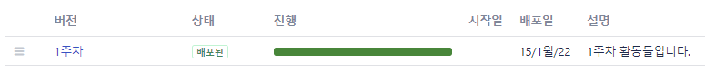
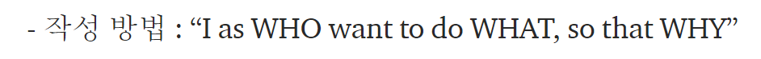
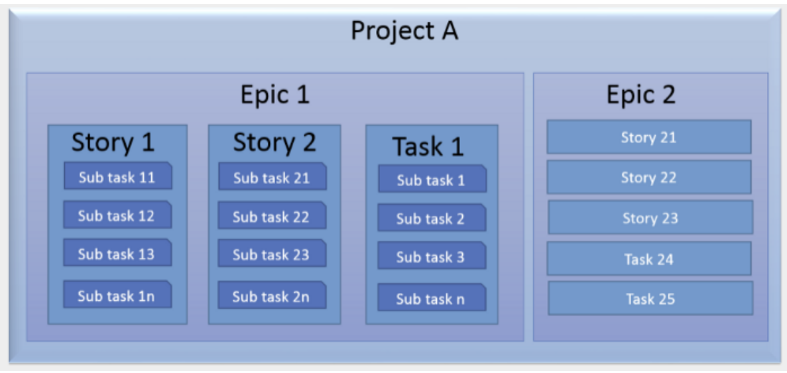
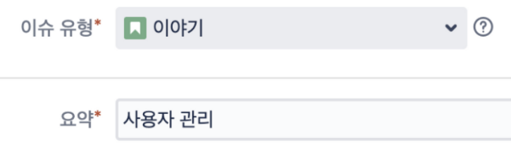
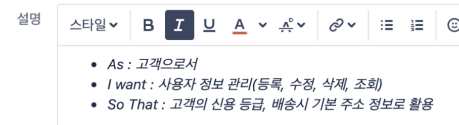
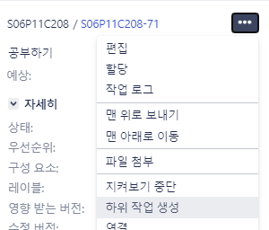
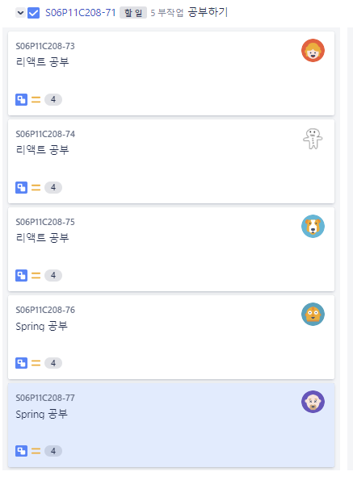
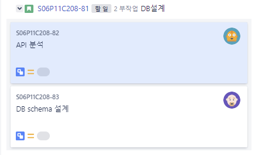

# 8팀 JIRA 매뉴얼

### 1. 보드는 2가지로 나뉜다.(칸반보드 & 스크럼보드)

✳ 칸반보드(일감전체)

 - 일감전체를 확인할 수 있는 칸반보드이다.

 - 전체 이슈들을 확인하는 곳이다.  

 - 완료된 이슈들을 배포할 수 있다. 

   	- 현재 1주차 이슈들 배포완료(2022.01.15)
   	- 

   - 버전 1주차 버튼을 클릭해서 지난 이슈들을 확인할 수 있다. 

💠 S06P11C208 

- 현재 작업중인 스프린트 위주로 확인 가능한 스크럼 보드이다. 
- 이슈들을 만들고 실시간으로 작업현황을 확인하는 곳이다. 

---

### 2. 용어정리

- Epic(에픽) : 큰 단위의 업무 (여러 이슈와 작업 묶은 단위)
- User Story(이야기) : WHO, WHAT, WHY 

- Task(작업) : 이슈 외의 기술적, 관리적 업무
- Sub-Task : 이슈랑 작업을 더 작은 단위로 나눈 업무 / 즉 모든 sub-task가 끝나야 업무종료

출처 : https://pmcircle.wordpress.com/2015/07/30/confused-about-epic-story-task-and-sub-tasks/

ex) 이슈 생성 예시

출처 : https://medium.com/hgmin/devops-jira%EB%A5%BC-%ED%99%9C%EC%9A%A9%ED%95%9C-%ED%98%91%EC%97%85-4f4049a36a56

---

### 3. Sub - Task 만들기

>  Task 혹은 Issue를 클릭해서 하위작업 생성하기

>  다음과 같이 한 작업에 대한 하위작업으로 구성해보면 어떨까요!? 

> sub-task 예시 

