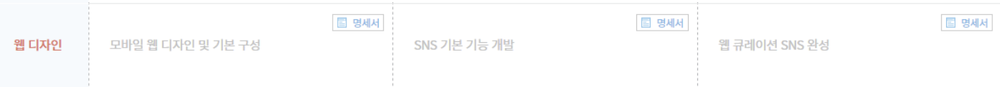
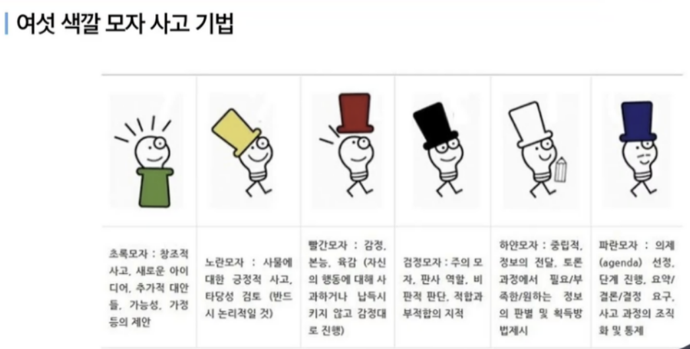
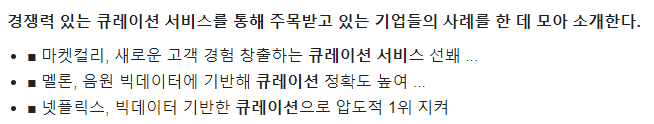

01/05 (수) 회의 


> 2학기 혜택

```
1. SSAFY 도서관 (e-book과 미니도서관)
2. 학습플랫폼 (SSAFY GIT, AWS, GPU)
3. 유료버전 소프트웨어 (모바비, 인텔리제이, 비욘드 컴패어)
4. 4차산업혁명 기술 멘토링
5. 자율프로젝트 교보재 지원(이러닝, 도서, 장비, 라이센스, 서버)
6. 포트폴리오 위크
7. 오픈소스 프로젝트 (특강 멘토링 제공)
8. 기업연계 프로젝트
```


>  TODO LIST 

```
- 명세서 읽어보고 주제 정하기
- 아이디어 회의
- 필요한 교보재 있는지 생각해보기
- 디스코드방 언급하기
- 프론트앤드 REACT 스터디 진행방법 생각해보기
```


> 주제 정하기







```
의견 
- 명세서 구현 제대로 하기
- 뼈대만 주어졌는데, 그대로 진행할 것인지 조금 바꿀것인지 정하기
- UX 중심으로 하는거라서 불편한 점 한두개를 쟁점으로 아이디어 기능 추가하기
- 우수 프로젝트 발표팀 참고하기

웹 큐레이션 SNS 
- 하나의 주제 관련된 공유 ex) 핀터레스트
- 사람들이 원하는 것을 어떻게 맞춤형으로 제공할 것인지

아이디어1 (승우)
- 추천 미술 , 예술쪽 (미술 작품), 뮤지컬 등 공연 추천
- 마이메뉴 (별점 매기는것)
- 이 아이디어로 갈 경우, 주제선정 이유를 코로나 때문에 예술계 다 죽는다는 식으로
```




```
마켓컬리 
- 소비자들의 선택의 고민과 시간을 줄여주기 위해 각 품목별 가장 좋은 상품 2~3개만 선별해 소개하는 것을 원칙

- 상품 설명 페이지 제작에도 남다른 큐레이션을 적용하고 있다. 소비자들의 쇼핑 편의를 위해 전문 에디터들이 직접 작성하고 있는 상세 페이지에는 원산지 특징, 참고하면 좋을 레시피까지 추가해 ‘읽고 싶은’ 콘텐츠로 큰 호응을 얻고 있다. 

- 이러한 큐레이션 서비스는 마켓컬리를 단순한 쇼핑몰이 아닌, 새로운 소비 경험을 창출하는 곳으로 만드는 데 큰 기여를 했다.

멜론
- 멜론은 차트를 실시간 차트, 장르 핫트랙, 시대별 차트, 멜론DJ 인기곡, 검색 인기곡 등 주제별로 다각화했다. 이는 이용자들이 취향에 맞게 더욱 세분화된 차트 음악을 감상할 수 있게 할 뿐만 아니라, 다른 이용자들의 선호 음악과 감상 트렌드까지 확인할 수 있게 해 호응을 얻고 있다.

넷플릭스
- 시네매치는 이용자의 시청 이력을 기반으로 선호하는 장르, 배우 등을 분석한다. 여기에 이용자가 어떤 장면을 반복해 봤는지, 어떤 부분을 건너뛰었는지도 파악한다. 이러한 정보들이 모두 빅데이터로 쌓이고, 이를 기반으로 이용자가 보고 싶어 하는 콘텐츠를 추천한다.

- ‘가입자 맞춤형 제작 방식’을 도입해 선보인 ‘넷플리스 오리지널’ 전용 큐레이션 콘텐츠는 이용자 유입에 탄력을 더하는데 크게 일조했다.
```


- 우리는 선택의 늪에서 살고 있다. 
- 뭘 볼까 고민하다가 하나도 못보는 경우도 있다. 


- 요즘 많은 어플들에서 내 취향을 파악하는데, 사람들이 전체적으로 관심있는 이슈들이나 뉴스를 잘 접하지 못하게 됐다.
- 예전에 네이버 실시간 검색도 좋은 기능이었는데 ..
- 그냥 많은 사람들이 알고 꼭 알아야하는 사회 이슈나 뉴스들을 알고 싶다. 


```
아이디어2 (윤영)
- 배달음식 뭐먹을지 맨날 고민되는데..
- 은근히 미디어에서 접한 음식들이 영향을 많이 미친다. 
- 다이어터를 위한 건강식단 먹거리 음식사진들과 레시피 모음? 추천?
- 다이어터 모드 on off기능...ㅋㅋㅋㅋㅋ off하면 일반 사람들이 좋아하는 음식?
- 그것도 보다보면.. 땡겨지지 않을까?
```


```
아이디어3 (준석)
- 사진 큐레이션 사진을 자유롭게 올리고 자유롭게 사용할 수 있는 
ex) 픽사베이..

- 할만한 게임 찾을때 시간 많이 걸린다.
- 게임 큐레이션 (게임 커뮤니티 많이 안 되있다.게임 성향 잘 제공하고 잘 제조해서 추천)
- 스팀? API 
- 게임관련 커뮤니티 큐레이션
```


```
아이디어4 (이레)
- 예술 도메인 
- 예술 관련된 큐레이션 사이트가 얼마 없고, 화력도 좋고 여초 SNS 
- 실제 상품 만든다고 생각하는 취지에도 좋다. 
```


```
아이디어5 (현수)
- SNS bm 광고, 후원 
- 구독, 멤버십
- 유튜브보다 나은점??
- 무신사 길거리 사진? 좋아요 비슷한 옷 추천
- 왓챠 피디아처럼 영화리뷰 평가? 수익구조 애매 
```


- 미술에 조예가 깊은 분이 자신의 작품을 

- 공연 설명 모달창으로 띄운다던지 추천도.. 보류 

- 가장 기본만이라도 잘 됐으면 좋겠다. 


오늘 할일 

- JIRA 이용하는 법 

- REACT 공식문서 자습서

- 이론강의, 클론강의
