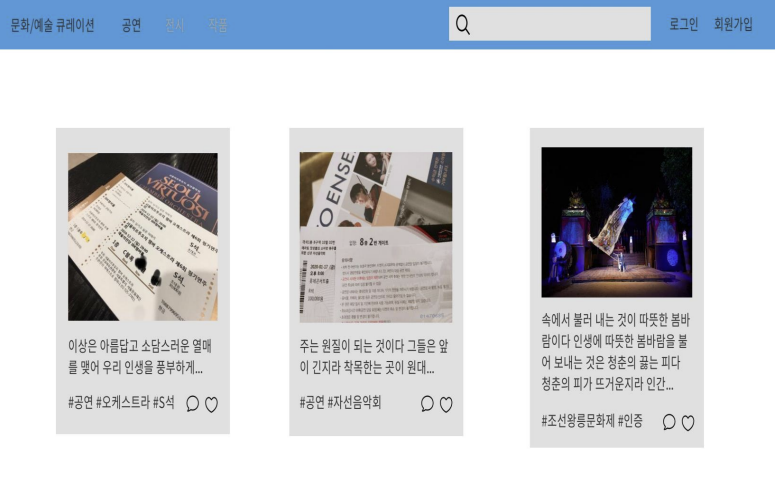
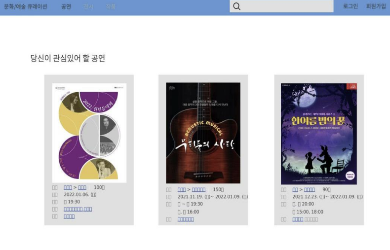

아이디어들 

```
메타버스 공연 및 전시회 사이트로 이동할 수 있게 연계? 모음들?
아이돌을 하위 카테고리에 가능하겠다
문화/예술 분야 최대한 넓게 포괄적으로 다뤄야 다양한 유저를 모을 수 있다.
수익구조 - 돈 내면 상위?라던지
좋아요 많으면 상단으로 배치?
웹 사이트 이름??
문화 예술인을 위한 SNS
추천이 구현하기 어렵다면 카테고리(날짜별 / 종류별 등등..)
홍보랑 SNS를 어떻게 짬뽕할지?? - 고객층이 관람객 뿐 아니라 예술하시는분들 포함
```


Why

```
- 코로나로 인한 공연 및 전시회 위축
- 공연 및 전시회 수요 급증
- 예술 종사자 타겟 홍보사이트 부족
```


### How

```
- 예술인과 시민과의 연계
- 공연에 대한 SNS 기능 추가
- 공연에 대한 정보 기능
```


### What





### Benefit

```
기대효과 : 공연 및 전시회 매출 상승 기대
개선점 : SNS & 큐레이션 vs 마케팅
```

