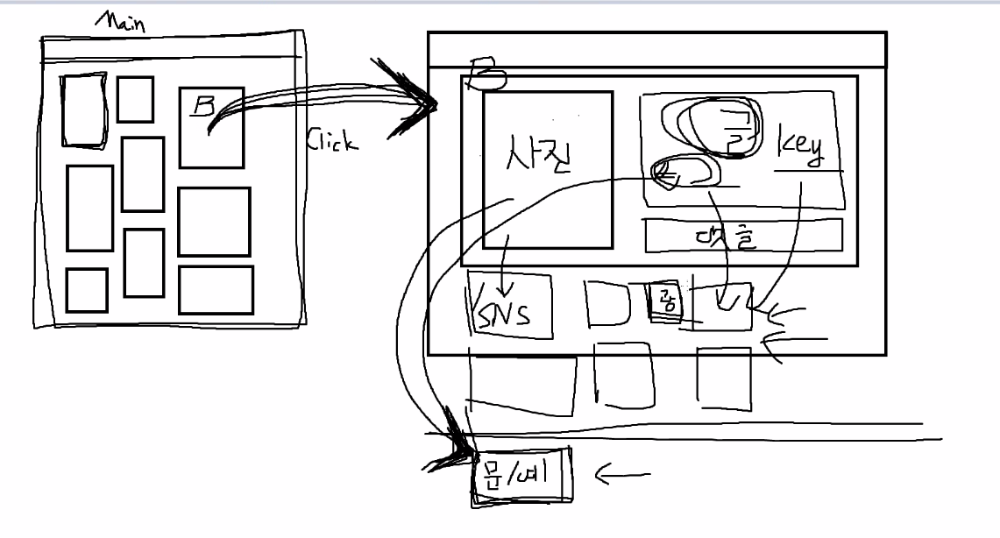
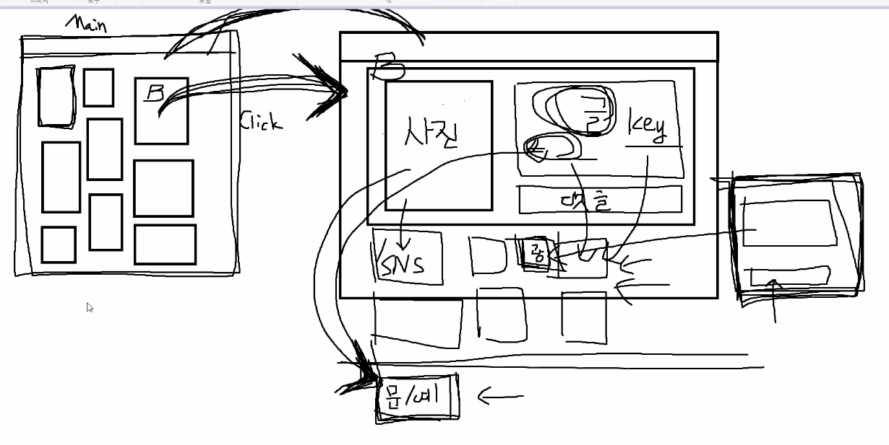

### 0107 팀회의

```
1. Front-End는 React로 결정
2. 도메인은 문화예술로 고정
3. 마케팅 관점에서 SNS를 접근할 것인지 아니면 SNS관점에서 마케팅에 접근할 것인지는 컨설턴트님과의 상의 후 결정
```





​																																					by 준석님 ㅋㅋ


키워드를 적으면 키워드와 관련된 연극이나 공연 정보 제공해준다. 

별도의 페이지 만들어서 

- 누구누구 사용자님이 좋아할 공연 
- 현재 가장 인기있는 공연 

---

고민1

- SNS 에 들어와서 공연정보로 갈지

- 공연정보에서 공연관련 SNS로 갈지

---

우리는 짤막한 글 형태의 소개만 할뿐 판단은 sns 보면서 고객이 하게끔 

태그가 걸려있는 SNS를 띄우자? 보고싶게 유도를 한다. (위축된 문화예술 분야 부흥!!)

UI나 UX 어떻게 뽑을 건지.. 고민고민!!


