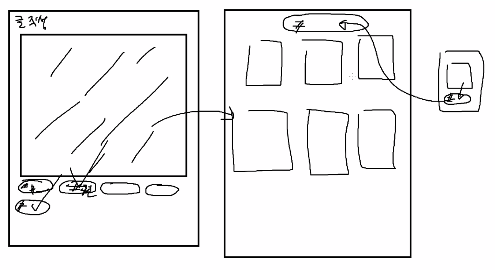
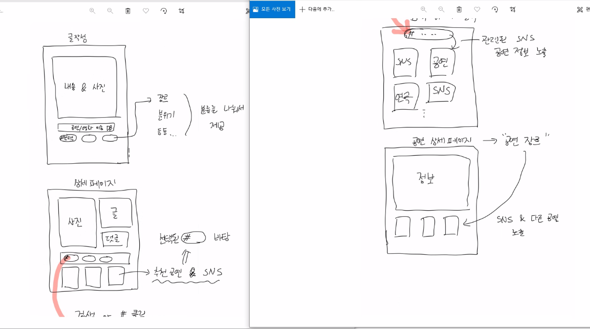
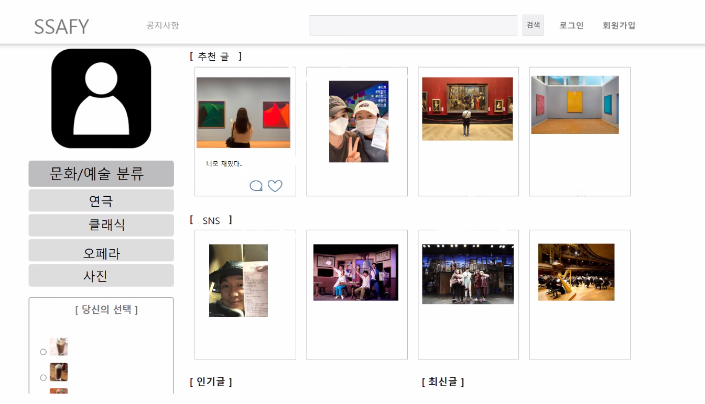
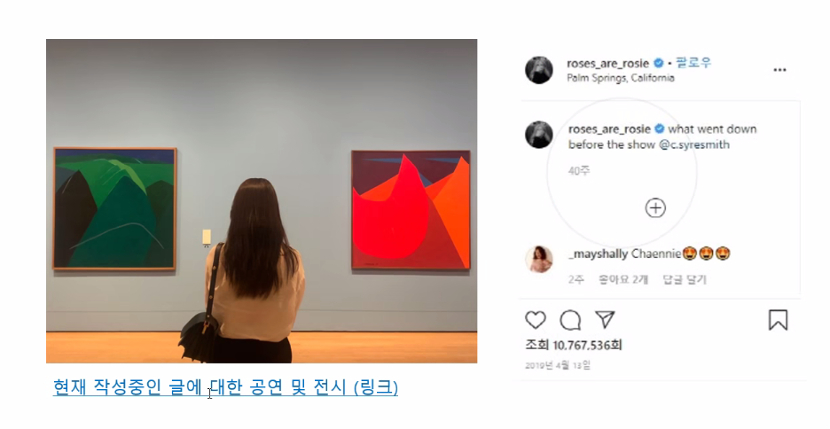
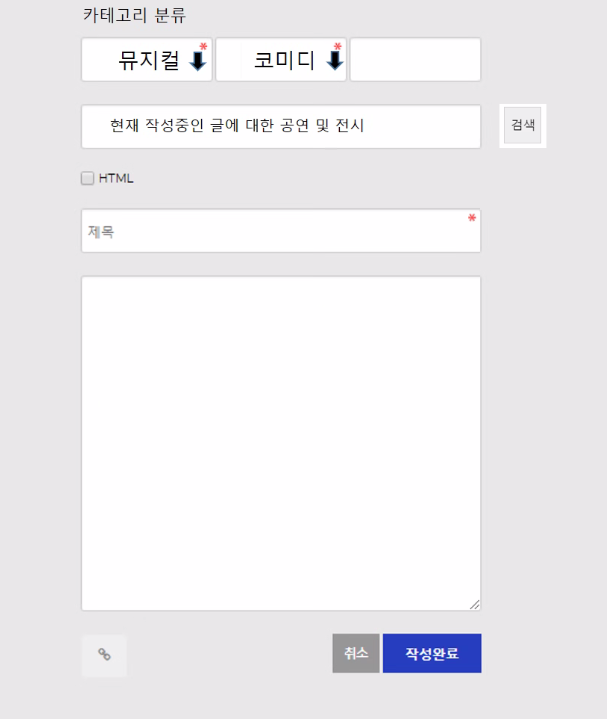
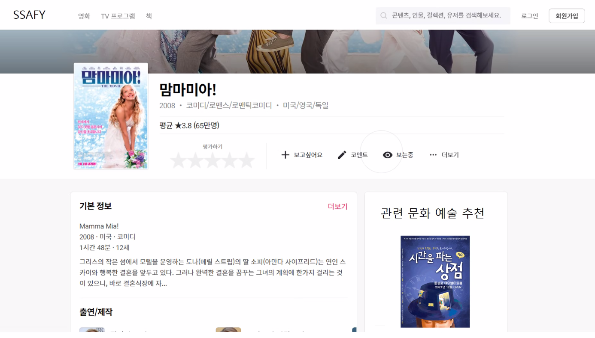
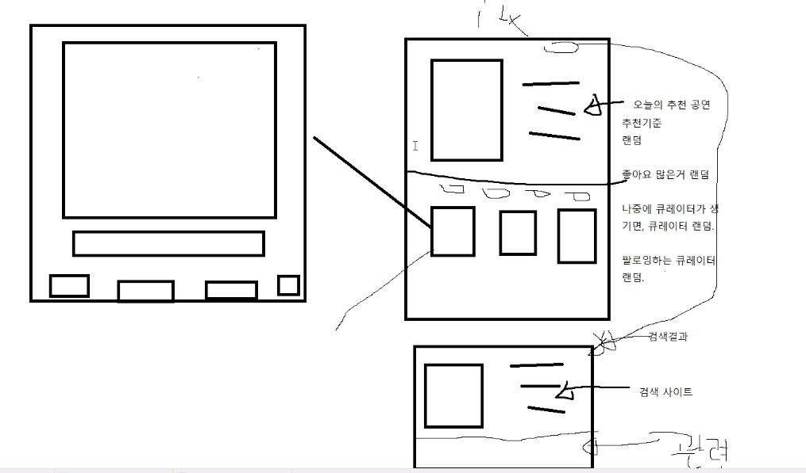
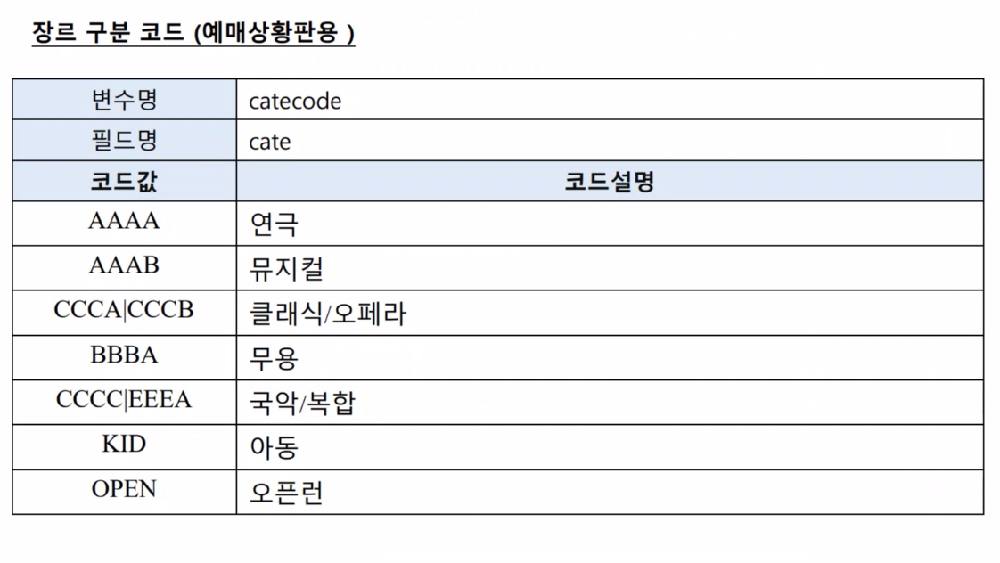
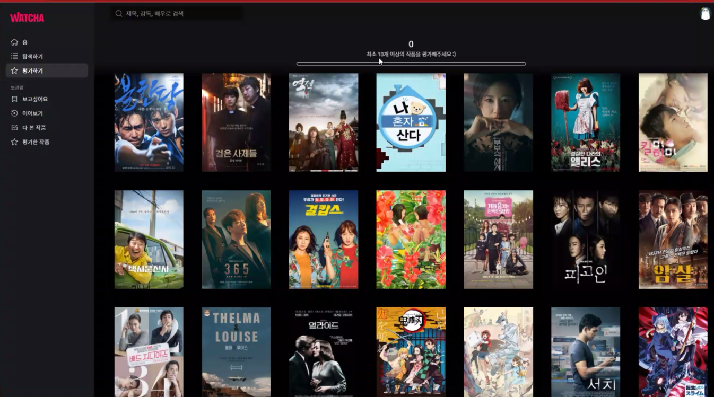
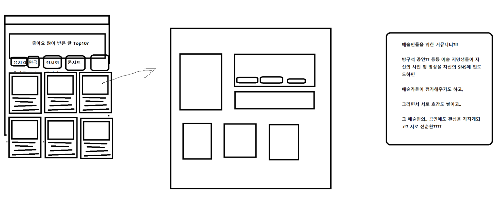

### 01/10 오늘 할일 

- 싸피깃 생성
- 깃랩과 깃헙 아이디 통일
- 지라 생성

- 컨설턴트님과 상담 대비 정리


### 디플로이 토큰!


```
유저네임 : gitlab+deploy-token-3555
비밀번호 : jv5uG1emYSheKNPW4sNy
```


---

### 팀장미팅(매일 13:00)

- 매주 월요일만 스크럼회의 (매번 스크럼 형식 x) 

  ```
  스크럼 
  - 어제한거 / 오늘할거 / 내일 뭐할까 정도 말하는것 / 1분정도
  - 짧게 서로의 시각을 공유하고, 내가 한 내용을 재확인할 수 있는 정도!!
  - 거기서 이슈가 튀어나오면 그자리에서 얘기하는것이 아니라 따로 회의잡는것이 낫다.
  - 다른팀과 비교했을때, 우리팀의 진도 파악 가능
  ```


- 깃 , 지라 필수 사용할 것

- 지라에도 잘 정리 

  - 지라는 약간 채점사항이므로 올려야한다!(거의 대부분 회사는 task를 지라로 관리)

- 내일 깃플로우 강의 잘 볼것

  - 개발 해야되는 피쳐단위로!! (사람별로 하는것이 아님)

  - 내일 강의 - 일반적 회사에서 쓰는 깃플로우 큰그림 강의


- 문서화 필요하다. (작성하는 설계부터 기술 문서들은 취업에 있어서 자산될것)

  - 블로그 형태, 노션 등 관리 잘하기(제일 쉬운건 노션)
  - 설계문서, 정책, 깃플로우 등 적어놓기

  - 어설프게 만들고 말거라면 링크 안거는 것이 낫다.

- 1일 1커밋 (팀원분들 다 스스로!! 싸피 수료하는 날까지 매일 필수!!)
  - 학습한 내용 정리해도되고, 기술문서 형태로.. 

  

- 지라 - 스토리포인트 / 스토리포인트가 곧 시간이다?라고 생각하면 된다.

  ex) 스토리포인트 4 라는 말은 4시간 걸리는 업무 

  (task 할당시간 최대 4시간으로!! 개수는 상관 없다.하지만 일주일에 적어도 10개 이상)

- 지라 - 개인당 주 40시간 이상 할당되어야 한다. (팀장이 만드는것이 아니라 각자 만드는것) 


---

### 팀 회의


질문1 

- 컨벤션 함수형으로 짜고싶은데 맞춰야 하는지!
- npm 왜 에러가 나는지..!!!


문제점

- sns쓰는 이유가 네트워크 효과때문에 쓰는 경우가 많은데 활성화시키기 어렵다.
- 어떻게 활성화 - 1. 검색이 되야한다. (우연히 유입 - 서비스 좋은데?!!)SEO를 통해서! 최적화!!
- 어떻게 연결?


- 우리가 원하는게 뭐냐?!!

- 소셜 네트워크? 공연홍보??

- 정보를 예쁘게 큐레이션 하면 유입이 된다. 

- 인벤 : 처음에는 정보가 있기 때문이었다. 검색해보면 인벤이 나오네? 게시판이 나오네? 떠들다가 유입이 되는..

처음에는 정보 제공한다. 괜찮은 성장방법 

sns 이어가기는 쉽지 않고.. 정보 모으는 과정이 고통스럽다. 


구현의 편리는 어떤게 더?? 

검색에 어떻게 더 잘걸리게?

봇 판단 지표 - 얘가 해석할 수 있어야 한다. (페이지) / 메타정보 달아주면 봇이 해석 잘한다.

로딩되는 시간같은것도 보고 

외부로부터의 유입이라는 지표도 있다. 

페이지 최적화(빨리 떠야되고, 그림 로딩시간 ....!! 봇이 로딩시간 많이들면 페이지 구리네 하고 점수깎임)


추천기능을 넣는다면 구현할 수 있을까? - 특화프로젝트에서 할거긴 한데

공통에서 할려면 할 수 있지만, 불가능한 것은 아니다. 


공연에서 SNS추천?? 


관점은 고민을 해봐야 한다. 


SNS키워드도 가능하다. 

페이지 최적화 잘 되어있으면 상단에 노출이 된다. 

맛집 검색 공연 검색 블로그가 뜨는것이랑 동일한 것 

상위 노출..!!! 


SNS관점이면 매핑시키는 것이 쉽지는 않겠다. 


오픈 api를 통해서 미리 데이터를 들고 있는것도 방법이다.

사용자가 검색해서 선택해서 명확하게 분류하게 만드는것 


키워드 분석은 차선책

ex) 왓챠도 영화데이터 다 들고 있다. 


open api를 통해서 매번 콜하면 너무 오래걸리고, 일종의 스냅샷을 가지고

주기적으로 업데이트 해줘야 한다. 


---

배치 시간별로 1번 하루에 1번 아침 8시 


글을 작성할 때 아예 카테고리를 주자


드라마 예능  sns도 추가해보면 어떨까?




 


---

UI대결

1. 준석님




2. 승우님












3. 현수님





4. 이레님

SNS만 올라오고 작품 안올라오게?

DB api 별점시스템

나랑 비슷한 사람들 글 위주로 큐레이션







사용자선호를 기반으로 비슷한 사람 게시글 

팔로우 댓글 시리즈?유사도 따라서 ...


5. 윤영




