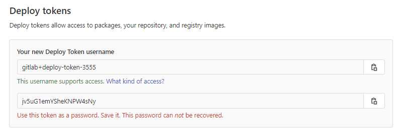
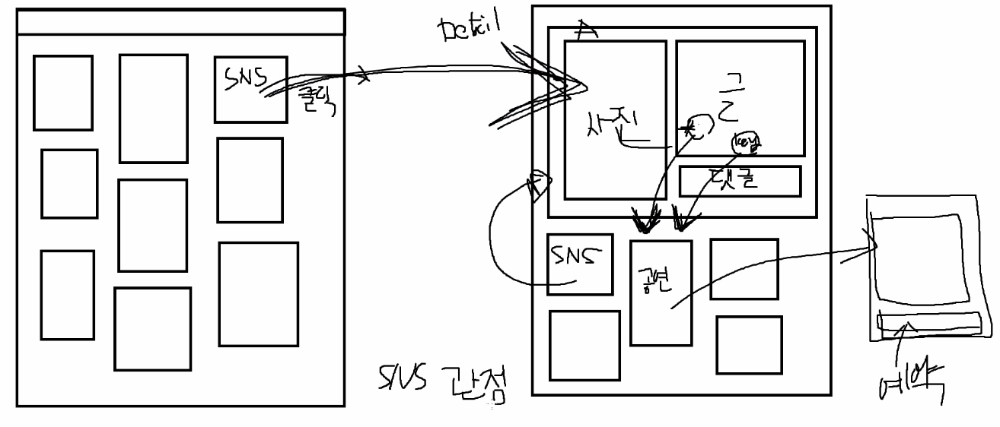

### 01/10 오늘 할일 

- 싸피깃 생성
- 깃랩과 깃헙 아이디 통일
- 지라 생성

- 컨설턴트님과 상담 대비 정리


### 디플로이 토큰!



```
유저네임 : gitlab+deploy-token-3555
비밀번호 : jv5uG1emYSheKNPW4sNy
```


---

### 팀장미팅(매일 13:00)

- 매주 월요일만 스크럼회의 (매번 스크럼 형식 x) 

  ```
  스크럼 
  - 어제한거 / 오늘할거 / 내일 뭐할까 정도 말하는것 / 1분정도
  - 짧게 서로의 시각을 공유하고, 내가 한 내용을 재확인할 수 있는 정도!!
  - 거기서 이슈가 튀어나오면 그자리에서 얘기하는것이 아니라 따로 회의잡는것이 낫다.
  - 다른팀과 비교했을때, 우리팀의 진도 파악 가능
  ```


- 깃 , 지라 필수 사용할 것

- 지라에도 잘 정리 

  - 지라는 약간 채점사항이므로 올려야한다!(거의 대부분 회사는 task를 지라로 관리)

- 내일 깃플로우 강의 잘 볼것

  - 개발 해야되는 피쳐단위로!! (사람별로 하는것이 아님)

  - 내일 강의 - 일반적 회사에서 쓰는 깃플로우 큰그림 강의


- 문서화 필요하다. (작성하는 설계부터 기술 문서들은 취업에 있어서 자산될것)

  - 블로그 형태, 노션 등 관리 잘하기(제일 쉬운건 노션)
  - 설계문서, 정책, 깃플로우 등 적어놓기

  - 어설프게 만들고 말거라면 링크 안거는 것이 낫다.

- 1일 1커밋 (팀원분들 다 스스로!! 싸피 수료하는 날까지 매일 필수!!)
  - 학습한 내용 정리해도되고, 기술문서 형태로.. 

  

- 지라 - 스토리포인트 / 스토리포인트가 곧 시간이다?라고 생각하면 된다.

  ex) 스토리포인트 4 라는 말은 4시간 걸리는 업무 

  (task 할당시간 최대 4시간으로!! 개수는 상관 없다.하지만 일주일에 적어도 10개 이상)

- 지라 - 개인당 주 40시간 이상 할당되어야 한다. (팀장이 만드는것이 아니라 각자 만드는것) 


---

### 팀 회의




