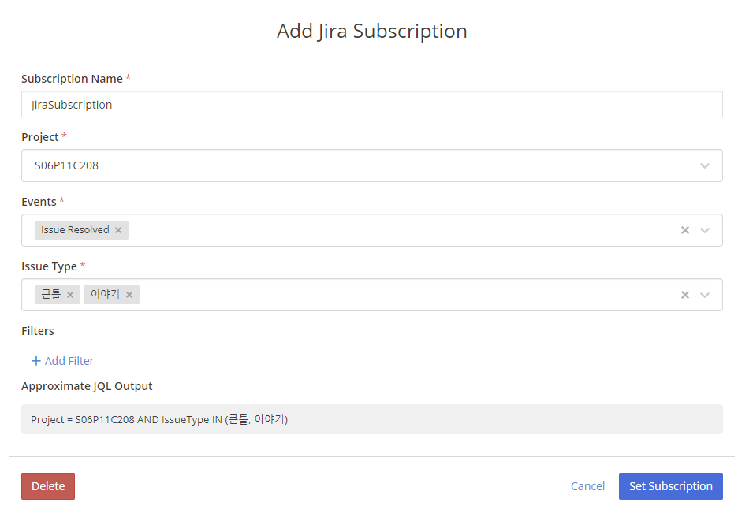
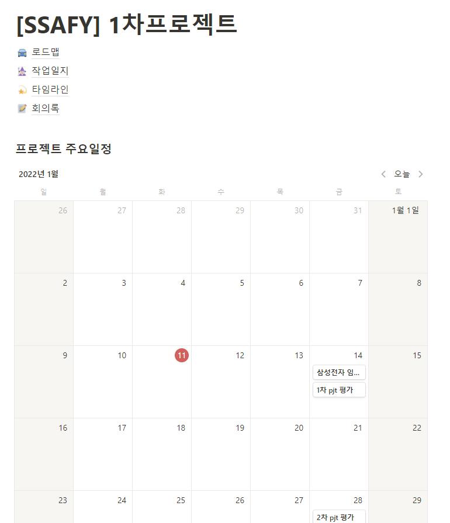
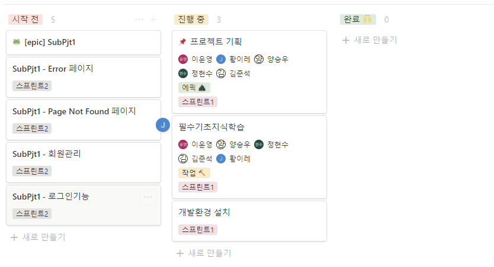
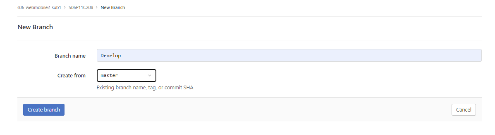

01/11 (화)

==========오늘의 할일 ==========

- git flow 오전강의 다시보기!
- git 이해도 높히기
- jira에 할일 등록하기
- branch 어떻게 할건지 회의하기!
- pull push 관련해서 규칙 정하기!!
- 명세서 보고 기본적으로 설치할것 설치하기

- 명세서에 적힌 필수지식 학습 보고 공부하기


- Jira 와 MM 연동하기

```
/jira connect
```

```
/jira subscribe
```



- 우리팀은 이슈완료인 경우에만, mm에 보고되도록 설정했다.


---

# 01/11 팀장회의

- 채널을 앞으로 늘려갈 것이다. 
- 서버 상 오류도 받아볼 필요가 있다. 

- 오후 프로젝트 그대로 진행할것!


---

# 01/11 팀회의

- 우리팀 전용 Notion 페이지 만들기







- branch 어떻게 할건지 회의하기!
  - Develop브랜치 만들기
  - 
- pull push 관련해서 규칙 정하기!!
  - git add 하기전에 무조건 pull 하기!! 습관적으로

